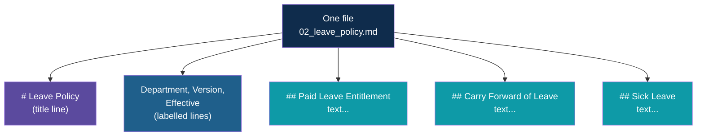

# Step 3 — The Documents

> Back to index · Previous: Project Setup · Next: Load and Chunk

## Goal

Create the `docs/` folder with the policy documents, and learn the layout that the code in
Step 4 depends on.

## Why this matters

The code you write next is short because the documents are tidy. Each file starts with a
title, then a few labelled lines, then a series of sections that each begin with a `##`
heading. The code never has to guess where one section ends: the next `##` tells it.

That tidiness is a decision, not an accident. How you cut documents into chunks is the
single biggest influence on whether the right text can be found later. Real documents are
rarely this clean, and the Day 4 notes on chunking show what to do when they are not. Here
the format is chosen so the pipeline itself stays visible.

## The Layout



| Part of the file | What the code uses it for |
|---|---|
| `# Leave Policy` | The source name, shown in "Retrieved from" |
| `Department`, `Version`, `Effective` | Nothing yet. They are there for an exercise in Step 9 |
| Each `## Heading` and the text under it | One chunk each |

## 1. Create the Folder

```bash
mkdir docs
```

## 2. Write One Document by Hand

Create `docs/02_leave_policy.md` and type it in. The sections are plain prose on purpose;
read each one as you go, because you will ask questions about them later.

The full file is in the checkpoint below.

## 3. Copy the Other Five

Do not retype these. Copy them from the reference project's `docs/` folder, or from the
files your trainer provides, so that your folder holds exactly these six files:

| File | Department | Sections |
|---|---|---|
| `01_hr_handbook.md` | HR | 6 |
| `02_leave_policy.md` | HR | 7 |
| `03_laptop_policy.md` | IT | 7 |
| `04_work_from_home_policy.md` | HR | 6 |
| `05_expense_reimbursement_policy.md` | Finance | 7 |
| `06_it_security_policy.md` | IT | 7 |

That is 40 sections in total, which means 40 chunks in Step 4.

All six documents are synthetic. "Acme Technologies" is a made-up company.

## Try it

```bash
ls docs
```

```text
01_hr_handbook.md
02_leave_policy.md
03_laptop_policy.md
04_work_from_home_policy.md
05_expense_reimbursement_policy.md
06_it_security_policy.md
```

Count the sections across all six files:

```bash
grep -c "^## " docs/*.md
```

The six counts add up to 40.

## Checkpoint

<details>
<summary>Full <code>docs/02_leave_policy.md</code></summary>

```markdown
# Leave Policy
Department: HR
Version: 2025
Effective: 1 April 2025

## Paid Leave Entitlement
Every confirmed and probationary employee earns 12 days of paid leave per year. Paid leave accrues at 1 day for each completed month of service, so a new joiner builds up leave gradually through the year. Paid leave can be taken only after it has accrued.

## Carry Forward of Leave
Unused paid leave of up to 6 days carries forward to the next leave year. Leave beyond 6 days expires on 31 March. This does not apply to employees in their first year of service, who cannot carry forward any leave. Carried-forward leave must be used by 30 June of the new year.

## Sick Leave
Employees get 8 days of paid sick leave each year, separate from paid leave. Sick leave of 3 or more consecutive days needs a medical certificate, which must be submitted to HR within 2 days of returning to work. Unused sick leave does not carry forward and cannot be encashed.

## Casual Leave
Each employee gets 5 days of casual leave per year for urgent personal matters. Casual leave cannot be combined with paid leave to take more than 5 days at a stretch. It does not carry forward.

## Maternity and Paternity Leave
Female employees are entitled to 26 weeks of paid maternity leave for the first two children, in line with the Maternity Benefit Act. Male employees are entitled to 10 working days of paid paternity leave, to be taken within 3 months of the child's birth. Both can be combined with the sick leave and paid leave balance if needed.

## How to Apply for Leave
Leave requests are raised in the HR portal and approved by the reporting manager. Leave of up to 2 days needs 2 working days' notice. Leave of 3 or more days needs at least 7 days' notice. Emergency leave can be requested on the same day by phone or message, and must be entered in the portal within 2 days.

## Leave Without Pay
When all paid leave is used up, further absence is treated as leave without pay and is deducted from that month's salary. Leave without pay for more than 15 days in a year needs approval from the department head.
```

</details>

This matches the reference project's `docs/02_leave_policy.md` exactly. The other five files
are the reference files themselves.

## Common Mistakes

| Symptom | Cause | Fix |
|---|---|---|
| Step 4 later reports `Made 0 chunks` | The folder is not called `docs`, or it is in a different folder from `ingest.py` | `docs` must sit next to `ingest.py`, with the `.md` files directly inside it |
| A section is missing from the answers | A heading was typed as `#` or `###`, or is not at the start of a line | Section headings must be exactly `## ` at the start of a line |
| Step 4 later fails with a `ValueError` about unpacking | A `##` heading has no text under it | Every section needs at least one line of text after its heading |
| The chunk count in Step 4 is not 40 | A file is missing or has a different number of sections | Compare with the table above using the `grep -c` command |

Next: **Step 4 — Load and Chunk**.
