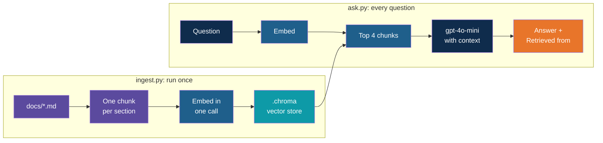

# Step 9 — Recap and Exercises

> Back to index · Previous: Answer with the Model

## Goal

Review what you built, note the traps that catch people, and practise by changing the app.

## What You Built

## Quick Reference

| Concept | Where it lives |
|---|---|
| Loading and chunking | The `for path in sorted(Path("docs").glob("*.md"))` loop in `ingest.py` |
| Chunk text with context | `f"{title} > {heading}\n{body.strip()}"` |
| Metadata | `metadatas.append({"source": title, "section": heading})` |
| Embedding | `client.embeddings.create(model="text-embedding-3-small", ...)` in both files |
| Vector store | `chromadb.PersistentClient(path=".chroma")` in both files |
| Stable ids, no duplicates | `ids=[f"{m['source']} > {m['section']}" ...]` and `upsert` |
| Top-k | `n_results=4` in `ask.py` |
| Grounding | The `SYSTEM` message and the `Context:` block in the user message |
| Where an answer came from | The "Retrieved from" loop over `result["metadatas"][0]` |

## Gotchas

| Gotcha | Why it happens | What to do |
|---|---|---|
| The right chunk is not retrieved | Chunk too vague, too big, or the document is poorly structured | Read the retrieved chunks first; change the chunking before the prompt |
| The right chunk is retrieved, the answer is still shaky | The model has to infer something the text does not say, such as "8 months" meaning "first year" | Make the question or the instruction more specific |
| Off-topic questions still get four chunks | The store always returns the k closest, however far away | Rely on the system message, and consider a minimum similarity |
| The model has no memory | Each question is handled on its own, as in `simple-chat` | Add the conversation history, as in the history version of `simple-chat` |
| Old text still found after an edit | `upsert` never removes ids that no longer exist | Delete `.chroma` and run `ingest.py` again |
| Changing the embedding model breaks the store | Vectors from different models are not comparable | Delete `.chroma`, change the model in both files, and re-ingest |
| Answers vary from run to run | The chat model has some randomness by default | Expected; do not judge a single run |

## Discussion Questions

1. Why are the title and heading written into the chunk text as well as stored as metadata?
2. `ingest.py` and `ask.py` both call the embedding model. Why must it be the same model?
3. The France question still retrieves four chunks. What stops the model from using them to
   invent an answer, and how would you check that it is working?
4. For the 8-month leave question, retrieval is right and the answer is sometimes wrong.
   What would you change first, and why not the chunking?
5. When would you run `ingest.py` again, and when not?

## Exercises

Ordered from easiest to hardest.

1. **Ask your own questions.** Write six questions in everyday words, two for each of three
   different documents. For each, check that "Retrieved from" lists the right section and
   that the answer is correct.
2. **Change k.** Set `n_results` to 1, then to 8. Ask the work-from-home and laptop-theft
   questions. What goes wrong with 1? What do you get with 8 that you did not need?
3. **Add a document.** Write `docs/07_travel_policy.md` in the same layout, run `ingest.py`,
   and ask about it. Check that the count goes up by the number of sections you wrote.
4. **See what the model sees.** Add `print(context)` above the model call. Ask the laptop
   question and read the context as if you were the model. Is anything missing or confusing?
5. **Show the score.** `result` also holds `distances`. Print the distance of each retrieved
   chunk next to its name. Compare the distances for an on-topic question with those for the
   France question. Where would you draw a line?
6. **Use the labelled lines.** The documents carry `Department` and `Version` lines that the
   code ignores. Read them in `ingest.py` and add them to the metadata of every chunk. Then
   pass `where={"department": "HR"}` to `collection.query` and check that an IT question
   no longer finds IT chunks. Think about which user in a company would need such a filter.
7. **Rebuild `ask.py` from memory.** Close this guide, delete `ask.py`, and rewrite it from
   the six steps of the RAG workflow. Then compare it with the reference and note every
   difference.

## What's Next

Day 4 continues with citations and evaluation: showing exactly where each answer came from,
and measuring whether the right chunk is being found. On Day 5, retrieval becomes one tool
that an agent can choose to use, so the `ask.py` you wrote today is the part you will reuse.
