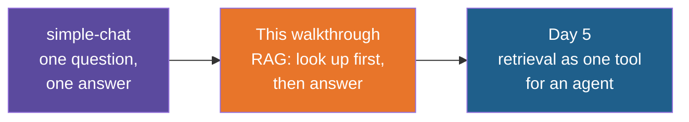

# HR Policy Q&A (RAG) — Build Walkthrough

A step-by-step guide to hand-building the `hr-policy-qa` reference project: the simplest
RAG app. You ask a question, the app finds the most relevant sections of some company
policy documents, and the model answers from those sections only. It is built in the same
order as the RAG workflow in the Day 4 notes: load, chunk, embed, store, then retrieve and
ask the model.

## What You'll Build

A uv-managed Python project with two small programs, a folder of documents and a few
supporting files:

| File | What it is |
|---|---|
| `docs/` | Six synthetic company policies (HR handbook, leave, laptop, work from home, expenses, IT security) |
| `ingest.py` | Run once. Loads the documents, cuts them into chunks, embeds them, and stores the vectors in a Chroma vector store |
| `ask.py` | Run for every question. Retrieves the 4 closest chunks and asks `gpt-4o-mini` to answer from them |
| `.env.example`, `.gitignore`, `pyproject.toml` | Key template, Git safety net, dependencies |

## Who This Is For / Prerequisites

- Comfortable with Python variables, `for` and `while` loops, f-strings, lists and dicts.
- `uv` installed. The environment setup note and the `simple-chat` walkthrough explain
  `uv sync` and `uv run`; this guide does not repeat them.
- An OpenAI API key. The `simple-chat` walkthrough, Step 6, shows how `.env` and
  `.env.example` work; Step 2 here gives the short version.
- Having read the RAG workflow note from the Day 4 notes helps, but Step 1 gives the
  vocabulary you need.

Budget about 70 minutes to build everything. In a live session Steps 4 to 8 are the core
(about 45 minutes). Step 3 can be shown rather than typed.

## Steps

| Step | File | What You'll Add | Est. Time |
|---|---|---|---|
| 1 | 01-concepts-overview.md | Vocabulary: chunk, embedding, vector store, top-k, context | 5 min |
| 2 | 02-project-setup.md | Project folder, dependencies, `.gitignore`, `.env` and a working key | 7 min |
| 3 | 03-the-documents.md | The `docs/` folder and the layout the code relies on | 8 min |
| 4 | 04-load-and-chunk.md | `ingest.py`, part 1: read the files and cut them into chunks | 10 min |
| 5 | 05-embed-the-chunks.md | `ingest.py`, part 2: turn every chunk into a vector | 8 min |
| 6 | 06-store-the-vectors.md | `ingest.py`, part 3: save the vectors in Chroma | 8 min |
| 7 | 07-retrieve-the-top-chunks.md | `ask.py`, part 1: question in, closest chunks out | 10 min |
| 8 | 08-answer-with-the-model.md | `ask.py`, part 2: chunks and question to the model | 8 min |
| 9 | 09-recap-and-exercises.md | Review, gotchas, practice | 5 min |

## Relationship to the Reference Implementation

By the end your files should match the reference project's files exactly: `pyproject.toml`,
`.gitignore` and `.env.example` (Step 2), `docs/02_leave_policy.md` (Step 3), `ingest.py`
(Step 6) and `ask.py` (Step 8). The other five documents in `docs/` are copied from the
reference rather than typed. This walkthrough was generated from the reference files, and
every full-file checkpoint was checked for valid Python syntax and compared against the
reference.

The comments in the code say "Step 1 and 2", "Step 3" and so on. Those numbers are the six
steps of the RAG workflow (load, chunk, embed, store, retrieve, ask), not the numbers of
the walkthrough steps in this guide.

## Suggested Demo Flow

1. Before Step 1, ask any chat model: "How many days of paid leave does Acme Technologies
   give per year?" It will answer confidently from nowhere. Ask the same question to the
   finished app at the end of Step 8 and compare.
2. In Step 4, print one finished chunk and read it aloud. Ask the room whether someone could
   answer a question from this card alone. That is why the title and heading are put inside
   the chunk text.
3. In Step 5, print the first five numbers of one vector and admit that nobody can say what
   they mean. Then point at the length, 1536, and note that the question will get a vector
   of the same length in Step 7. That shared length is what makes comparison possible.
4. In Step 7, stop before the model is involved. Ask "Can I roll over my vacation days?",
   a question that shares no important word with the heading "Carry Forward of Leave", and
   watch the right section come back first. This is semantic search, shown on its own.
5. In Step 8, ask "What is the capital of France?" and read "I could not find that in the
   policy documents." aloud. Point at the "Retrieved from" list under it: retrieval always
   returns something, and it is the instruction in the prompt that stops the model from
   using it.
6. At the end of Step 8, ask "I joined 8 months ago. Can I carry forward my unused leave?"
   several times. Retrieval returns the right section every time, but the answer
   sometimes changes. Use it to separate "did retrieval work?" from "did the model use it
   well?", the question you will ask every time a RAG answer is wrong.

## Series

Start with Step 1 — Concepts Overview.
