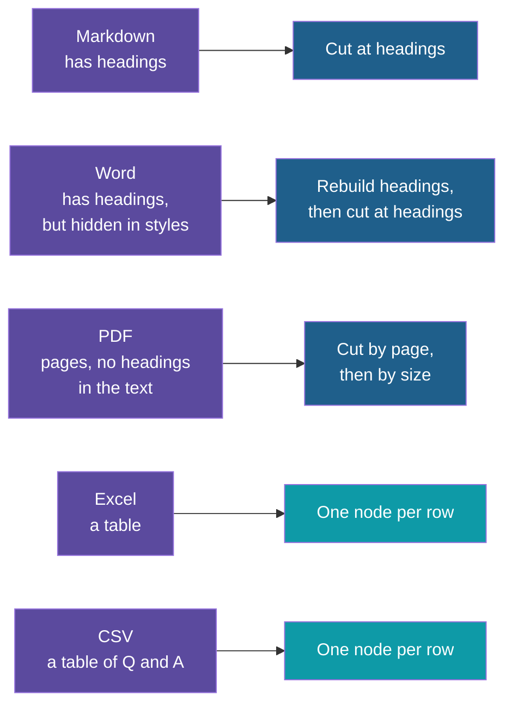

# Step 1 — Concepts Overview

> Back to index · Next: Start From the LlamaIndex App

## Goal

Understand what is new compared with the `hr-policy-qa-llamaindex` app, and why each file
type is treated differently.

## Why this matters

The earlier app had one kind of file and one chunking rule: cut at every `##` heading. That
was enough, because every document was a Markdown policy with headings. Real collections are
not like that. The same company has a handbook in Word, a policy as a PDF, limits in a
spreadsheet and answers in a CSV.

If you push all of them through one rule, each fails in its own way. A heading rule finds no
headings in a PDF. A size rule cuts a spreadsheet row in half. A plain read of a Word file
throws its headings away. So the lesson of this app is that **the right unit to cut at
depends on the format**, and the second lesson is that **no single way of searching suits
every question**: "can I get my money back?" needs a search by meaning, and "hotel limit for
L3" needs a search by exact words.

## The New Vocabulary

| Term | Plain meaning | Where you will see it |
|---|---|---|
| **Loader** | A function that reads one file type and returns nodes | One per format in `loaders.py` |
| **Metadata** | Facts stored with a node: file name, file type, page, sheet, row | `base_metadata` in `loaders.py` |
| **Excluded metadata** | Metadata kept for filtering and for showing sources, but hidden from the text that is embedded | `NO_EMBED` in `loaders.py` |
| **Overlap** | The end of one chunk repeated at the start of the next, so a sentence on the boundary is not lost | The PDF splitter |
| **Docstore** | A saved copy of every node's text, kept outside the vector store | `.store/docstore.json` |
| **BM25** | A search that scores nodes by how well they share the question's exact words | `BM25Retriever` in `retrieval.py` |
| **Hybrid retrieval** | Running a search by meaning and a search by words, and merging the two lists | `QueryFusionRetriever` in `retrieval.py` |
| **Reciprocal rank fusion** | A merge that uses each node's position in each list, not its score | `mode="reciprocal_rerank"` |

## One Rule Does Not Fit All

## What Stays and What Changes

| Stays the same | Changes |
|---|---|
| Chroma as the store, in `.chroma/` | `docs/`: five new documents in five formats |
| `text-embedding-3-small` and `gpt-4o-mini` | `pyproject.toml`: more packages |
| The chat engine with memory | New files: `loaders.py`, `retrieval.py`, `compare_retrieval.py`, `make_sample_data.py` |
| The `condense_plus_context` chat mode | `ingest.py` and `ask.py`: rewritten around the new files |
| `.env`, `.env.example` | A second saved copy of the nodes in `.store/` |
| Synthetic data only | The collection name, so the two apps do not share a store |

## What You Gain and What You Give Up

| You gain | You give up |
|---|---|
| Every format cut the way it deserves | More code to own: one loader per format |
| Exact codes such as "L3" found reliably | A second index to keep in step with the first |
| One question can use facts from a PDF and a spreadsheet | The similarity cut-off from the earlier app, because fused scores are rank points |
| A `/only` filter to narrow to one file type | A little speed: two searches per question |

## Check Yourself

Before moving on, you should be able to say why an Excel row needs its column names written
into the node (the row `L3, 6000, 1500` means nothing alone), and why the app stores the
nodes twice (vectors for search by meaning, plain text for search by words).

Next: **Step 2 — Start From the LlamaIndex App**.
