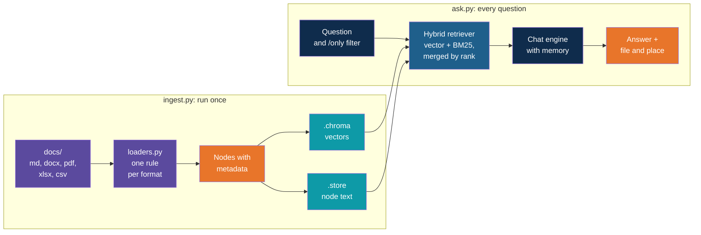

# Step 15 — Recap and Exercises

> Back to index · Previous: Filter by File Type

## Goal

Review what you built, compare it with the single-format LlamaIndex app, and practise by
changing it.

## What You Built



## Single-Format Versus Multi-Format, Step by Step

| RAG step | `hr-policy-qa-llamaindex` | This app | Walkthrough step |
|---|---|---|---|
| Load | `SimpleDirectoryReader` over Markdown files | One loader per format, chosen by file extension | 4 to 8 |
| Chunk | `MarkdownNodeParser`, one node per heading | Headings for Markdown and Word, page then size for PDF, one node per row for Excel and CSV | 4 to 7 |
| Metadata | File name | File name and type, plus page, sheet, row or category. Location keys hidden from the embedded text | 7, 8 |
| Embed and store | `VectorStoreIndex` over Chroma | The same, plus a saved copy of the node text | 9, 11 |
| Retrieve | One vector retriever, top 4, similarity cut-off | Vector and BM25 merged by reciprocal rank fusion, optional file type filter | 10 to 12 |
| Weak matches | Dropped by the similarity cut-off | Not filtered. The prompt tells the model to say "not found" | 13 |
| Answer | `as_chat_engine`, built from the index | `CondensePlusContextChatEngine`, built from our retriever, with separate memory | 13 |
| Narrowing | None | `/only` command | 14 |

## What You Gave Up

| Gave up | What it costs you | How to limit it |
|---|---|---|
| The similarity cut-off | An off-topic question still gets four sources, and the prompt alone stops a bad answer | Exercise 4 removes the zero-score keyword results. A re-ranker could restore a cut-off |
| One place for the data | The nodes live twice, in Chroma and in the docstore, and can drift apart | Always run `ingest.py`, which writes both. Do not delete only one of `.chroma` and `.store` |
| Speed and simplicity | Two searches per question, and one loader to maintain per format | Keep to the formats you need. A new format is one function and one line in `LOADERS` |
| Control over BM25 filtering | The retriever's own filter option did not restrict results | Filter the nodes before building the index, as `retrieval.py` does |

## Quick Reference

| Concept | Where it lives |
|---|---|
| Which loader runs for a file | `LOADERS` and `load_nodes` in `loaders.py` |
| Markdown and Word chunking | `MarkdownNodeParser`, after `docx_nodes` rebuilds the headings |
| PDF chunking | `SentenceSplitter(chunk_size=256, chunk_overlap=40)`, one document per page first |
| Spreadsheet and CSV chunking | One `TextNode` per row, with column names written into the text |
| What is embedded | The node text plus the metadata not listed in `NO_EMBED` |
| Metadata for filters and sources | `node.metadata`: `file_name`, `file_type`, `page`, `sheet`, `row`, `category` |
| Models and paths shared by all scripts | The constants and `configure_models` in `retrieval.py` |
| Node text for keyword search | `.store/docstore.json`, read by `open_nodes` |
| The three retrievers | `build_retrievers` in `retrieval.py` |
| The merge | `QueryFusionRetriever(..., mode="reciprocal_rerank", num_queries=1)` |
| File type filter | `MetadataFilters` for vectors, a filtered node list for BM25 |
| Source labels | `describe` in `retrieval.py` |
| Memory that survives a filter change | `ChatMemoryBuffer`, created once in `ask.py` |

## Gotchas

| Gotcha | Why it happens | What to do |
|---|---|---|
| A CSV answer is cut short and its category is a sentence | An answer with a comma was not in double quotes, so the reader split it into extra columns. The reference data had this bug, and it was fixed | Quote any CSV field that contains a comma, and check that every row has the same number of columns |
| A Word file loads as one big node | A plain read loses the heading styles | Rebuild the headings as markdown first, as `docx_nodes` does. Note that the directory reader's Word support needs another package, `docx2txt` |
| `BM25Retriever` ignores its `filters` option | The option did not restrict results when tested | Pass it only the nodes you want searched |
| Keyword search returns four results with a score of 0.000 | It always returns `top_k` results, even with no matching word | Treat a zero score as "no match" and drop it (Exercise 4) |
| Hybrid scores look tiny | They are rank points, `1 / (60 + position)` summed over lists | Compare order, never size. Do not reuse a similarity cut-off |
| The fusion retriever complains about the LLM | It resolves a default chat model when it is built | Set `Settings.llm` yourself, as `configure_models` does |
| Single characters such as "A" or "5" never match | The default BM25 tokenizer ignores tokens of one character | Expected. Codes and words of two or more characters work |
| Answers cite the wrong spreadsheet row | Excel counts the header as row 1, so the first data row is row 2 | `enumerate(rows[1:], start=2)` keeps the numbers equal to Excel's |
| A scanned PDF gives empty or odd text | It has no text layer | Use OCR before loading. Out of scope here |
| Excel cells show `None` | A formula was never calculated and saved | Open and save the workbook once, or avoid formulas in source data |
| `ingest.py` and `ask.py` disagree | Different embedding models, or only one of the two stores was rebuilt | Keep the model in `retrieval.py`, delete both `.chroma` and `.store`, and re-run `ingest.py` |
| `RateLimitError` | The free tier's limit | Wait a minute. Forty-one nodes need very few calls |

## Discussion Questions

1. The Excel loader writes `Grade: L3. Hotel Limit Per Night (INR): 6000...` into each node.
   What would the embedding model see if only `L3 6000 1500 1200 Economy` were stored? What
   would BM25 see?
2. The PDF is cut by size with overlap, and the Markdown file by heading. What does each
   choice risk, and when would you use the other rule for the other file?
3. The hybrid retriever has no similarity cut-off. What stops the assistant from answering
   "What is the dress code?" with a made-up rule if the FAQ file did not contain one?
4. Reciprocal rank fusion ignores the scores. Can you think of a case where a very high score
   in one list should count for more than a rank of 2 in the other?
5. The nodes are stored twice. What could go wrong if someone updates `docs/` and runs only
   half of the pipeline?
6. A user says "it's in the PDF". Is `/only pdf` the right fix for them, or does the app
   need a different way to find out which file to search?

## Exercises

Ordered from easiest to hardest.

1. **Ask one question per format.** Write one question for each of the five files, and one
   that needs two files. For each, check the source list names the file you expected, and
   note which retriever (vector or keyword) would have found it alone, using
   `compare_retrieval.py`.
2. **Change the PDF chunk size.** In `loaders.py`, change `chunk_size` to 1024, run
   `ingest.py`, and count the PDF nodes: you should get 3, one per page. Then use
   `chunk_size=128` with `chunk_overlap=20` and you should get 11. Ask the claim deadline
   question each time. Which size would you ship?
3. **Add a text-file loader.** Add `txt_nodes` to `loaders.py`: build a `Document` from the
   file and cut it with `SentenceSplitter`. Add `".txt": txt_nodes` to `LOADERS`. Put a short
   synthetic `.txt` file in `docs/`, re-run `ingest.py`, and check that `/only txt` works with
   no other change. Why did it?
4. **Drop zero-score keyword results.** In `compare_retrieval.py`, print only keyword results
   whose score is above 0. Then think about how you would stop them reaching the fusion step
   in `retrieval.py`. Hint: a retriever's `retrieve` method returns a list you can filter.
5. **Change the merge mode.** In `retrieval.py`, change `mode` to `"relative_score"` and run
   `compare_retrieval.py`. The hybrid scores change scale. What do they now look like, and do
   ties appear? Switch back afterwards.
6. **Read the prompt.** Run this once and read what LlamaIndex puts above your `SYSTEM` text:

   ```bash
   uv run python -c "from llama_index.core.chat_engine.condense_plus_context import DEFAULT_CONTEXT_PROMPT_TEMPLATE as T; print(T)"
   ```

   Then pass your own `context_prompt` to `CondensePlusContextChatEngine.from_defaults`. It
   must contain `{context_str}` where the nodes go. Does the tone of the answers change?
7. **Rebuild `loaders.py` from memory.** Close this guide, delete `loaders.py`, and rewrite
   it from the table in Concepts Overview: one function per format, a metadata helper, a
   router. Then compare it with the reference and note every difference.

## What's Next

The Day 4 notes on hybrid RAG and on LlamaIndex retrievers go deeper into the two ideas in
Steps 11 and 12: why exact-word search and meaning search fail in opposite ways, and what
other retrievers LlamaIndex offers, such as auto-merging and routing. The note on PageIndex
describes a very different approach for long documents, where a model reads a table of
contents instead of searching chunks. Of the five files here, the PDF is the only one that
would benefit, and only if it were much longer. The `hr-policy-qa-pgvector` project shows the
same app idea with Chroma replaced by Postgres. On Day 5, retrieval becomes one tool that an
agent can choose to use, and the hybrid retriever built here is the part you would reuse.
