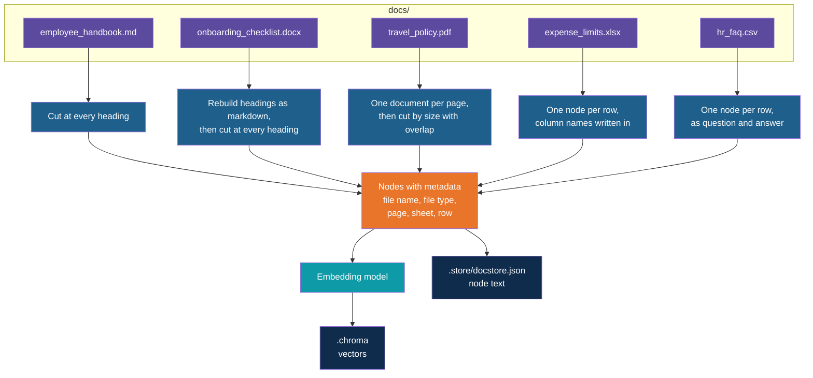
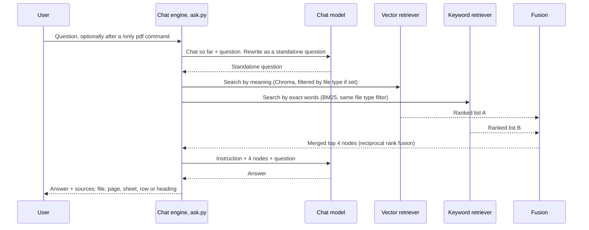
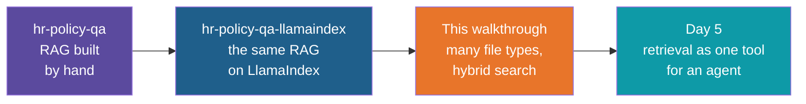

# Multi-Format RAG with LlamaIndex — Build Walkthrough

A step-by-step guide to building the `multi-format-rag-llamaindex` reference project. You
start from a copy of the finished `hr-policy-qa-llamaindex` app and grow it from "six
Markdown files" into "five kinds of file, each cut the way its format deserves, searched by
meaning and by exact words at the same time". Nothing the earlier walkthroughs taught is
repeated: the environment, the key handling, the six steps of RAG and the LlamaIndex
vocabulary are all reused as they are.

## What You'll Build

An assistant for company policies that live in different kinds of file: a Markdown handbook,
a PDF policy, an Excel workbook, a Word checklist and a CSV of FAQs. All names, numbers and
documents are synthetic. "Acme" is a made-up company.

| File | What it is |
|---|---|
| `docs/` | The five source documents. Two are typed in, three are generated by a script |
| `make_sample_data.py` | Writes the PDF, Excel and Word sample files. Copied, not typed |
| `loaders.py` | Reads each file type and cuts it into nodes. One chunking rule per format |
| `ingest.py` | Run once. Embeds the nodes, stores them in Chroma, and saves a copy of their text for keyword search |
| `retrieval.py` | Shared setup: models, vector, keyword and hybrid retrievers, the file type filter |
| `ask.py` | Run for every question. A chat engine over the hybrid retriever, with memory and a `/only` filter |
| `compare_retrieval.py` | Runs the same questions through vector, keyword and hybrid retrieval, side by side |
| `pyproject.toml`, `.gitignore`, `.env.example`, `.env` | Changed or copied from the earlier app |

## How the Whole App Works

The app has two phases, as every RAG app does. The new part is that the first phase treats
each file type differently, and the second phase searches two ways at once.

### Phase 1: Ingest (run once, and again when the documents change)

All of it runs from `uv run ingest.py`, which calls `load_nodes` in `loaders.py`. The nodes
are saved twice, because the two searches in Phase 2 need different things: vectors for
search by meaning, and plain text for search by exact words.

### Phase 2: Ask (every question)

The same retrievers, built in `retrieval.py`, are also used by `compare_retrieval.py`, which
prints the three lists instead of asking the model to answer.

### Who Runs When

| Script | When | Needs the key |
|---|---|---|
| `make_sample_data.py` | Once, to write the PDF, Excel and Word files. Optional if the files already exist | No |
| `ingest.py` | Once, then whenever a document changes | Yes (embeddings) |
| `ask.py` | Every session | Yes (embeddings and chat) |
| `compare_retrieval.py` | Any time, to judge the retrievers | Yes (embeddings) |

## Who This Is For / Prerequisites

- You have finished the `hr-policy-qa-llamaindex` walkthrough, or you have the finished
  `hr-policy-qa-llamaindex` app to copy. This guide assumes you know what a node, an index,
  a retriever and a chat engine are, and does not explain them again.
- `uv` installed and an OpenAI API key already in that app's `.env`. Step 2 copies the file,
  so you do not enter the key again.
- Reading the Day 4 notes on hybrid RAG and on LlamaIndex retrievers helps, but Step 1 gives
  the vocabulary you need.

Budget about 2 hours. In a live session Steps 6, 7, 11 and 12 are the core (about 35
minutes). Steps 2 and 3 are mostly copying and can be shown rather than typed.

## Steps

| Step | File | What You'll Add | Est. Time |
|---|---|---|---|
| 1 | 01-concepts-overview.md | Vocabulary, and why each format gets its own treatment | 6 min |
| 2 | 02-start-from-the-llamaindex-app.md | A copy of the app, new packages, a working import | 6 min |
| 3 | 03-make-the-sample-data.md | The five documents, and what each one is designed to test | 8 min |
| 4 | 04-load-markdown-by-heading.md | `loaders.py`, part 1: Markdown, one node per heading | 7 min |
| 5 | 05-load-word-through-markdown.md | `loaders.py`, part 2: Word, with its headings rebuilt | 6 min |
| 6 | 06-load-pdf-by-page-and-size.md | `loaders.py`, part 3: PDF, one document per page, then size-based chunks | 8 min |
| 7 | 07-load-excel-and-csv-by-row.md | `loaders.py`, part 4: spreadsheet and CSV rows as nodes | 8 min |
| 8 | 08-route-by-file-type.md | `loaders.py`, part 5: metadata hygiene and a router by file extension | 7 min |
| 9 | 09-embed-and-store.md | `retrieval.py`, part 1, and `ingest.py`: embed and store the nodes | 8 min |
| 10 | 10-vector-retrieval-with-a-filter.md | `retrieval.py`, part 2: vector retriever with a file type filter | 6 min |
| 11 | 11-keyword-retrieval-with-bm25.md | `retrieval.py`, part 3, and `ingest.py`: a second search, by exact words | 9 min |
| 12 | 12-hybrid-retrieval-and-comparison.md | `retrieval.py`, part 4, and `compare_retrieval.py`: merge the two searches | 9 min |
| 13 | 13-answer-with-a-chat-engine.md | `ask.py`, part 1: chat engine over the hybrid retriever, with sources | 8 min |
| 14 | 14-filter-by-file-type.md | `ask.py`, part 2: the `/only` command | 6 min |
| 15 | 15-recap-and-exercises.md | Comparison, trade-offs, practice | 6 min |

## Relationship to the Reference Implementation

By the end your files should match the reference project's files exactly: `pyproject.toml`
and `.gitignore` (Step 2), `loaders.py` (Step 8), `ingest.py` and `retrieval.py` (Steps 11
and 12), `compare_retrieval.py` (Step 12) and `ask.py` (Step 14). `employee_handbook.md`,
`hr_faq.csv` and `make_sample_data.py` (Step 3) also match. The PDF, Excel and Word files
are generated, so their bytes can differ from the reference (they carry timestamps) while
their content is the same. The reference project also has a `README.md`, which this
walkthrough does not rebuild.

Every full-file checkpoint was checked for valid Python syntax, and each final checkpoint
was compared against the reference file and is identical. The output shown for loading and
chunking (Steps 4 to 8) and for the keyword search (Step 11) comes from real runs on the
sample data, and does not need an API key. Steps 9, 10, 12, 13 and 14 were run end to end
with stand-in models, to check that the code fits together, so the vector scores and the
wording of the answers there are described, not copied. Run the finished app once with a
real key before a session and confirm that your own numbers fit what the steps say.

The comments in the code say "Steps 1 and 2" and "Steps 3 and 4". Those are the six steps
of the RAG workflow (load, chunk, embed, store, retrieve, ask), not the numbers of the
walkthrough steps in this guide.

## Suggested Demo Flow

1. Before Step 4, open `expense_limits.xlsx` and `travel_policy.pdf` in their normal
   programs and ask the room where each one should be cut. Most people say "by row" for the
   workbook and "by section" for the PDF, and the PDF has no real sections in its text.
2. In Step 5, print the Word file as plain text next to the converted markdown. The
   headings "Before Day One" and "Day One" are indistinguishable from body lines in the
   first and obvious in the second.
3. In Step 6, print the end of the first PDF node and the start of the second. They share
   a sentence, and that is the overlap doing its job.
4. In Step 7, print one spreadsheet node as the embedding model will see it. Four lines of
   `file_name`, `file_type`, `sheet` and `row` sit above the row, and Step 8 removes the
   three that do not help.
5. In Step 11, run the keyword search for "hotel limit for L3" and write the scores on the
   board: the L3 row scores 2.552 and the rows behind it score 1.539. One token, "L3",
   made the difference, and it is exactly what a search by meaning struggles with.
6. In Step 14, type `/only pdf` and ask the hotel limit question again. The limit lives in
   the workbook, so the assistant should say it could not find it. That is the filter
   working, and also the moment to ask what a user would feel about it.

## Series

Start with Step 1 — Concepts Overview.
