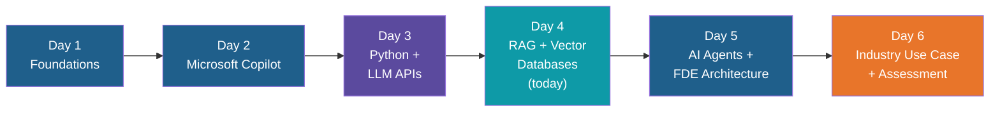
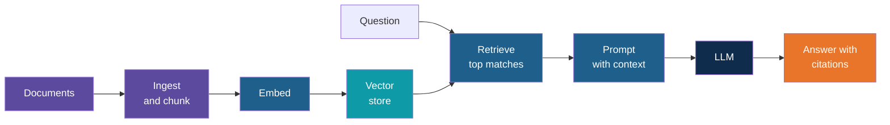
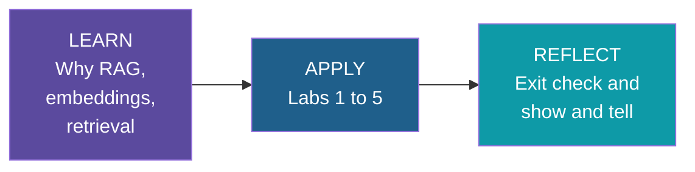

# Day 4: RAG + Vector Databases — Introduction

**AI Developer & FDE Training | Kalpataru Projects, Ahmedabad**
Week 2, Day 4 of 6 | 4 hours | Batch 1 (forenoon) and Batch 2 (afternoon)

---

## Welcome

So far, the model has only known what it learned during training. Today you fix that. You
will give an LLM access to a set of documents it has never seen, and get it to answer
questions from them, with the source named next to every answer.

This technique is called Retrieval-Augmented Generation (RAG). It is the most common pattern
behind "chat with your documents" tools, and the one most enterprise AI projects start with.
By the end of the day you will have built a small document knowledge assistant yourself.

You don't need any new background. If you can call an LLM API from Python (Day 3), you have
what you need.

## Why This Day Exists

An LLM on its own has three problems that matter in real work:

| Problem | What it looks like |
|---|---|
| Knowledge cutoff | It doesn't know anything recent |
| No private data | It has never seen your internal documents |
| Hallucination | When it doesn't know, it may still answer confidently |

RAG addresses all three by looking up the relevant passages first and handing them to the
model along with the question. The model answers from what it was given, and you can show
where each answer came from.

## How Today Fits Into the Program

- Day 3's API client and prompting habits are the last step of today's pipeline.
- Day 5's agents will treat retrieval as one tool among several, so today's assistant is
  something you can reuse tomorrow.

## The Pipeline You Will Build

## Learn, Apply, Reflect — Today

- **Learn:** one pipeline stage per block, explained with everyday examples first.
- **Apply:** five labs, each adding one stage to the same assistant.
- **Reflect:** the exit check and show and tell, where you compare assistants and see where
  they succeed and fail.

## Today's Journey

| Block | Focus | You'll produce |
|---|---|---|
| 1. Why RAG and Architecture | Limits of LLMs, RAG vs. prompt stuffing vs. fine-tuning, the end-to-end pipeline | A clear picture of the pipeline |
| 2. Ingestion and Chunking | Loading, cleaning, chunk size and overlap, metadata | Ingestion and chunking pipeline (Lab 1) |
| 3. Embeddings | What embeddings are, similarity, models, dimensions and free-tier limits | Embeddings for your chunks (Lab 2) |
| 4. Vector Stores | Indexing, search, FAISS, Chroma, pgvector, filtering, persistence | A working vector store (Lab 3) |
| 5. Retrieval and Generation | Top-k, retrieval quality, prompting with context, re-ranking overview | Retrieval-augmented answers (Lab 4) |
| 6. Citations and Evaluation | Source attribution, "answer not found", failure modes, basic evaluation | Answers with citations and checks (Lab 5) |

The Day4 schedule file in this folder has the full timing and topic-by-topic detail.

## Before You Start

- Your Day 3 Python environment and API client working, with a free-tier key in `.env`
- A quick check that you can still make one successful API call before the session starts
- A vector store library installed as instructed by the trainer (FAISS, Chroma, or a free
  equivalent)
- The synthetic sample documents provided for today's labs
- No confidential Kalpataru documents, datasets or credentials on the machine you're using

## How These Notes Are Organized

- The Day4 schedule file: the agenda with timing, topic lists, labs and ground rules.
- `intro.md`: this page, covering why the day matters and how it connects to the program.
- `notes/`: one file per block, with the idea explained through examples and diagrams.

## Not Covered Today

- Agent workflows and frameworks (Day 5)
- Docker, containers and deployment

## Ground Rules

- Use only the provided synthetic or sanitized documents
- No confidential Kalpataru documents in any AI tool
- Keep API keys out of code and Git

---

*Prepared for Kalpataru Projects | AIM ADaSci | Confidential*
