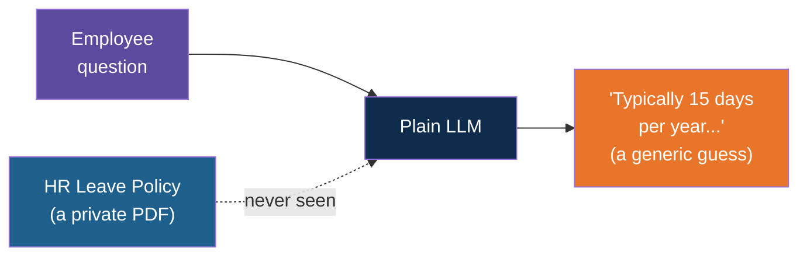
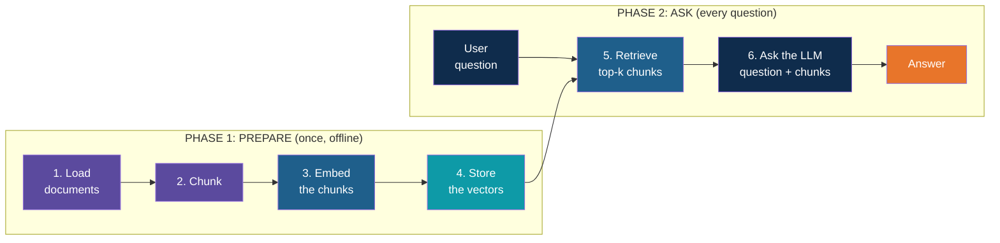
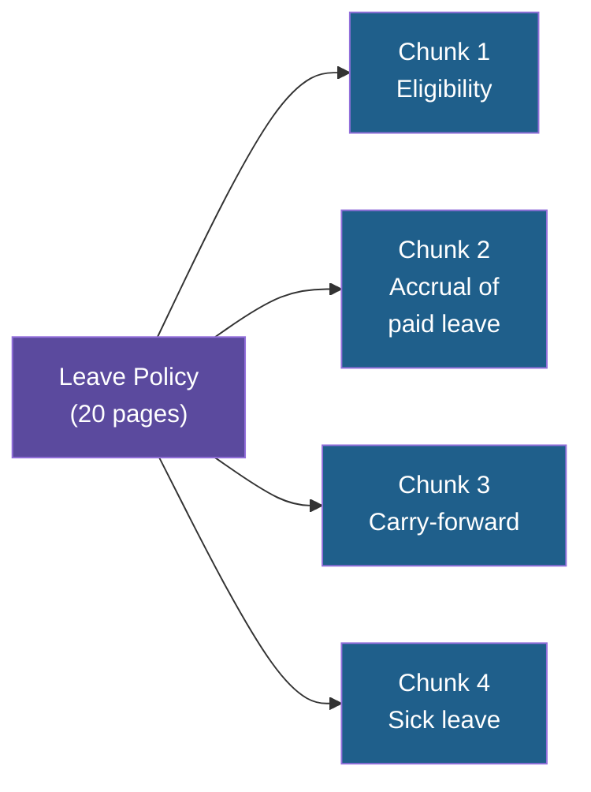
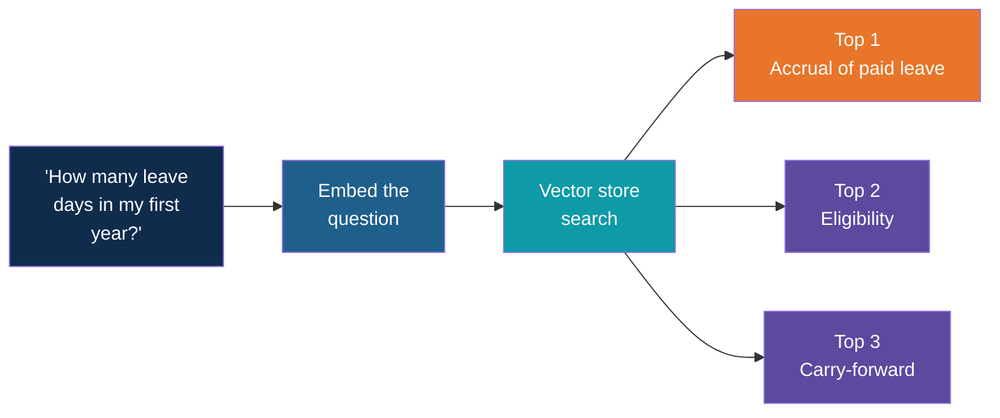
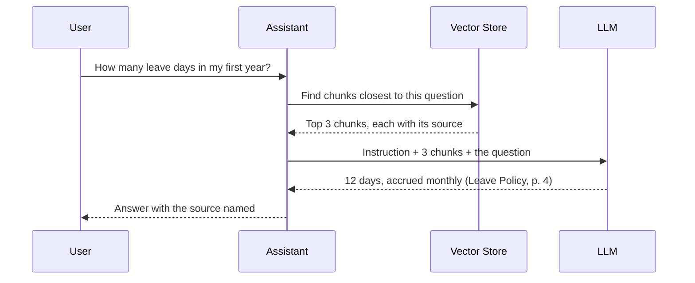

# RAG and the RAG Workflow

<!-- Slide deck in markdown. Each block between the --- lines is one slide.
     Trainer notes are in HTML comments and do not show in the preview.
     All documents, names and numbers in this deck are made up for teaching. -->

---

# RAG and the RAG Workflow

## Let the model look it up before it answers

**Day 4 | Block 1: Why RAG and Architecture**

<!-- Trainer: about 25 minutes. Spend most of the time on the problem and the two-phase picture. Later blocks open up each stage. -->

---

## The Open-Book Exam

Two students sit the same exam on a company's return policy.

| | Student A | Student B |
|---|---|---|
| Rule | Closed book, answer from memory | Open book, find the page, then answer |
| Knows the latest policy? | Only if they studied it | Yes, it is in the book |
| When unsure | Tends to guess confidently | Can say "the book doesn't cover this" |
| Can show their source? | No | Yes, "page 12" |

An LLM on its own is **Student A**. RAG turns it into **Student B**.

> **RAG = Retrieval-Augmented Generation.** Retrieve the relevant text first, then
> generate the answer from it.

---

# The Problem

## What goes wrong with a plain LLM

---

## Three Gaps

| Gap | Plain meaning | Example |
|---|---|---|
| **Knowledge cutoff** | It learned only up to a date | "What changed in this month's policy?" It cannot know |
| **No private data** | Your documents were never in its training | "What is our refund window for the Pro plan?" |
| **Hallucination** | When it doesn't know, it may still sound sure | It invents a policy that reads perfectly well and is wrong |

> The third gap is the dangerous one. A wrong answer in a confident voice gets acted on.

---

## Example 1: Employee Q&A

A new employee asks the company's chatbot:

> *"How many days of paid leave do I get in my first year?"*

The real policy says **12 days, accrued monthly**. The model answered from the internet's
average, not from the company's document.

---

## Example 2: Support Agent

A customer writes to a support chatbot for a made-up appliance brand:

> *"My Model X200 shows error E14. What do I do?"*

| Without RAG | With RAG |
|---|---|
| Guesses from general knowledge about washing machines | Finds the E14 section in the X200 service manual |
| May suggest a fix that belongs to a different model | Answers with the steps for this exact model |
| Cannot say where the advice came from | Names the manual and section |
| Goes stale when the manual is revised | Stays current when the manual is updated |

> The support team does not need a smarter model. It needs the model to **read the right
> page**.

---

## Why Not Just Paste Everything?

The obvious fix is to paste every document into the prompt. It breaks quickly.

| Approach | What it means | Where it struggles |
|---|---|---|
| **Prompt stuffing** | Paste all documents with each question | Hits the context window limit, and you pay for every token every time |
| **Fine-tuning** | Retrain the model on your documents | Costly and slow, hard to update, still cannot show sources |
| **RAG** | Find the few relevant passages, send only those | Needs a retrieval pipeline, but cheap, current and citable |

Recall Day 1: a 100-page document did not fit, and sending less was 11 times cheaper. RAG
is the systematic way to **send less, but the right less**.

---

# The Workflow

## Two phases, six steps

---

## The Big Picture

RAG has two phases. The first is prepared **once, ahead of time**. The second runs
**on every question**.

Think of a **library**: first you catalogue the books (Phase 1). Then a librarian fetches
the right pages when someone asks (Phase 2).

---

# Phase 1: Prepare

## Building the knowledge base

---

## Step 1: Load Documents

Get the raw material into the system.

| Source | Examples |
|---|---|
| Files | PDF, Word, text, spreadsheets |
| Web and wikis | Help-centre pages, internal wiki |
| Systems | Past tickets, emails, database records |

The text is pulled out and cleaned: page numbers, headers and repeated footers removed.

> Garbage in, garbage out. If the loader scrambles a table, every later step inherits it.

---

## Step 2: Chunk Them

A document is too long to hand over whole, so it is split into **chunks**: small,
self-contained passages.

Think of **index cards** instead of a whole textbook. Each card should make sense on its
own, and each remembers where it came from (document, page).

| Too small | Too big |
|---|---|
| Loses context: "12 days" with no mention of what it counts | Mixes several topics, so the match is vague and tokens are wasted |

---

## Step 3: Embed the Chunks

Computers cannot compare **meaning** directly, so each chunk is turned into a list of
numbers called an **embedding** (or vector).

The key property: **chunks with similar meaning get similar numbers.**

| Chunk text | Lands... |
|---|---|
| "Employees accrue 1 day of paid leave each month." | Close to the next one |
| "You earn one paid vacation day per month worked." | Close to the one above |
| "The cafeteria is open from 8 am to 5 pm." | Far away from both |

The first two share almost no words, yet they sit side by side. This is why the search can
find an answer even when the question is phrased differently.

---

## Step 4: Store the Vectors

The vectors, together with the original text and its source, are saved in a **vector
store**: a database built to answer "which stored vectors are closest to this one?"

| Stored together | Why |
|---|---|
| The vector | For finding similar meaning |
| The original chunk text | To hand to the LLM later |
| Metadata: document name, page, date | For citations and filtering |

This is the end of Phase 1. The knowledge base is ready. It only needs repeating when the
documents change.

---

# Phase 2: Ask

## What happens on every question

---

## Step 5: Retrieve the Top-k Chunks

The question goes through the **same embedding step**, so it lands in the same space as the
chunks. The store returns the **k closest** chunks. k is just a number you choose, often 3
to 5.

Like a librarian who does not read every book, but returns with the **three most relevant
pages**.

---

## Step 6: Pass the Chunks and the Question to the LLM

The retrieved chunks and the question are placed together in one prompt. The prompt also
tells the model how to behave.

| Part of the prompt | Example |
|---|---|
| **Instruction** | "Answer using only the context below. If the answer is not there, say you don't know." |
| **Context** | The top-k chunks, each labelled with its source |
| **Question** | The user's original question |

The LLM writes the answer **from the supplied text**, not from memory. This is just the
prompting you practised on Days 1 and 3, with retrieved text added.

---

## One Question, End to End

The LLM never saw the 20-page policy. It saw **three short passages**, and that was enough.

---

## What Changed for the Two Examples

| | Employee Q&A | Support agent |
|---|---|---|
| Documents loaded | Leave policy, travel policy, code of conduct | Product manuals, past ticket resolutions |
| Chunk | One policy section | One troubleshooting section |
| Question | "Leave days in my first year?" | "Model X200 shows E14" |
| Top-k returned | Accrual, eligibility, carry-forward | The E14 section, the reset procedure |
| Answer | "12 days, accrued monthly" with source | The exact fix steps for this model, with the manual named |
| Update by | Re-ingest the new policy | Re-ingest the revised manual |

Same pipeline, different documents. That is why RAG is the first pattern most teams build.

---

# Using RAG Well

## Where it helps, and what it does not solve

---

## RAG Is Not Magic

| RAG helps with | RAG still depends on |
|---|---|
| Current and private knowledge | Good source documents. Outdated documents give outdated answers |
| Fewer made-up answers | Good chunking. A bad split can hide the answer |
| Answers you can cite | Good retrieval. If the right chunk is not found, the LLM answers without it |
| Cheaper than pasting everything | A clear "I don't know" instruction |

Blocks 2 to 6 take these stages one at a time, and Block 6 covers how to check that the
answers are really grounded.

---

## Enterprise Note

Because RAG touches company documents, two questions come before any build:

| Question | Why it matters |
|---|---|
| Who is allowed to see this document? | A user should never get an answer drawn from a file they could not open themselves |
| Where do the document text and the question go? | Chunks and questions are sent to the model, so check whether the endpoint is approved |

In class we use only synthetic documents.

---

## Explore It Yourself

No code needed.

| To see... | Try | What to do |
|---|---|---|
| The gap RAG fills | A local model in Ollama chat | Ask about a made-up policy ("What is the leave policy at Northwind Appliances?"). Note the confident, invented answer |
| RAG by hand | The same Ollama chat | Paste one short paragraph of a synthetic policy, then ask the same question. Notice the answer now matches the text. You just did steps 5 and 6 manually |
| The "not found" case | The same chat | Paste the paragraph, then ask something it does not cover. Add "If the answer is not in the text, say so" and compare |
| A ready-made RAG tool | A "chat with your document" feature in a tool you already have access to, such as NotebookLM | Upload a synthetic document, ask questions, and look at how it points to the passages it used |

<!-- Trainer: try each tool before class; features and names change. Use only synthetic documents. -->

---

## Remember These Four Things

1. A plain LLM has **three gaps**: it is out of date, has never seen your documents, and
   may guess confidently
2. **RAG** looks up the relevant text first, then answers from it
3. **Phase 1 (once):** load, chunk, embed, store. **Phase 2 (every question):** retrieve
   top-k, then pass to the LLM
4. The answer is only as good as what gets **retrieved**

---

## Next Up

**Ingestion and chunking:** loading real documents, cleaning them, and choosing chunk size
and overlap (Lab 1).

---

*Prepared for Kalpataru Projects | AIM ADaSci | Confidential*
