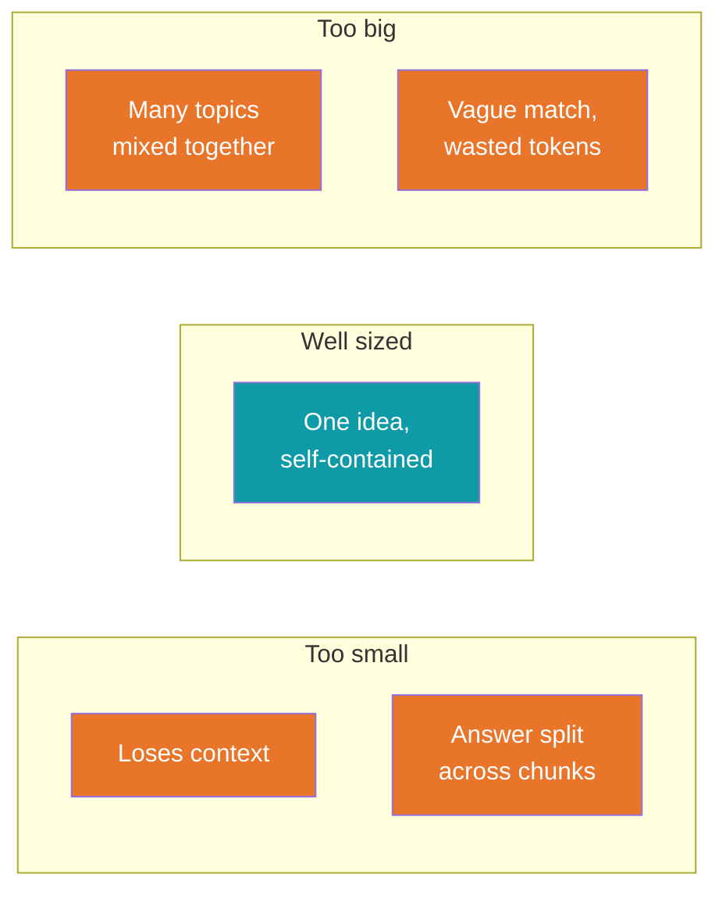
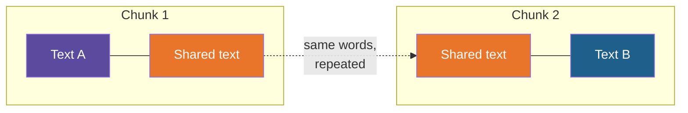
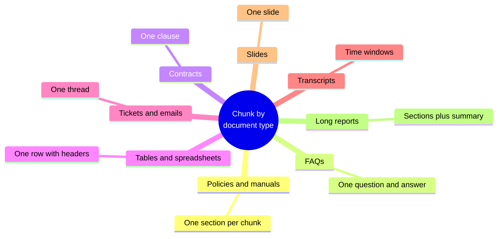
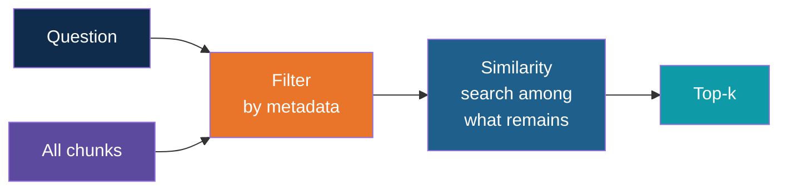

# Chunking and Metadata Filtering

<!-- Slide deck in markdown. Each block between the --- lines is one slide.
     Trainer notes are in HTML comments and do not show in the preview.
     All documents, names, sizes and numbers in this deck are made up for teaching. Sizes are starting points, not rules. -->

---

# Chunking and Metadata Filtering

## Cut the documents well, label every piece, and the search gets sharper

**Day 4 | Block 2: Ingestion and Chunking**

<!-- Trainer: this is the 40-minute block, including Lab 1. Spend about 25 minutes on these slides and keep the rest for the lab. -->

---

## Where We Are in the Workflow

Steps 1 and 2 (orange) happen before any AI is involved, yet they quietly decide how good the final answer can be.

> The LLM only sees what retrieval hands it. Retrieval can only find what chunking made findable.

---

## Before Chunking: Load and Clean

| Source | Watch out for |
|---|---|
| Text-based PDF | Headers, footers and page numbers repeated on every page |
| Scanned PDF | It is a picture, so it needs OCR (text recognition) first |
| Word and web pages | Menus, navigation and boilerplate mixed in with the content |
| Spreadsheets | Merged cells and headers far from the data |
| Multi-column pages | Text read straight across, mixing two columns into nonsense |

Clean text in, clean chunks out. Remove the noise **before** cutting, or it ends up in every chunk and into the search.

---

# Part 1

## Why chunking matters

---

## The Index Card Idea

Imagine you must answer questions from a 300-page manual, but you can only hand your friend a few cards.

| If the cards are... | What happens |
|---|---|
| **Whole chapters** | The answer is on the card, but buried among 40 other things |
| **Single sentences** | The card is neat, but says "it expires after 6 days" with no mention of what *it* is |
| **One idea per card, with a title** | Your friend finds the right card and understands it at once |

A **chunk** is one such card. Good chunks are **small enough to be specific** and **large enough to make sense alone**.

---

## Chunk Size Changes What Retrieval Finds

| | Too small | Too big |
|---|---|---|
| Embedding | Too little meaning to place well | Averages many topics into a blur |
| Retrieval | Misses the answer, or finds only a fragment | Right chunk found, but the answer is a needle in a haystack |
| LLM prompt | Missing context, so a poorer answer | Many irrelevant words, so higher cost and more distraction |

---

## Example: A Cut in the Wrong Place

Our made-up leave policy has this passage:

> *"Unused paid leave up to 6 days carries forward to the next year. This does not apply to employees in their first year, who cannot carry forward any leave."*

A fixed cut falls **between the two sentences**.

| Chunk | Text |
|---|---|
| Chunk 7 | "Unused paid leave up to 6 days carries forward to the next year." |
| Chunk 8 | "This does not apply to employees in their first year, who cannot carry forward any leave." |

A first-year employee asks: *"How many leave days can I carry forward?"*

Chunk 7 matches best and gets retrieved. Chunk 8 does not. The assistant answers **"6 days"**, politely and confidently, and it is **wrong** for this person.

> The documents were fine, the embedding was fine, the LLM was fine. The cut was wrong.

---

## Example: A Chunk That Is Too Big

The same policy, chunked as whole 2,000-word sections. The assistant retrieves the top 3 chunks.

| | 2,000-word chunks | 300-word chunks |
|---|---:|---:|
| Words sent to the LLM (top 3) | 6,000 | 900 |
| Approx. tokens sent | 8,000 | 1,200 |
| Share of it that is relevant | A few sentences | Most of it |
| Cost per question | About 7 times higher | Baseline |

Recall the Day 1 lesson on tokens: sending less, but the right less, is cheaper and clearer for the model.

---

# Part 2

## Size and overlap

---

## Starting Point for Size

| Setting | Typical starting point | Notes |
|---|---|---|
| Chunk size | A few short paragraphs, roughly 150 to 400 words | Stay under the embedding model's input limit |
| Overlap | About 10 to 20 percent of the chunk | Repeats the end of one chunk at the start of the next |
| Top-k | 3 to 5 | Chosen later in Block 5 |

These are **starting points**. The right values depend on the document type (Part 3) and are settled by testing, not guessing.

---

## Overlap: The "Previously On..." Recap

A TV episode opens with a short recap of the last one, so a viewer who joins late is not lost. **Overlap** does the same for chunks.

| With overlap | Without overlap |
|---|---|
| An idea that straddles the cut appears whole in at least one chunk | The idea may be cut in half |
| Slightly more chunks and storage | Fewer chunks |

For a 10,000-word document at 300 words per chunk: about **34 chunks** without overlap, about **40** with 15 percent overlap. A small price for fewer cuts in the wrong place.

> Overlap is a safety net, not a cure. Cutting at natural boundaries (next part) matters more.

---

# Part 3

## Chunking approaches

---

## The Main Approaches

| Approach | How it cuts | Strength | Weakness |
|---|---|---|---|
| **Fixed size** | Every N words, regardless of content | Simple and predictable | Cuts mid-sentence or mid-idea |
| **Sentence or paragraph** | At natural breaks, grouped up to a size | Keeps ideas intact | Chunk sizes vary |
| **Structure-aware** | By headings, sections, clauses, rows | Mirrors how the author organised it | Needs a document with real structure |
| **Semantic** | Where the topic changes, detected by comparing neighbouring sentences | Cuts follow meaning | Slower, and harder to predict |
| **Parent and child** | Search small chunks, but hand the LLM the larger section around the match | Precise search, rich context | More to set up |

**Rule of thumb:** cut along the lines the document already has. Fall back to fixed size only when there is no structure.

---

## Parent and Child, in Plain Words

Think of **a book's index**: it points you to an exact page (small and precise), but you then read the whole page for context.

This fixes the "too small versus too big" tension: the small piece **finds**, the big piece **explains**. An overview here is enough for Day 4. Treat it as an extension after the labs.

---

# Part 4

## Best approach for each kind of document

---

## One Size Does Not Fit All

The question to ask for every document type: **what is the smallest piece that still answers a question on its own?**

---

## Policies and Manuals

| | |
|---|---|
| **Shape** | Headings, numbered sections, paragraphs |
| **Best approach** | Structure-aware: one section or sub-section per chunk. If a section is long, split it by paragraph |
| **Keep with each chunk** | The section title and number |
| **Example** | Chunk "4.2 Carry-forward of Leave", with the heading text attached. The first-year exception stays in the same chunk |
| **Avoid** | Cutting by a fixed word count across headings |

---

## FAQs and Help Articles

| | |
|---|---|
| **Shape** | Short question, short answer, repeated |
| **Best approach** | **One question plus its answer per chunk.** Do not split them and do not merge several |
| **Why** | A user's question often resembles the FAQ question itself, so the match is very strong |
| **Example** | Chunk: "Q: How do I reset my password? A: Open Settings, choose Security, then select Reset" |
| **Avoid** | Chunking by size, which may separate an answer from its question |

---

## Contracts and Legal Text

| | |
|---|---|
| **Shape** | Numbered clauses, definitions, cross-references |
| **Best approach** | One clause per chunk, with the clause number and title kept. Add a little overlap |
| **Watch out** | Clauses refer to others ("subject to clause 9.3"). A defined term, such as "the Supplier", may be explained on page 1 |
| **Help** | Parent and child chunking, or metadata with the clause number so the cited clause can be found |
| **Example** | Search finds clause 14.2 on payment terms. The parent view also shows the definitions it relies on |

---

## Tables and Spreadsheets

| | |
|---|---|
| **Shape** | Rows and columns, with headers at the top |
| **Problem** | A lone row such as "12, 3, 450" means nothing without its headers |
| **Best approach** | One row per chunk, **with the column names written into the chunk** as readable text |
| **Example** | Before: "12, 3, 450". After: "Item: Cement bags. Quantity: 450. Delivery: 12 March. Supplier: Supplier A" |
| **Avoid** | Splitting a table by word count, which cuts rows in half and separates the headers |

---

## Tickets, Emails and Chats

| | |
|---|---|
| **Shape** | A thread: subject, messages back and forth, a resolution |
| **Best approach** | One thread per chunk, or one issue plus its resolution. For a very long thread, split by groups of messages and repeat the subject in each |
| **Keep with each chunk** | Subject, date, product, and the final resolution |
| **Example** | Chunk: "Subject: Model X200 shows E14. Customer says the drum won't spin. Resolution: replace the door lock sensor" |
| **Avoid** | One message per chunk, because a lone "Thanks, that worked!" carries no meaning |

---

## Transcripts and Long Reports

| Document | Best approach | Keep with each chunk |
|---|---|---|
| **Meeting or call transcript** | Windows of a few minutes, or by topic change, with overlap. People change subject without headings | Speaker, timestamp, meeting title |
| **Long report or research paper** | By section, plus a short summary chunk per section or for the whole document | Section title, page number |
| **Slide deck** | One slide per chunk, together with its speaker notes. Titles often carry the meaning | Slide number, deck title |
| **Product catalogue** | One product per chunk | Product name, category, model |

---

## Which Approach, at a Glance

| Document | Chunk unit | Overlap needed? | Most important metadata |
|---|---|---|---|
| Policy or manual | Section | Small | Section title, version |
| FAQ | Question and answer | No | Topic |
| Contract | Clause | Small | Clause number |
| Table | Row, with headers | No | Table name |
| Ticket or email thread | Thread or issue | No | Product, date |
| Transcript | Time window | Yes | Speaker, timestamp |
| Long report | Section plus summary | Small | Section, page |

---

# Part 5

## Metadata and filtering

---

## Labels on the Index Cards

**Metadata** is information about a chunk, stored next to it: a label on the card.

| Metadata | Example |
|---|---|
| Source document | "Leave Policy" |
| Page or section | "Page 4, Section 4.2" |
| Document type | Policy, manual, ticket |
| Date or version | "Version 2025" |
| Product, department or project | "Model X200", "HR" |
| Language | English, Hindi |
| Who may see it | "All staff", "Managers only" |

Attach metadata **when you chunk**. It is very hard to rebuild afterwards.

---

## Two Jobs for Metadata

| Job | What it gives you |
|---|---|
| **Citations** | "Answer from the Leave Policy, page 4" because every chunk knows where it came from (Block 6) |
| **Filtering** | The search can be limited to the right documents before it starts |

---

## Filtering: Narrow Before You Search

Semantic search is **fuzzy**: it finds the closest meaning. Filtering is **exact**: it keeps only chunks whose label matches. Together they are stronger than either alone.

Think of a **library**: you first walk to the right section ("Law, 2025 editions"), then scan the shelf for the closest title. You do not scan the whole library.

---

## Example: Old and New Versions

The knowledge base holds three versions of the same policy.

| Chunk | Source | Version | Text (short) |
|---|---|---|---|
| 1 | Leave Policy | 2023 | "Employees get 10 days paid leave" |
| 2 | Leave Policy | 2024 | "Employees get 11 days paid leave" |
| 3 | Leave Policy | 2025 | "Employees get 12 days paid leave" |

The question is: *"How many paid leave days do I get?"*

| | Result |
|---|---|
| **No filter** | All three chunks look equally close in meaning. The assistant may quote 10 or 11, or mention all three |
| **Filter: version = 2025** | Only chunk 3 can be found. The answer is 12 days |

---

## Example: The Support Agent

Manuals for different models contain very similar troubleshooting sections.

| Chunk | Product | Text (short) |
|---|---|---|
| 21 | X100 | "Error E14: check the water inlet valve" |
| 22 | X200 | "Error E14: replace the door lock sensor" |
| 23 | X300 | "Error E14: reset the control board" |

Similarity alone cannot tell them apart, because they are nearly identical in meaning. The customer has already told the app they own an **X200**.

| | Result |
|---|---|
| **No filter** | Any of the three may come first. Two out of three are wrong for this customer |
| **Filter: product = X200** | Only chunk 22 is considered. Correct on the first try |

Where does the filter value come from? **Usually from context the app already has**: the logged-in user, the product selected on screen, or the date. It is rarely from the question text.

---

## Example: Who May See This

| Chunk | Source | Access |
|---|---|---|
| 40 | Travel Policy | All staff |
| 41 | Salary Bands | HR only |

Filtering by the user's role means a regular employee's search **never sees chunk 41**, even if it matches their question perfectly.

> A filter is how access control is carried into RAG: a user should never get an answer drawn from a file they could not open themselves.

Filters only work if the label was attached at ingestion. Block 4 shows how vector stores apply them.

---

# Part 6

## Putting it together

---

## If the Answers Are Bad, Look Here

| Symptom | Likely cause | First thing to try |
|---|---|---|
| Right document found, wrong or partial answer | Answer split across chunks | Larger chunks, more overlap, or cut by section |
| Right chunk is missing from the top results | Chunk too big and blurry, or too small and vague | Re-chunk and re-run your test questions |
| Answer from an old or wrong version or product | No filtering | Add version or product metadata, and filter on it |
| Table answers make no sense | Row separated from its headers | One row per chunk, with the headers included |
| Weird gibberish chunks | Poor loading, such as columns or scans | Fix extraction first |
| Citation says "unknown source" | No metadata attached | Add source and page at ingestion |
| User sees content they should not | No access labels | Add access metadata and filter on it |

---

## Test It, Do Not Guess

Use the same method as for choosing an embedding model:

| Step | What to do |
|---|---|
| 1 | Write 10 real questions and note which passage should answer each |
| 2 | Chunk the documents one way, and check whether the right chunk is in the top 3 |
| 3 | Change one thing, such as chunk size, overlap or approach |
| 4 | Run the same questions again and compare |

Change **one thing at a time**, so you know what made the difference.

---

## Lab 1 Tie-In: Ingestion and Chunking

By the end of the lab you should be able to:

| Task | Outcome |
|---|---|
| Load a few synthetic documents of different types | Clean text extracted, with noise removed |
| Chunk them with a size and overlap you chose | A list of chunks of sensible size |
| Attach metadata to each chunk | Source, page or section, and one filter label such as version |
| Inspect the chunks by eye | You can say whether each one makes sense on its own |

---

## Explore It Yourself

No code needed.

| To see... | Try | What to do |
|---|---|---|
| Chunk size and overlap on real text | A chunk visualiser website, for example ChunkViz | Paste a paragraph, change the size and overlap, and watch where the cuts fall. Find a setting that cuts a sentence in half |
| How cuts break meaning | Scissors and a printed page | Print one page of a synthetic policy, cut it into 4 pieces at fixed intervals, then cut it again by headings. Which set could answer a question on its own? |
| Why a chunk needs context | A local model in Ollama chat | Paste only the second chunk from the carry-forward example and ask the leave question. Then paste both and compare |
| Filtering by hand | A pen and a short table | Write 6 chunks with a version label. Pick a question and cross out every chunk with the wrong label before choosing the best match |

<!-- Trainer: open the website before class; tools and names change. Use only synthetic documents. -->

---

## Remember These Four Things

1. **Chunking decides what can be found.** Too small loses context, too big blurs the match
2. **Cut along the document's own structure**: sections, FAQ pairs, clauses, table rows, threads
3. **Overlap** is a safety net, and size and overlap are settled by testing
4. **Metadata** on every chunk gives you citations and filters, and filters rescue you when many chunks look alike

---

## Next Up

**Embeddings:** turning each chunk into a vector, and why the chunk size you chose affects how well it can be placed (Lab 2).

---

*Prepared for Kalpataru Projects | AIM ADaSci | Confidential*
