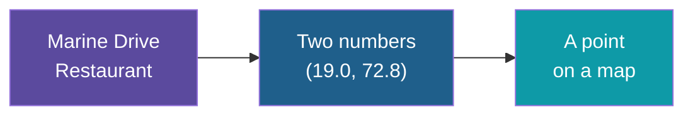
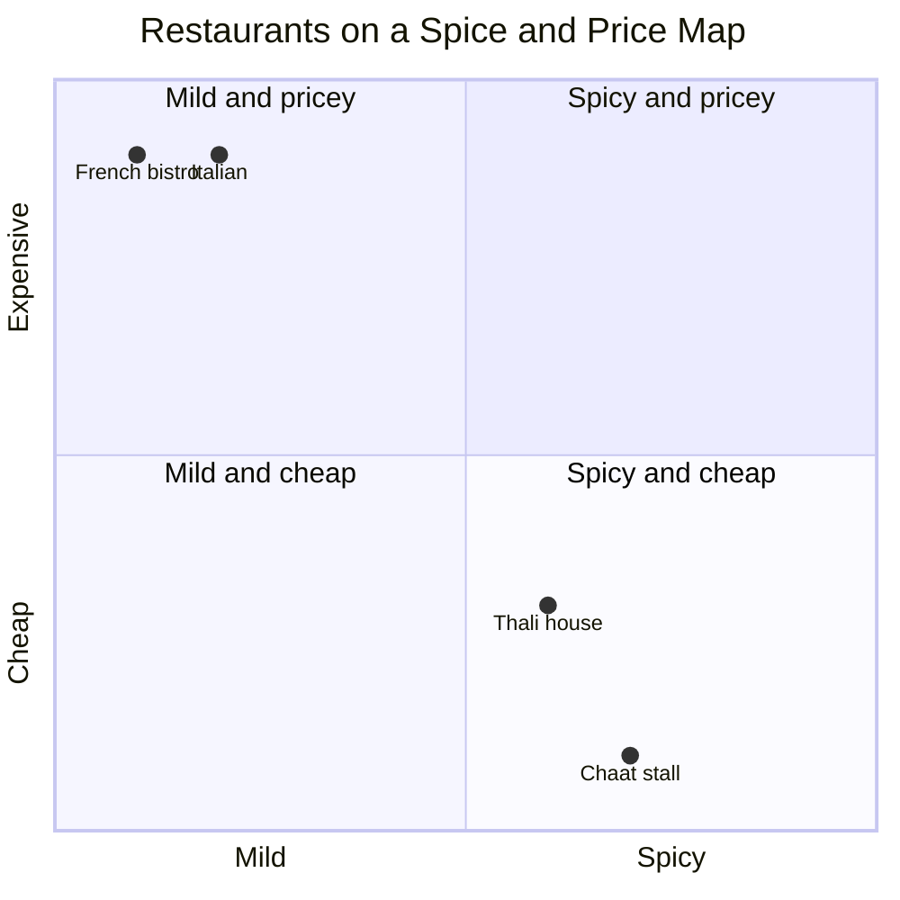
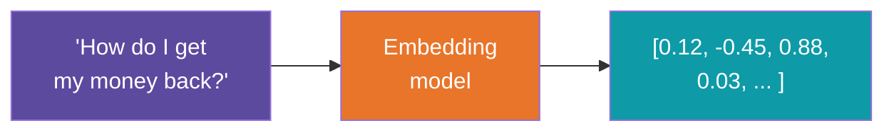
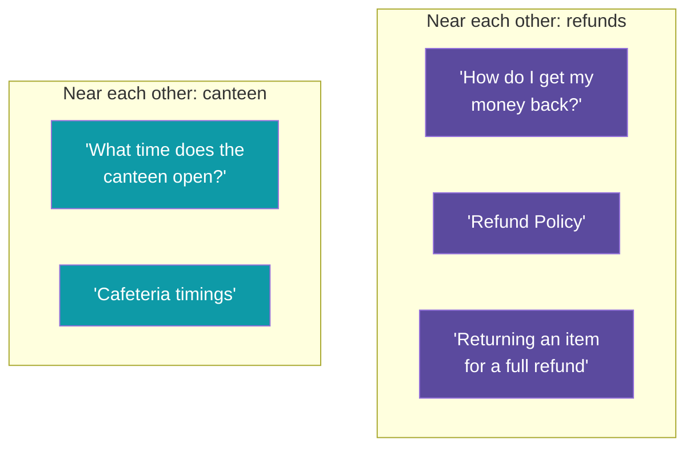
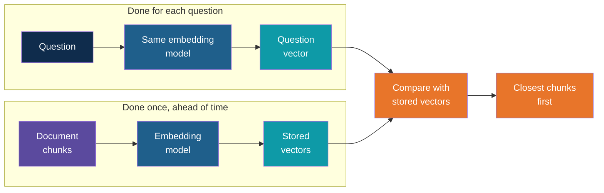

# Vectors, Embeddings and Semantic Search

<!-- Slide deck in markdown. Each block between the --- lines is one slide.
     Trainer notes are in HTML comments and do not show in the preview.
     All numbers in this deck are made up to teach the idea. Real embeddings are much longer. -->

---

# Vectors, Embeddings and Semantic Search

## How a computer learns that two sentences mean the same thing

**Day 4 | Block 3: Embeddings**

<!-- Trainer: about 25 minutes. Do the "map" and "restaurant" slides slowly. Everything later depends on them. -->

---

## The Problem to Solve

A customer types:

> *"How do I get my money back?"*

The company's document is titled:

> *"Refund Policy"*

Not one word is shared. A human sees the match instantly. A computer that only matches
words sees nothing.

| | Words the question uses | Words the document uses |
|---|---|---|
| Question | get, money, back | |
| Document | | refund, policy |
| **Overlap** | **None** | |

To find the right passage, the computer must compare **meaning**, not spelling.

---

# Part 1

## Numbers can describe things

---

## Describing a Place with Two Numbers

How do you tell a friend exactly where a restaurant is? You do not describe it in words.
You give **two numbers**: its latitude and longitude.

Two useful facts about these numbers:

- **Places with similar numbers are near each other.**
- You can tell how close two places are without knowing their names.

---

## Describing Restaurants with Two Different Numbers

Let us invent a map that is not about location. Score each restaurant on two things, from 0
to 10:

| Restaurant | Spiciness | Price |
|---|:---:|:---:|
| Street-side chaat stall | 7 | 1 |
| Local thali house | 6 | 3 |
| Fine-dining Italian | 2 | 9 |
| Luxury French bistro | 1 | 9 |

Each restaurant is now a pair of numbers, for example **(7, 1)**. A list of numbers like this
is called a **vector**.

The chaat stall and the thali house sit **close together**. The Italian and French places
sit close to each other, far from the first pair. **Similar things end up near each other.**

---

## That Is All a Vector Is

> A **vector** is just a list of numbers that describes something.

| Thing | Its vector | What each number could mean |
|---|---|---|
| A place on a map | (19.0, 72.8) | Latitude, longitude |
| A colour on screen | (255, 140, 0) | Amount of red, green, blue (this one is orange) |
| A restaurant | (7, 1) | Spiciness, price |
| A cricketer | (45, 130, 8) | Batting average, strike rate, bowling economy |

Notice the pattern: **close numbers mean similar things.** Two shades of orange have nearly
the same red, green and blue values.

---

# Part 2

## From things to meaning: embeddings

---

## What Is an Embedding?

Restaurants are easy to score because we chose the two scales ourselves. Sentences are
harder: what scale measures the "meaning" of *"How do I get my money back?"*

An **embedding model** is a trained AI model that does this job. You give it text, and it
returns a **vector that captures the meaning** of that text.

An **embedding** is the vector the model produces for a piece of text. The words
"embedding" and "vector" are often used interchangeably in practice.

---

## How Many Numbers?

Our restaurant used 2 numbers. A real embedding uses **hundreds or thousands**.

| What | Numbers per item |
|---|---:|
| Map location | 2 |
| Colour | 3 |
| Our restaurant example | 2 |
| A typical text embedding | **384 to 3,072** |

Why so many? Meaning has far more sides than "spice" and "price": topic, tone, who is
involved, what action is described, and many more. Each number is one small slice of that.

> Nobody can say what number 217 stands for. The model learned these scales on its own
> from huge amounts of text. We only use the result.

---

## Meaning Becomes Distance

Now the key idea. Sentences about the same thing end up **near each other**, even with
different words.

The question and "Refund Policy" share no words, yet they sit side by side. The canteen
sentences sit in a **different neighbourhood**.

---

## The Supermarket Idea

Think of how a supermarket is arranged. Rice, flour and pulses are in one aisle. Soap and
shampoo are in another. You do not need to know the exact product name: if you can find
the right aisle, you find the right things.

| Supermarket | Embedding space |
|---|---|
| Aisles group related products | Neighbourhoods group related meanings |
| Walk to the right aisle | Search near the question's position |
| Distance between aisles | How different the meanings are |

An embedding model builds an enormous supermarket in which **every sentence has its own
shelf position**, and related sentences are on neighbouring shelves.

---

## Measuring "How Close?"

To rank results we need a **similarity score**: a number that says how close two vectors are.

| Pair | Similarity (made-up scores, 0 to 1) | Meaning |
|---|:---:|---|
| "Get my money back" and "Refund Policy" | **0.86** | Very close |
| "Get my money back" and "Returning an item" | **0.79** | Close |
| "Get my money back" and "Cafeteria timings" | **0.12** | Far apart |

The most common measure is called **cosine similarity**. Picture two people pointing
with their arms from the same spot: if they point the same way, the meanings agree. If they
point in different directions, they do not. You do not need the maths. You only need to
know that **a higher score means closer in meaning**.

---

# Part 3

## Semantic search

---

## Keyword Search vs Semantic Search

| | Keyword search | Semantic search |
|---|---|---|
| Matches on | The same **words** | The same **meaning** |
| Like using | Ctrl+F in a document | Asking a well-read colleague |
| "Get my money back" finds "Refund Policy"? | No | **Yes** |
| "Cancel my plan" finds "Terminate subscription"? | No | **Yes** |
| Spelling or phrasing differs | Often fails | Usually fine |
| Exact codes such as "E14" or invoice numbers | **Good** | Can be weak |

Semantic search does not replace keyword search. Each is strong where the other is weak,
and Block 5 returns to combining them (hybrid search).

---

## How Semantic Search Works

> **One rule:** the chunks and the question must be embedded by the **same model**. Two
> different models are like two maps with different scales. Positions on one mean nothing
> on the other.

---

## A Worked Search

Our made-up knowledge base has four chunks. The question is:

> *"Can I return something I bought last week?"*

| Chunk | Text (short) | Similarity | Rank |
|---|---|:---:|:---:|
| A | "Items may be returned within 30 days for a full refund." | **0.88** | 1 |
| B | "Refunds are credited to the original payment method in 5 days." | **0.74** | 2 |
| C | "Our stores are open from 10 am to 9 pm." | 0.21 | 3 |
| D | "Gift cards cannot be exchanged for cash." | 0.18 | 4 |

The question does not contain the words "returned", "30 days" or "refund", yet chunk A wins
by a distance. Taking the top 2 hands chunks A and B to the LLM, which is exactly
**retrieve the top-k** from the RAG workflow.

---

## Where You Already Meet This

| Everyday feature | Embeddings at work |
|---|---|
| "Customers also bought" on a shopping site | Items whose vectors are close |
| "Recommended for you" on a video app | Videos close to ones you watched |
| Searching photos by typing "beach" | Photo and word placed in the same space |
| Spam filters that spot reworded scams | Messages close to known spam |
| Finding duplicate support tickets | Tickets whose vectors are almost the same |

---

# Part 4

## Choosing and using an embedding model

---

## Not All Embedding Models Are Equal

An embedding model is a separate, smaller model from the chat LLM. Common choices come from
the same providers as the LLMs, plus open-weight ones you can run locally.

| Trade-off | What to think about |
|---|---|
| **Quality** | Does it place similar meanings close together for your kind of text? |
| **Languages** | Does it handle Hindi and Gujarati, or only English? Check, because many do not do equally well |
| **Dimensions** | More numbers can capture more detail, but take more storage and search time |
| **Cost and limits** | Cloud models charge per token and have free-tier limits. Local models cost nothing per call |
| **Privacy** | A cloud model receives your text. A local model keeps it on your machine |
| **Input length** | Each model has a maximum text length it can embed at once, which affects chunk size |

---

## Dimensions, Cost and Free-Tier Limits

| Dimensions | What it means in practice |
|---|---|
| Fewer (about 384) | Small and fast, uses little storage, a good start |
| More (about 1,536 to 3,072) | Can capture more nuance, uses several times more storage |

| Free-tier limit | How it shows up | What to do |
|---|---|---|
| Requests per minute | A "rate limit" error | Embed in small batches and pause between them |
| Tokens per day | Embedding stops partway | Start with a small set of documents |
| Many chunks | Slow first run | Embed once, save the results, reuse them |

Embedding is a **one-time cost per chunk**. After that, only each new question needs
embedding, which is tiny.

---

## Things to Keep in Mind

| Remember | Why |
|---|---|
| Similar does not mean correct | A chunk can be close in meaning and still not hold the answer |
| Switching models means re-embedding everything | Old and new vectors live on different "maps" |
| Exact IDs and codes can be missed | "E14" and "E41" may look alike in meaning space |
| Changed document, changed chunk | Re-embed only what changed |
| Quality in, quality out | Poorly chunked text gives poorly placed vectors |

---

## Explore It Yourself

No code needed.

| To see... | Try | What to do |
|---|---|---|
| Meaning as a map, in 3D | TensorFlow Embedding Projector (projector.tensorflow.org) | Load a word set, click a word such as "king", and see which words sit nearest. Spin the cloud to see neighbourhoods |
| Keyword vs meaning | A document search you already use, such as Ctrl+F in a PDF, then a "chat with your document" tool | Search for "money back" in a document that only says "refund". Ctrl+F finds nothing, the chat tool finds it |
| Similar sentences, different words | A local model in Ollama chat | Ask it to rate how similar in meaning two sentences are. Try a pair with no shared words, then an unrelated pair |
| Your own judgment as the "embedding model" | Pen and paper | Write five sentences from a synthetic policy and one question. Sort the sentences from closest to furthest in meaning. That is what the search does |

<!-- Trainer: open each site before class; tools and features change. Use only synthetic text. -->

---

## Remember These Four Things

1. A **vector** is just a list of numbers that describes something
2. An **embedding** is a vector that captures the **meaning** of text, made by an embedding
   model
3. **Similar meaning means close together**, so closeness can be scored
4. **Semantic search** embeds the question and returns the chunks closest to it, even when
   the words differ

---

## Next Up

**Vector stores:** where all these vectors live, and how a search over thousands of them
stays fast (Lab 3).

---

*Prepared for Kalpataru Projects | AIM ADaSci | Confidential*
