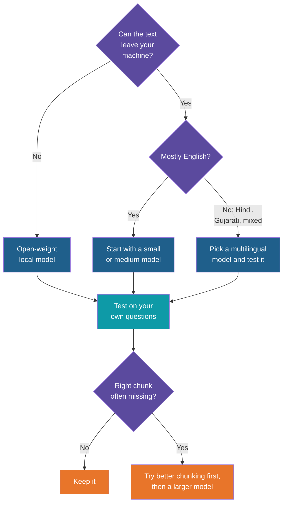

# Embedding Models

<!-- Slide deck in markdown. Each block between the --- lines is one slide.
     Trainer notes are in HTML comments and do not show in the preview.
     Sizes, scores and prices in this deck are illustrative. Check the provider's page for real values. -->

---

# Embedding Models

## The translator that turns text into meaning-numbers

**Day 4 | Block 3: Embeddings (second note)**

<!-- Trainer: about 15 minutes, taken from the Block 3 time. Assumes the vectors and semantic search note has been covered. -->

---

## Quick Recap

An **embedding model** takes text in and gives a **vector** out. Similar meanings get nearby vectors, so the search can compare meaning.

This note is about the orange box: **where it comes from, how models differ, and how to pick one.**

---

## It Is Not the Chat Model

A RAG assistant uses **two different models** for two different jobs.

| | Embedding model | Chat (LLM) model |
|---|---|---|
| Job | Turn text into a vector | Write an answer |
| Output | A list of numbers | Text |
| Used | Ingestion, and once per question | Once per question, at the end |
| Size and cost | Small and cheap | Larger and costlier |
| Can it chat? | No | Yes |

Think of a **librarian and an author**. The librarian finds the right books quickly but writes nothing. The author writes the reply from what the librarian brought.

---

# Part 1

## Where embedding models come from

---

## How a Model Learns Meaning

Nobody types in "refund means money back". The model **learns it from reading an enormous amount of text**, in two stages.

| Stage | Plain meaning |
|---|---|
| **1. Learn language** | Like a child who has read a whole library: it knows how words and sentences work |
| **2. Learn what belongs together** | Like a student given flashcards, each showing a question with its correct answer. After millions of cards, it can tell which texts are about the same thing |

---

## What the Flashcards Look Like

In stage 2 the model is shown pairs that **should be close**, and pairs that **should be far**.

| Pair | Should be |
|---|---|
| A question and the passage that answers it | Close |
| A news headline and its article | Close |
| The same sentence worded two ways | Close |
| A question and an unrelated passage | Far |

After enough rounds the model arranges all text so that matching pairs sit near each other. This is the **supermarket aisle** layout from the previous note, produced by practice.

> It also explains the weak spots. A model that has seen little Gujarati, or little construction jargon, has had few flashcards for it, so it places that text less well.

---

# Part 2

## How models differ

---

## What Varies

| Difference | What it means | Why you care |
|---|---|---|
| **Quality** | How well similar meanings land close together | Better answers found |
| **Dimensions** | How many numbers per vector | Storage and speed |
| **Maximum input** | The longest text it can embed in one go | Limits your chunk size |
| **Languages** | Which languages it was trained on | Hindi, Gujarati, mixed text |
| **Where it runs** | Cloud API, or on your own machine | Privacy, cost, limits |
| **Price and speed** | Per token in the cloud, or your hardware locally | Budget and time |

---

## Two Families

| | Cloud embedding API | Open-weight local model |
|---|---|---|
| How you use it | Send text over the internet, get vectors back | Download once, run on your laptop or server |
| Examples (verify current names) | Gemini, OpenAI and other provider embedding models | Open models such as BGE, E5, Nomic and MiniLM, run via Ollama or similar |
| Strength | Strong quality, nothing to install | Free per call, text never leaves your machine |
| Limit | Free-tier quotas, and your text is sent out | Limited by your hardware, usually a little behind the best cloud models |
| Good for | Best quality, small volumes | Practice, private documents, large volumes |

In class we use whichever the trainer provides, free tier only.

<!-- Trainer: model names change quickly. Confirm the names you show are current and available on the classroom setup. -->

---

## Dimensions, Seen as Storage

Every chunk stores one vector. More dimensions means more space.

Each number takes about 4 bytes. For **10,000 chunks**:

| Dimensions | Storage for vectors |
|---:|---:|
| 384 | about 15 MB |
| 768 | about 31 MB |
| 1,536 | about 61 MB |
| 3,072 | about 123 MB |

For a **million chunks**, the first is about 1.5 GB and the last about 12 GB. Small for a laptop in class, but it adds up in a company-wide system, and bigger vectors also mean slower searches.

> More dimensions can capture more nuance, but with sharply diminishing returns.

---

## Maximum Input and Chunk Size

An embedding model can only read so much text at once. Longer text is cut off, and the cut part is **silently ignored**.

| Chunk size | Result |
|---|---|
| Within the model's limit | Whole chunk is embedded |
| Over the limit | Only the beginning is embedded, and the rest is invisible to search |

So the model's input limit sets an upper bound on chunk size. Check it when you choose a model, then keep chunks comfortably under it.

---

# Part 3

## Does a bigger model help?

---

## Small, Medium, Large

| | Small model | Large model |
|---|---|---|
| Typical dimensions | 384 | 1,536 to 3,072 |
| Speed and cost | Fast and cheap | Slower and costlier |
| Plain English documents | Usually good enough | A little better |
| Subtle or technical text | Misses more | Catches more |
| Hindi, Gujarati, mixed language | Often weak | Usually better, but test it |

Think of **two sorters** in a post office. The experienced one gets nearly every parcel right, even with messy handwriting. The new one gets most of them right, and mistakes the messy ones. For tidy addresses, you would never notice the difference.

---

## The Gains Level Off

Cost and storage keep rising at every step, while quality gains shrink. A very large model is often **not worth it** until you have measured a real problem.

Other fixes often help more than a bigger model, and cost less:

| Fix | Where you meet it |
|---|---|
| Better chunking | Block 2 |
| Adding metadata filters | Blocks 2 and 4 |
| Combining keyword and semantic search | Block 5 |
| Re-ranking the top results | Block 5 |

---

## Leaderboard Scores Are Not Your Scores

Public leaderboards rank embedding models on general test sets. They are a good way to build a **shortlist**, not to pick a winner.

| Leaderboard says | But on your documents |
|---|---|
| Model A is first overall | Model B, smaller, may do better on your type of text |
| Model C is best in English | It may be poor on your Hindi or Gujarati text |

The only score that counts is the one on **your documents and your questions**.

---

# Part 4

## Choosing and testing

---

## How to Choose

---

## A Simple Test You Can Run

You do not need a tool. You need a short list of questions and the passage that should answer each.

| Step | What to do |
|---|---|
| 1 | Write 10 questions a real user would ask, in their own words |
| 2 | For each, note which chunk holds the answer |
| 3 | Run the search with the model and look at the top 3 results |
| 4 | Count how often the right chunk is in the top 3 |
| 5 | Repeat with a second model and compare |

An example result, with made-up numbers:

| Model | Right chunk in top 3 | Notes |
|---|:---:|---|
| Small local model | 7 of 10 | Missed two Hindi questions |
| Larger cloud model | 9 of 10 | Missed one that needed an exact code |

A 2-question gain may or may not justify the extra cost. That is now your decision, made on evidence.

---

## Rules That Do Not Bend

| Rule | Why |
|---|---|
| **Embed chunks and questions with the same model** | Different models use different "maps" |
| **Changing the model means re-embedding everything** | Old vectors are meaningless to the new model |
| **Record which model you used** | Otherwise nobody knows later which one the stored vectors belong to |
| **Embed once, save, reuse** | Saves quota and time |
| **Mind free-tier limits** | Embed in batches and pause on rate-limit errors |
| **Never send confidential text to an unapproved endpoint** | A cloud embedding call sends your chunk text outside |

---

## Explore It Yourself

No code needed.

| To see... | Try | What to do |
|---|---|---|
| How models rank | A public embedding leaderboard such as the MTEB leaderboard on Hugging Face | Look at the top models, and compare their dimensions and maximum input |
| What is available locally | The embedding models section of the Ollama model library | Pick two, and compare their size, dimensions and context length |
| Real prices and limits | Your provider's embedding pricing and rate-limit pages | Find the price per million tokens and the free-tier limit, and estimate the cost of embedding 10,000 chunks |
| The post-office test | Pen and paper | Write five questions and five passages from a synthetic document, then pair them by hand. That is what the search is being scored on |

<!-- Trainer: open each page before class; names, dimensions and limits change. Use only synthetic text. -->

---

## Remember These Four Things

1. An embedding model is **separate from the chat model**, and it is trained on huge amounts of text plus matched pairs
2. Models differ in **quality, dimensions, input length, languages and cost**
3. A bigger model helps, but the gains **level off**, so start small and measure
4. Always **test on your own questions**, and use the **same model** for chunks and questions

---

## Next Up

**Vector stores:** where the vectors are kept, and how searches over thousands of them stay fast (Lab 3).

---

*Prepared for Kalpataru Projects | AIM ADaSci | Confidential*
