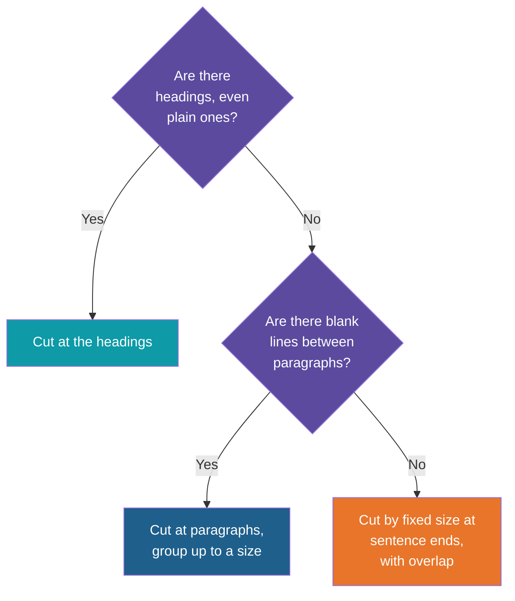
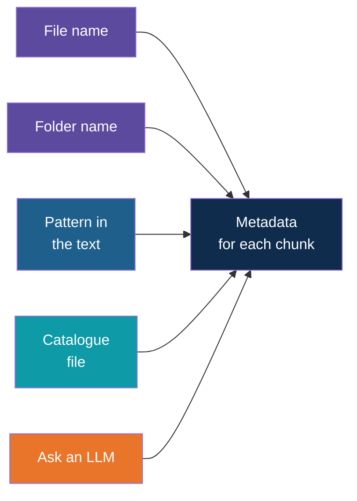

# Chunking and Metadata for Plain Text

<!-- Slide deck in markdown. Each block between the --- lines is one slide.
     Trainer notes are in HTML comments and do not show in the preview.
     All documents, names and numbers in this deck are made up for teaching. Sizes are starting points, not rules. -->

---

# Chunking and Metadata for Plain Text

## When the documents carry no headings and no labels

**Day 4 | Block 2: Ingestion and Chunking (extension)**

<!-- Trainer: about 10 minutes. Best taught after the chunking and metadata filtering note, as a "what if the data is messier" follow-up. -->

---

## Why the Earlier Examples Were Easy

Our sample policies were written with clear headings and labelled details at the top.

| What the file gave us for free | What we used it for |
|---|---|
| A title line | The **source** name |
| Labelled lines (department, version) | **Metadata** for filtering |
| A heading above each section | The **chunk boundary** and the section name for citations |

Software could just read the structure the author had already put there.

> Structure that is written down is cheap. Structure that has to be guessed is where the work is.

---

## The Same Policy, as Plain Text

Many real documents are exported or typed as plain text, with no markup at all.

> *leave policy effective 1 april 2025*
> *paid leave*
> *employees get 12 days of paid leave a year, credited monthly.*
> *carry forward*
> *up to 6 days can be carried forward. this does not apply to first-year employees.*
> *sick leave*
> *10 days a year with a medical certificate for absences over 2 days.*

There are no `#` marks, no labels, and no blank lines. A person sees the sections at once. A program sees one long stream of words.

| Question for the program | What it cannot tell |
|---|---|
| Where does one section end? | No marker says so |
| What is this document called? | The title is just another line |
| What version or department is it? | Nothing is labelled |

---

# Part 1

## Finding the chunk boundaries

---

## Plain Text Still Has Shape

Structure is usually still there. It has just stopped being labelled, so we **detect** it. Start from the strongest clue and fall back to weaker ones.

The further down you go, the more the cuts depend on luck, and the more overlap you need as a safety net.

---

## Four Common Shapes

| What the text looks like | How to chunk it | Watch out for |
|---|---|---|
| **Headings typed as plain lines**, such as `LEAVE POLICY`, `1. Carry Forward` or `Section 4:` | Recognise the pattern (capital letters, a leading number, a trailing colon) and cut there | Headings that are inconsistent across files |
| **Paragraphs separated by blank lines** | Cut at the blank lines, then join short paragraphs until the chunk reaches a sensible size | One-line paragraphs that carry no meaning alone |
| **A wall of text** | Fixed-size chunks of about 300 words, cut at sentence ends, with about 15 percent overlap | The cut falling in the wrong place |
| **Emails, tickets and chat logs** | Cut at the message separator, such as a "From:" line or a timestamp, and keep a thread together | A one-word reply becoming its own chunk |

---

## Example: A Wall of Text Goes Wrong

Take the leave policy above, with no breaks, and cut it every 20 words.

| Chunk | Text |
|---|---|
| 1 | "leave policy effective 1 april 2025 paid leave employees get 12 days of paid leave a year, credited monthly. carry forward up to 6 days" |
| 2 | "can be carried forward. this does not apply to first-year employees. sick leave 10 days a year with a medical certificate" |

The cut falls **inside the carry-forward rule**, and the first-year exception lands in a different chunk from the rule it changes. This is the same failure as in the chunking note, now made much more likely.

| With overlap of about 15 percent | Effect |
|---|---|
| Last few words of chunk 1 repeat at the start of chunk 2 | The rule and its exception appear together in at least one chunk |

Overlap does not make a bad cut good. It makes sure the neighbours share the words around the cut.

---

## Clean First

Plain text often arrives untidy. Clean it **before** cutting, or the noise lands in every chunk.

| Mess | Fix |
|---|---|
| Line breaks in the middle of sentences, left by a PDF export | Join the lines back into sentences |
| Page numbers and repeated headers or footers | Remove them |
| Extra spaces and blank lines | Collapse them |
| Odd characters from a bad export | Replace or drop them |
| Hyphenated words split across lines | Rejoin them |

Check a few chunks by eye afterwards. If a chunk reads badly to you, it will embed badly too.

---

# Part 2

## Getting metadata without labels

---

## Where Metadata Can Come From

In the structured files, the author labelled the details. In plain text, we have to **collect them from somewhere else**.

---

## The Options, Compared

| Source | Example | Reliability | Effort |
|---|---|---|---|
| **File name** | `leave_policy_2025.txt` gives source "Leave Policy" and version 2025 | High, if names are consistent | Very low |
| **Folder name** | `docs/hr/leave.txt` gives department "HR" | High | Very low |
| **File properties** | Date last modified | The date of the file, not of the policy | Very low |
| **Pattern in the text** | A first line such as "Effective 1 April 2025" | Medium, as wording varies | Medium |
| **A catalogue file** | A small table beside the documents listing source, department and version for each | Highest | Someone must keep it up to date |
| **Ask an LLM** | Give the first page to the model and ask for the title, department and version | Flexible, but can be wrong | Extra cost per document |

**Start with the file and folder names.** They cost nothing and are right most of the time. A short naming rule for the document owners, agreed at the start of a project, is worth more than clever extraction later.

---

## Example: One Folder, Real Metadata

A tidy folder can supply nearly everything the filters need.

| File path | Source | Department | Version |
|---|---|---|---|
| `hr/leave_policy_2025.txt` | Leave Policy | HR | 2025 |
| `hr/leave_policy_2024.txt` | Leave Policy | HR | 2024 |
| `it/laptop_policy_2025.txt` | Laptop Policy | IT | 2025 |
| `finance/expense_policy_2025.txt` | Expense Policy | Finance | 2025 |

With this, the filters from the chunking note work again: filter on version 2025 to avoid old policies, or on department to keep the search to the right area.

---

## What Citations Look Like Now

Section names came from headings. Without headings, the citations are coarser.

| Chunking method | What a citation can say |
|---|---|
| By heading | "Leave Policy, Carry Forward" |
| By paragraph | "Leave Policy, paragraph 7" |
| By fixed size | "Leave Policy, chunk 12" |
| By page, if the file keeps page breaks | "Leave Policy, page 4" |

A reader can still go and check, but it takes longer. If citations matter, keep **page or paragraph numbers** while chunking. They cannot be recovered afterwards.

---

# Part 3

## Putting it together

---

## Structured vs Plain Text, Side by Side

| | Structured files (headings, labels) | Plain text |
|---|---|---|
| Chunk boundaries | Read from the headings | Detected, or approximated by size |
| Chunk quality | Whole sections, one idea each | Varies with how good the detection is |
| Overlap needed | Little | More |
| Metadata | Read from labels | From file names, folders, patterns or a catalogue |
| Citation | Section name | Paragraph, page or chunk number |
| Effort in preparation | Low | Higher |
| Risk of a wrong cut | Low | Higher |

> Same pipeline, same models, same question. The difference in answer quality often comes from the preparation, not from the AI.

---

## When You Can Choose, Improve the Source

| Option | Effect |
|---|---|
| Ask owners to keep a consistent file naming rule | Free, reliable metadata |
| Keep documents in a few clearly named folders | Free department or area filters |
| Export documents with headings kept, where the tool allows | Structure survives |
| Write new documents with clear headings from the start | The easiest fix of all |

It is often cheaper to improve how documents are written than to build ever more careful detection.

---

## Explore It Yourself

No code needed.

| To see... | Try | What to do |
|---|---|---|
| Boundaries in unlabelled text | Pen and highlighter | Print a page of synthetic plain text. Mark where you would cut. List the clues you used (a short line, capital letters, a number). Those are the rules a program needs |
| A bad cut | A chunk visualiser website, for example ChunkViz | Paste a plain-text paragraph, use a small chunk size with no overlap, and find a cut that separates a rule from its exception. Add overlap and compare |
| Missing context | A local model in Ollama chat | Paste only the second chunk from the wall-of-text example and ask the carry-forward question. Then paste both chunks |
| Metadata from names | A folder on your computer | List five file names and write down the source, department and version you can read from them. Then rename one badly and see what is lost |

<!-- Trainer: open the website before class; tools and names change. Use only synthetic documents. -->

---

## Remember These Four Things

1. Plain text has structure but **no labels**, so boundaries and metadata have to be detected or supplied
2. Chunk with the **strongest clue available**: headings, then paragraphs, then fixed size with overlap
3. **File and folder names** are the cheapest source of metadata, and a naming rule makes them reliable
4. Keep **page or paragraph numbers** while chunking, or citations get vague

---

## Next Up

**Embeddings:** turning each chunk into a vector, and why chunk size affects how well it can be placed (Lab 2).

---

*Prepared for Kalpataru Projects | AIM ADaSci | Confidential*
