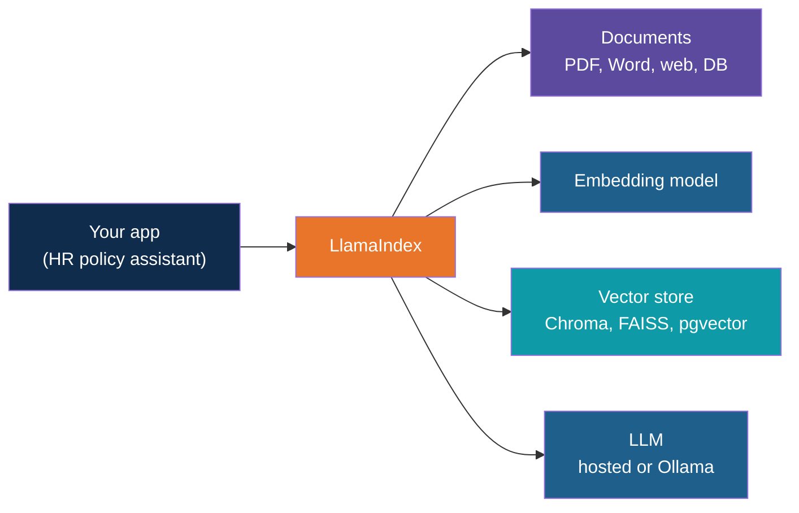
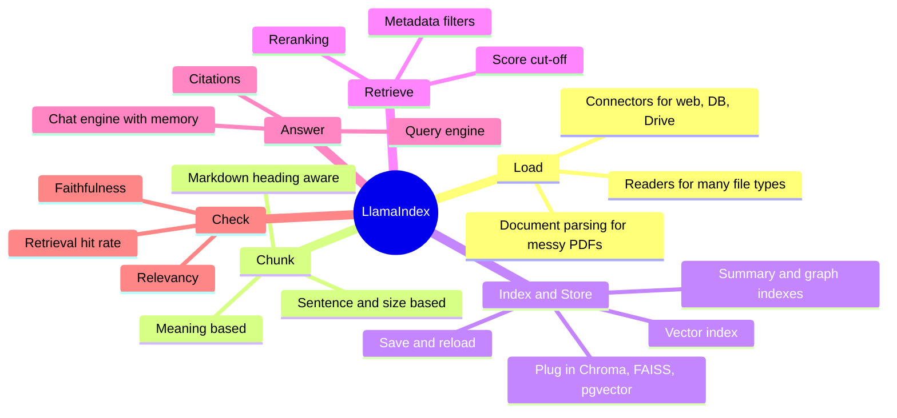
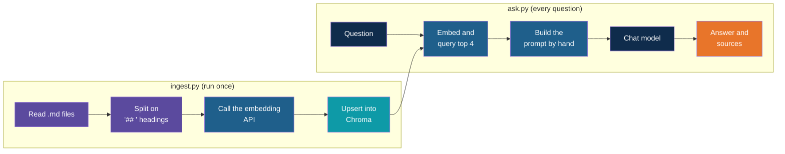
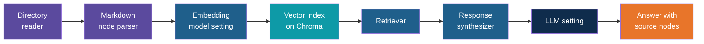
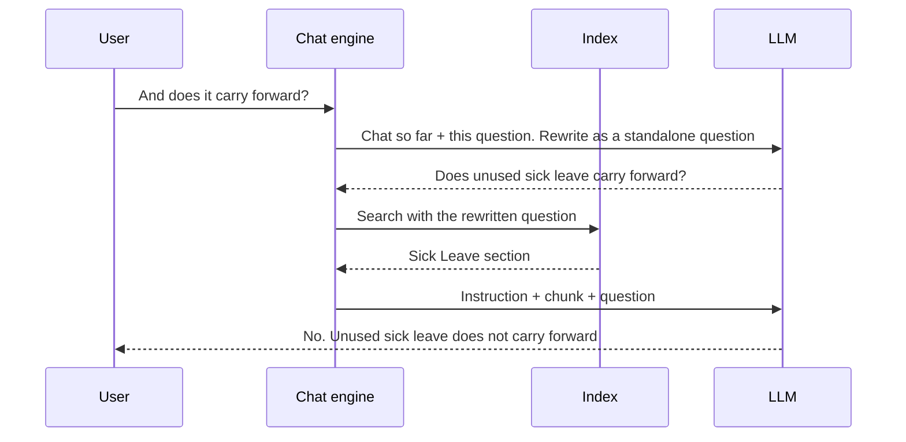

# LlamaIndex and the HR Policy Assistant

<!-- Slide deck in markdown. Each block between the --- lines is one slide.
     Trainer notes are in HTML comments and do not show in the preview.
     All documents, names and numbers in this deck are made up for teaching. -->

---

# LlamaIndex and the HR Policy Assistant

## A toolbox for the RAG pipeline you just built by hand

**Day 4 | Extension after Blocks 1 to 6: Frameworks for RAG**

<!-- Trainer: about 15 minutes. Teach this only after trainees have run ingest.py and ask.py. The point is "now you know what each box does, so you can judge what a framework saves you". Check class names against the current LlamaIndex docs; the library changes quickly. -->

---

## Hand-Built Versus Ready-Made

You can make tea from scratch: boil water, measure leaves, time the steep. Or you can use a
well-stocked kitchen where the kettle, strainer and timer already exist.

| | Hand-built RAG (our app) | With LlamaIndex |
|---|---|---|
| You write | Every step: load, split, embed, store, search, prompt | The choices: which loader, which splitter, which store |
| You learn | Exactly what each step does | Which ready-made part to pick |
| Best for | Understanding, small and fixed jobs | Growing apps with changing documents |

> We built it by hand **first** so that the toolbox does not feel like magic.

---

## What LlamaIndex Is

**LlamaIndex** is a free, open-source Python library for building apps that answer questions
over your own documents. It supplies ready-made parts for every step of the RAG workflow
from Block 1.

| It is | It is not |
|---|---|
| A toolbox that connects your documents, an embedding model, a vector store and an LLM | An LLM. It still calls GPT, Gemini, Llama or another model |
| A set of ready-made loaders, splitters, retrievers and evaluators | A vector database. It sits in front of Chroma, FAISS or pgvector |
| Model-agnostic: hosted or local (Ollama) | Tied to one vendor |

---

## Where It Sits

Think of a **universal travel adapter**. The app plugs into one thing, and LlamaIndex
handles the different sockets behind it.

---

## The Building Blocks

Six words cover most of LlamaIndex. Each has a plain-language meaning and a counterpart in
our app.

| Term | Plain meaning | In our app today |
|---|---|---|
| **Document** | One loaded source, such as a file | One file in docs/ |
| **Node** | One chunk, carrying its text, metadata and links to neighbours | One entry in the texts and metadatas lists |
| **Index** | The searchable collection of nodes, usually vector-based | The Chroma collection |
| **Retriever** | Finds the top-k nodes for a question | The collection query call in ask.py |
| **Query engine** | Retriever plus prompt plus LLM: question in, answer out | The whole body of the ask.py loop |
| **Chat engine** | A query engine that remembers the conversation | Does not exist yet |

---

## Features at a Glance

---

## The Features by RAG Step

| RAG step (Block 1) | What LlamaIndex offers |
|---|---|
| 1. Load | A directory reader that handles Markdown and text out of the box, and PDF, Word and more once a reader package is added. It records file name and path as metadata. Many connectors for other sources |
| 2. Chunk | Splitters by size with overlap, by sentence, by Markdown heading, or by meaning. Each node keeps a link to its document and its neighbours |
| 3. Embed | One setting chooses the embedding model, hosted or local, applied to both documents and questions so they always match |
| 4. Store | A vector index over Chroma, FAISS, pgvector and many others, with save and reload |
| 5. Retrieve | Top-k, metadata filters, similarity cut-off, and optional reranking of the results |
| 6. Generate | A response synthesizer that builds the prompt, with editable templates. It copes when the chunks together are too long for one prompt |
| After | Source nodes on every answer for citations, plus built-in evaluators |

---

# Our Application

## The HR policy assistant, with and without it

---

## The App Today

The assistant has two scripts and about 60 lines of code. Every box below is code we wrote.

It works, and it teaches well. The rest of this deck is about what happens when the
documents and the questions get harder.

---

## The Same App with LlamaIndex

Same six steps, same documents, same Chroma store, same models. The hand-written parts
become ready-made parts.

The win is not fewer lines. The finished LlamaIndex version is about the same size, and
the same lines now also give memory, a similarity cut-off and scores. Hand-written glue
becomes configuration, and the next slides show what that buys.

---

## Eight Ways It Can Make the App Better

| # | Gap in our app today | What LlamaIndex adds | Day 4 block |
|---|---|---|---|
| 1 | Reads only .md files. Real policies arrive as PDF and Word | A directory reader for many formats, with file metadata attached | 2 |
| 2 | Splits on "## " by hand. A file with no headings breaks it, and a very long section stays one huge chunk | A Markdown-aware parser that keeps the heading path as metadata, plus size-based splitting with overlap as a fallback | 2 |
| 3 | Re-embeds every chunk on every run. Sections deleted from a document stay in the store | An ingestion pipeline that fingerprints each document, re-embeds only what changed, and can remove what was deleted | 2, 4 |
| 4 | Always returns 4 chunks, even for "What is the capital of France?". Only the prompt stops a bad answer | A similarity cut-off that drops weak matches, and optional reranking so the best chunk comes first | 5 |
| 5 | Cannot filter. A question about leave can still pull a laptop chunk | Metadata filters such as department, policy name or version | 2, 5 |
| 6 | No memory. Every question stands alone | A chat engine that rewrites a follow-up into a full question before searching | 5 |
| 7 | Prints source names, but the answer text has no citations | Source nodes with scores on every answer, and a query engine that numbers citations inside the answer | 6 |
| 8 | No way to measure quality. Changes are judged by feel | Evaluators for faithfulness, relevancy and retrieval hit rate | 6 |

<!-- Trainer: do not walk all eight. Pick 3, 6 and 8 for the examples that follow, and let the table stand for the rest. -->

---

## Example 1: A Follow-Up Question

Ask the current app two questions in a row:

> *"How many days of sick leave do I get?"*
> *"And does it carry forward?"*

The second question alone says nothing about sick leave. The app searches for those exact
words and will likely return the **paid leave** carry-forward rule, which is a different
rule with a different answer.

A person would never ask "does what carry forward?" back. The chat engine's extra
rewriting step gives the assistant the same common sense.

---

## Example 2: One Policy Changes

HR revises the Leave Policy. One section changes, and an old section is removed.

| | Our app today | With an ingestion pipeline |
|---|---|---|
| What runs | Re-embeds all chunks from all six files | Checks each document's fingerprint. Only the Leave Policy changed |
| Cost | Pays for every embedding again | Pays for the changed document only |
| The removed section | Stays in the store, and may still be quoted as current policy | Can be removed along with the old version |
| Risk | An outdated rule answered with full confidence | The store matches the documents |

> An outdated answer from a stale chunk is exactly the failure RAG was meant to prevent.

---

## Example 3: Checking the Answers

Today the only test is a person reading answers. An evaluator makes this repeatable.

| Check | Question it answers | Example failure |
|---|---|---|
| **Faithfulness** | Does the answer stay inside the retrieved text? | The answer adds "up to 10 days" and no chunk says that |
| **Relevancy** | Does the answer and its context fit the question? | A laptop rule returned for a leave question |
| **Retrieval hit rate** | Did the right chunk appear in the top-k at all? | The Sick Leave section was never retrieved |

Run a fixed list of about 20 questions after every change. If a score drops, the last change
made things worse. This is the Block 6 idea, with the scaffolding supplied.

---

# Using It Well

## What it does not fix

---

## The Trade-Offs

| Cost | What it means in practice |
|---|---|
| **Hidden steps** | A one-line index call hides load, chunk, embed and store. When an answer is wrong you must know which step to open up. This is why we built it by hand first |
| **Fast-changing library** | Class names and imports move between versions. Pin the version and read the current docs |
| **More dependencies** | A bigger install than the two-script app |
| **Defaults are not tuned** | Default chunk size and top-k are generic. Your documents still need the Block 2 and Block 5 thinking |
| **Does not fix bad inputs** | Outdated documents, scrambled tables and missing access control are still your job |

---

## When to Reach for It

| Situation | Choice |
|---|---|
| Six small Markdown files, one-off demo, learning | The hand-built app is enough |
| PDFs and Word files, documents that change, follow-up questions, quality checks needed | LlamaIndex saves real work |
| Teaching a team how RAG works | Hand-built first, then LlamaIndex |
| Many different document collections that need routing, or multi-step reasoning | LlamaIndex has parts for it. Multi-step agents are Day 5 |

Rule of thumb: add the framework when the hand-written glue code starts to grow faster than
the idea it carries.

---

## Explore It Yourself

No code needed to start.

| To see... | Try | What to do |
|---|---|---|
| The memory gap | Run the existing hr-policy-qa app | Ask the sick leave question, then "And does it carry forward?". Read the "Retrieved from" list and see which section came back |
| The weak-match gap | The same app | Ask "What is the capital of France?" and note that four chunks are still retrieved. Only the prompt saved the answer |
| The map between our code and the toolbox | The official LlamaIndex starter tutorial in its documentation | Read it beside ingest.py and ask.py. For each line in the tutorial, find the step it replaces |
| Messy-PDF parsing | The online playground of a document-parsing tool such as LlamaParse | Upload a synthetic PDF with a table and compare the extracted text with a plain copy-paste. Use synthetic documents only |

<!-- Trainer: try each tool before class; free-tier limits and names change. Do not upload any real company document to a hosted parsing service. -->

---

## Remember These Four Things

1. **LlamaIndex** is a toolbox of ready-made parts for every RAG step. It is not a model
   and not a vector database
2. The six words to know: **Document, Node, Index, Retriever, Query engine, Chat engine**
3. For the HR assistant it adds: more file types, smarter chunking, re-embedding only
   what changed, filters and cut-offs, memory, citations and evaluation
4. It does not replace understanding. Know the six steps first, then let the framework
   carry them

---

## Next Up

**Day 5:** agents and agent frameworks, where the assistant stops only answering and starts
deciding which tool to use.

---

*Prepared for Kalpataru Projects | AIM ADaSci | Confidential*
