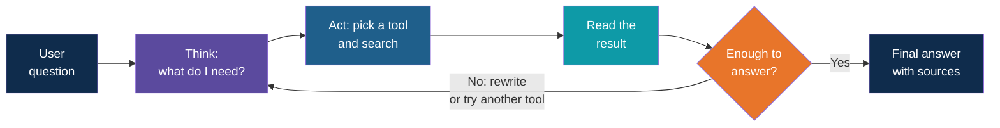
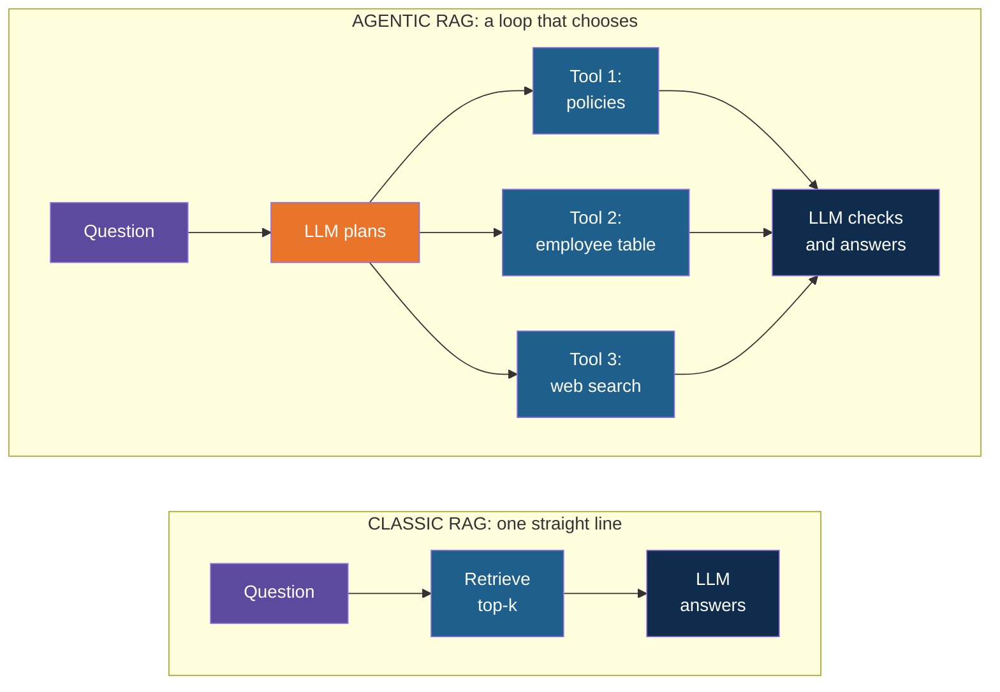
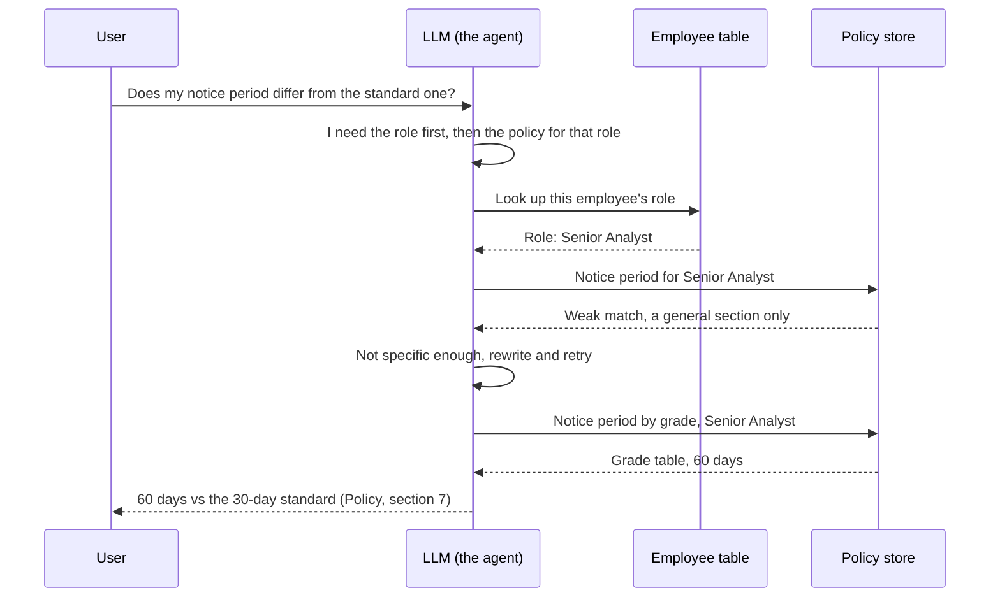
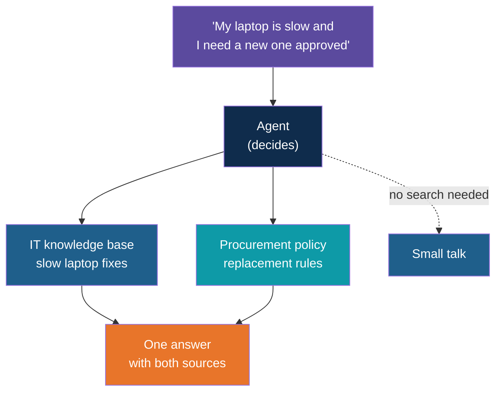

# Agentic RAG

<!-- Slide deck in markdown. Each block between the --- lines is one slide.
     Trainer notes are in HTML comments and do not show in the preview.
     All documents, names and numbers in this deck are made up for teaching. -->

---

# Agentic RAG

## When the assistant decides how to look it up

**Day 4 | Extension to Block 5: Retrieval and Generation (a preview of Day 5)**

<!-- Trainer: about 20 minutes. This is a concept note only. Agent workflows and frameworks are taught on Day 5, so keep this at the level of the idea and the trade-offs. -->

---

## Two Ways to Use a Library

| | Classic RAG | Agentic RAG |
|---|---|---|
| Who runs the search? | A fixed pipeline | The LLM decides |
| How many searches? | Exactly one | As many as needed, including none |
| Where does it search? | One vector store | Any source it is given: documents, a database, the web |
| If the first result is poor? | The LLM answers anyway | It notices, rewrites the query and tries again |

Classic RAG is a vending machine: one button, one result. Agentic RAG is a **research
assistant**: it thinks about the question, picks where to look, reads what it finds and
goes back if the answer is not there yet.

> **Agentic RAG = RAG where the LLM controls the retrieval steps**, instead of following a
> fixed script.

---

# The Problem

## Where classic RAG runs out

---

## Four Questions a Fixed Pipeline Handles Badly

| Question | Why one search is not enough |
|---|---|
| "Compare the leave policy with the travel policy on approval rules" | The answer lives in **two documents**. One search tends to return chunks from only one |
| "What is the notice period for the role I was hired into?" | It first needs **my role** (an employee record), then the policy for that role. Two lookups, in order |
| "What is the weather in Pune today?" | Not in any document. Retrieval returns weak matches and the model may still answer from them |
| "Hi, thanks!" | Needs no lookup at all, yet a fixed pipeline retrieves anyway and wastes tokens |

Classic RAG assumes every question needs **exactly one search in one place**. Real
questions often do not.

---

# The Idea

## Add a decision-maker in front of retrieval

---

## The Agentic Loop

The LLM is given a set of **tools** (search the policies, search the manuals, query a
table, search the web). Before answering, it works in a loop: think, act, look at the
result, then decide whether to go again.

Compare with Block 1, where retrieval was a single arrow. Here it is a **loop with a
judge** in the middle.

---

## Classic vs Agentic, Side by Side

---

## Four Things the Agent Can Do That a Pipeline Cannot

| Ability | Plain meaning | Example |
|---|---|---|
| **Route** | Choose the right source, or none | "Hi, thanks!" gets no search. A manual question goes to the manuals |
| **Rewrite** | Turn a vague question into a better search | "And does it carry forward?" becomes "Does sick leave carry forward to the next year?" |
| **Break down** | Split a big question into smaller ones | Compare two policies: search each separately, then combine |
| **Check and retry** | Judge the results, then search again if they are weak | First search returns nothing relevant, so it tries different words |

---

## One Question, End to End

A user asks: *"Does my notice period differ from the standard one in the policy?"*

Three tool calls, one rewrite, one decision to retry. A classic pipeline would have made
one search and answered from whatever came back.

---

# Weighing It Up

## What you gain and what you pay

---

## Advantages

| Advantage | Why it matters |
|---|---|
| **Handles multi-part questions** | Comparisons and "first find X, then use it to find Y" questions get answered, not half-answered |
| **Searches the right place** | One assistant can use documents, tables and the web, and pick the source per question |
| **Recovers from a bad first search** | It can rewrite the query and retry instead of answering from weak chunks |
| **Skips needless retrieval** | Greetings and simple questions do not trigger a search |
| **Fewer confident wrong answers** | Because it checks the evidence, it is more likely to say "not found" than to guess |
| **Grows by adding tools** | A new data source is a new tool, not a rebuilt pipeline |

---

## Disadvantages

| Disadvantage | What it looks like in practice |
|---|---|
| **Slower** | Every loop is another LLM call plus a search. A 2-second answer can become 10 |
| **More expensive** | More calls means more tokens. On a free tier you hit the rate limit sooner |
| **Less predictable** | The same question may take different routes on different days |
| **Harder to test** | You must check the path taken, not only the final answer |
| **Can loop or wander** | Without a cap on steps, it may keep searching or pick the wrong tool |
| **Bigger security surface** | Each tool is a door. The agent must only reach what the user is allowed to see |
| **Depends on a capable model** | Small local models often plan poorly and choose tools wrongly |

> Agentic RAG buys **flexibility** and pays for it in **speed, cost and predictability**.

---

## Classic or Agentic? A Quick Guide

| If your questions are... | Choose |
|---|---|
| Mostly "find the paragraph that answers this" | **Classic RAG**. It is faster, cheaper and easier to trust |
| Spread across several sources or systems | **Agentic** |
| Comparisons, multi-step lookups, "find X then use it for Y" | **Agentic** |
| Time-critical, with a tight cost budget | **Classic**, perhaps with re-ranking and hybrid search from Block 5 |
| Highly regulated, where every answer must be repeatable | **Classic**, or agentic with strict limits and logging |

Start with classic RAG. Move to agentic only when you can name the questions it fails on.

---

# Use Cases

## Where the extra loop earns its cost

---

## Four Use Cases

| Use case | Why classic RAG falls short | What the agent does |
|---|---|---|
| **Internal helpdesk across HR, IT and finance** | Three document sets, and the user does not say which one applies | Routes the question to the right collection, or asks which one is meant |
| **Product support** | The answer needs the manual **and** the customer's order history | Looks up the order for the model number, then searches that model's manual |
| **Research and comparison** | "Compare policy A and policy B" spans two documents | Searches each separately, then writes one comparison with sources for both |
| **Data question with a document answer** | Needs a number from a table and a rule from a policy | Queries the table, retrieves the rule, then combines them |

All four share one pattern: **the question cannot be answered by one search in one place**.

---

## Example: The Helpdesk That Routes

One sentence from the user touches two document sets. The agent splits it, searches both
and answers once.

---

## Keeping It Safe

Whatever the agent does, these limits stay in place:

| Guardrail | Why |
|---|---|
| **Cap the number of steps** (for example 4 or 5) | Stops endless loops and runaway cost |
| **Give it only the tools it needs** | Fewer doors, fewer mistakes |
| **Apply the user's access rights to every tool** | The agent must not read what the user could not open |
| **Keep citations on every answer** | Same rule as Block 6: no source, no claim |
| **Log each step taken** | You can review why it answered the way it did |

---

## Explore It Yourself

No code needed.

| To see... | Try | What to do |
|---|---|---|
| The limit of one search | A local model in Ollama chat | Paste two short synthetic policies. Ask a comparison question, but paste only one of them. Notice how it answers from half the evidence |
| The agentic loop by hand | The same Ollama chat | Act as the agent yourself. Ask the question, decide which text to paste, paste it, then ask the model "Is this enough, or what else do you need?" Repeat once |
| Query rewriting | The same chat | Ask "And does it carry forward?" with no history. Then ask the model to rewrite it as a full standalone search query |
| A ready-made agent that picks its own sources | A research or "deep research" mode in an assistant you already have access to | Ask a comparison question. Watch the steps it lists: the searches it makes and the way it changes them |

<!-- Trainer: try each tool before class; features and names change. Use only synthetic documents. Do not name or demo agent frameworks here; they come on Day 5. -->

---

## Remember These Four Things

1. **Classic RAG** does one search in one place. **Agentic RAG** lets the LLM decide where,
   how often and with what words to search
2. The loop is **think, act, read, decide**. Its four skills are route, rewrite, break down
   and retry
3. **Gains:** multi-part questions, many sources, recovery from weak results.
   **Costs:** slower, dearer, less predictable, harder to test
4. Start with classic RAG. Go agentic when one search clearly is not enough, and always
   cap the steps and keep the citations

---

## Next Up

**Day 5:** AI agents and agent frameworks, where the loop you just saw is built properly,
with tools, memory and guardrails.

---

*Prepared for Kalpataru Projects | AIM ADaSci | Confidential*
