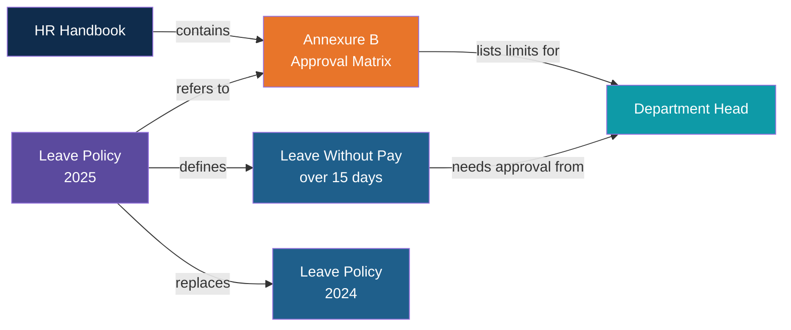
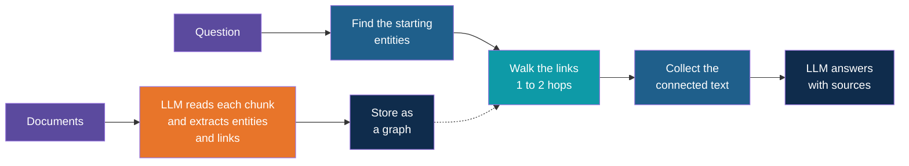
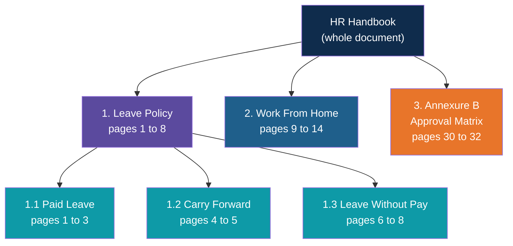
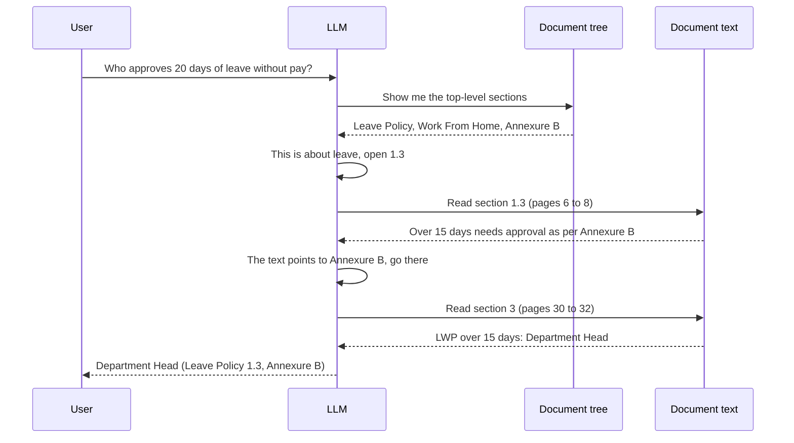
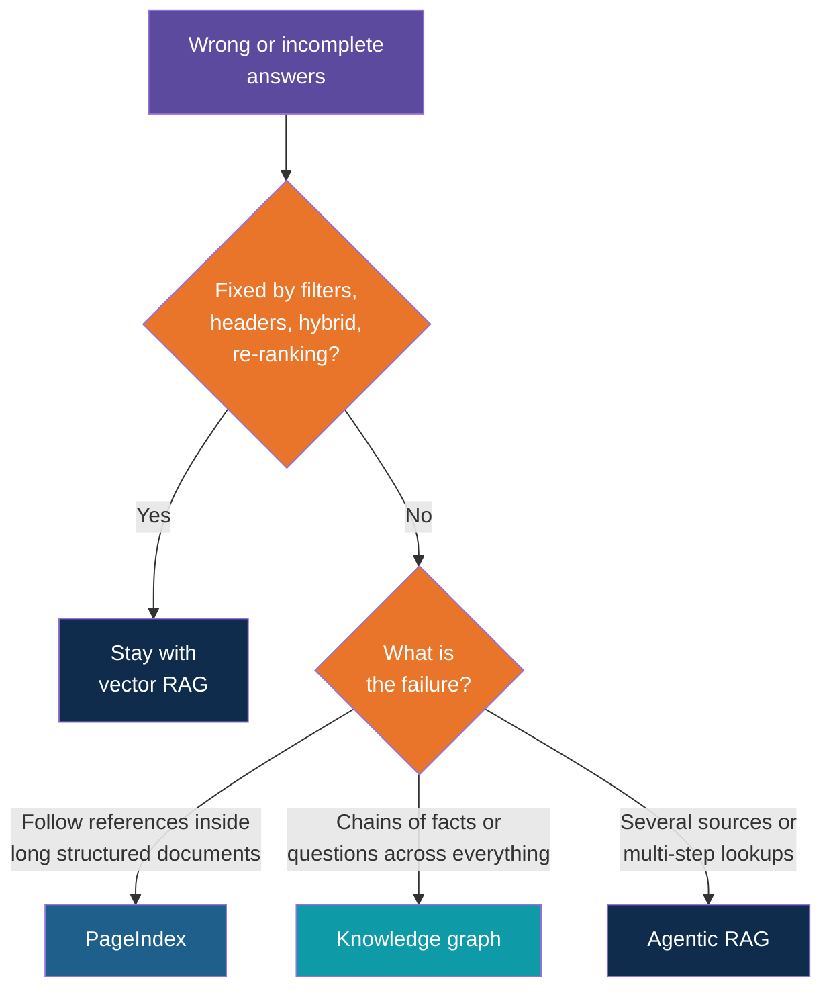

# Beyond Vector RAG: Knowledge Graphs and PageIndex

<!-- Slide deck in markdown. Each block between the --- lines is one slide.
     Trainer notes are in HTML comments and do not show in the preview.
     All documents, names and numbers in this deck are made up for teaching. -->

---

# Beyond Vector RAG

## When "find the most similar chunk" is not enough

**Day 4 | Extension to Block 6: Common Failure Modes**

<!-- Trainer: about 25 minutes. Concept note only. Neither a graph database nor PageIndex is part of the Day 4 lab toolchain (FAISS, Chroma, pgvector), so keep this at the level of the idea, the trade-offs and when to choose each. -->

---

# The Problem

## Why the wrong chunk comes back

---

## Three Complaints From the HR Desk

| What HR sees | Example |
|---|---|
| **Wrong policy comes back** | Asked "What is the approval limit for a laptop replacement?", the assistant answers with the expense policy's approval limits |
| **Right policy, wrong part** | Asked about carry forward, it returns the sick leave section instead of the paid leave section |
| **Cross-references are missed** | The leave policy says "approval as per Annexure B of the HR Handbook". The assistant quotes the leave policy and never opens Annexure B |

All three have the same root: vector search finds text that **sounds like** the question.
It does not know **which document** a chunk belongs to, or **what that chunk points to**.

---

## Why It Happens

| Cause | What goes wrong |
|---|---|
| **Look-alike policies** | Leave, Work From Home and Expense policies all talk about "approval", "manager" and "notice". Their chunks sit close together in meaning |
| **Chunks lose their context** | A chunk that says "This applies to all employees" no longer says which policy, or which year, it came from |
| **Meaning is not relevance** | The most similar paragraph is not always the one that answers. A table of limits looks nothing like the question about limits |
| **No sense of links** | "See Section 7", "as per Annexure B", "subject to the Travel Policy" are just words to an embedding. Nothing follows them |
| **Several versions** | The 2024 and 2025 policy say nearly the same thing, so both come back |

---

## Fix the Cheap Things First

Before changing the whole approach, try the repairs that keep the pipeline you already built.

| Fix | What it does | Where it was taught |
|---|---|---|
| **Metadata filter** | Search only the Leave Policy, only the 2025 version | Block 2 |
| **Chunk header** | Put "Leave Policy, 2025, Carry Forward" at the top of every chunk, so the chunk carries its own context | Block 2 |
| **Hybrid search** | Add keyword matching, so "Annexure B" and exact names count | Block 5 |
| **Re-ranking** | Pull 20 chunks, let a stronger model sort them, keep the best 4 | Block 5 |
| **Query rewriting** | Turn "and does it carry forward?" into a full standalone question | Day 4 agentic note |

These fix the first two complaints well. The third, **cross-references**, and questions that
need **several linked facts**, are where the approaches in this note come in.

---

# Approach 1

## Knowledge graphs (GraphRAG)

---

## From Pile of Chunks to Web of Facts

Vector RAG treats a policy as a pile of independent paragraphs. A **knowledge graph** keeps
the **things** in the policy and the **links** between them, like a map instead of a pile
of index cards.

| Term | Plain meaning | Example |
|---|---|---|
| **Entity (node)** | A thing worth naming | Leave Policy, Annexure B, Department Head, Leave Without Pay |
| **Relationship (edge)** | How two things connect | "requires approval from", "refers to", "replaces" |
| **Triple** | One fact in the form thing, link, thing | (Leave Without Pay over 15 days) requires approval from (Department Head) |

---

## A Small Policy Graph

The orange line from the Leave Policy to Annexure B is the **cross-reference**, now stored
as a real link instead of a few words in a paragraph.

---

## How It Works

Two phases, as in plain RAG, but the **ingestion step is heavier**: an LLM reads every
chunk and writes down who and what is connected to whom. Many tools keep a vector index
as well, so the graph and the similarity search work together.

---

## Two Kinds of Question a Graph Answers Well

| Kind | Example | How the graph helps |
|---|---|---|
| **Multi-hop** | "Who approves 20 days of leave without pay?" | Leave Without Pay, then Department Head, then Annexure B limits. Three linked facts, none of which sit in one chunk |
| **Whole-collection** | "Which policies mention the Department Head?" or "What are the main themes across all HR policies?" | A top-4 similarity search can never see the whole set. A graph can count, group and summarise across it |

Microsoft's GraphRAG, the best-known version, also groups related entities into
**communities** and writes a summary of each, which is how it answers the "big picture"
questions.

---

## Knowledge Graphs: Gains and Costs

| Gains | Costs |
|---|---|
| Follows cross-references and chains of facts | **Expensive ingestion**: an LLM call for every chunk |
| Answers "across everything" questions | Extraction can be **wrong or incomplete**, and a missing link is a silent failure |
| Shows **why** an answer was given (the path through the graph) | Graph must be **rebuilt or patched** whenever a policy changes |
| Handles look-alike names, since each entity is one node | Needs a design: which entities and links matter for your documents |
| Supports counting and filtering, not only reading | More moving parts: graph store, extraction prompts, a query step |

> Use a graph when the **relationships** are the answer, not just the text.

---

# Approach 2

## PageIndex: search by reasoning, not by similarity

---

## The Idea: Read the Table of Contents

A person who needs the carry forward rule does not scan every paragraph for similar
words. They open the **table of contents**, choose "Leave Policy", then "Carry Forward",
read that page, and follow "see Annexure B" if it says so.

**PageIndex** (an open-source project from Vectify AI) copies that behaviour. It builds a
**tree** of the document, like a table of contents where every section carries a short
summary and its page range. At question time the **LLM reads the tree and decides where
to go**. There are no embeddings, no vector database, and no fixed-size chunks.

| | Vector RAG | PageIndex |
|---|---|---|
| Document is stored as | Many small chunks and their vectors | A tree of sections with summaries |
| Relevance means | Sounds similar to the question | An LLM **judges** that this section should hold the answer |
| Unit that is read | A chunk, cut by size | A whole section, cut by the document's own structure |
| Needs a vector database | Yes | No |

---

## The Tree

Each box also holds a one or two line summary. The LLM navigates using those summaries,
the way you use chapter titles.

---

## One Question, Step by Step

A user asks: *"Who approves 20 days of leave without pay?"*

The reference was **followed on purpose**, because the LLM read the sentence that
contained it. This is the behaviour vector search cannot give you.

---

## PageIndex: Gains and Costs

| Gains | Costs |
|---|---|
| Picks the right **policy and section** by reasoning about the question | **Slower and dearer** per question: several LLM calls to navigate, then read |
| Follows "see Section 7" and "refer to Annexure B" | Building the tree needs LLM calls at ingestion |
| Reads whole sections, so a rule is not cut from its exceptions | Best on **long, well-structured** documents. Messy, flat text gives it little to navigate |
| Every answer comes with page and section, so citations are natural | Across thousands of documents you still need a first step to choose which document to open |
| No vector database to run | Quality depends on the LLM reading the tree well, so small local models struggle |

<!-- Trainer: the project reports strong results on long financial reports. Treat these as the project's own claims, and tell trainees to test on their own documents. -->

---

# Putting It Together

## Choosing an approach

---

## Side by Side

| | Plain vector RAG | Vector + hybrid + re-rank | Knowledge graph | PageIndex | Agentic RAG |
|---|---|---|---|---|---|
| **Finds text by** | Similarity | Similarity and keywords, then sorted | Walking links between entities | An LLM reading the section tree | An LLM choosing tools and searches |
| **Strong at** | Simple "find the paragraph" questions | The same, with fewer misses | Multi-hop, relationships, whole-collection | Long structured documents, cross-references | Many sources, multi-step questions |
| **Weak at** | Look-alikes, cross-references | Cross-references | Messy text, fast-changing documents | Huge document sets, flat text | Cost, speed, predictability |
| **Ingestion cost** | Low | Low | **High** | Medium | Low to medium |
| **Cost per question** | Low | Low to medium | Medium | **Medium to high** | **High** |

These are not rivals. A real system often combines them: filters and hybrid search for the
first pass, a graph or tree for linked questions, an agent to choose between them.

---

## Which Complaint Needs Which Fix

| Complaint | Try first | If it persists |
|---|---|---|
| Wrong policy returned | Metadata filter and chunk headers | Route to the right document first (an agent or a tree) |
| Right policy, wrong section | Better chunking, hybrid search, re-ranking | PageIndex, which reads by section |
| Cross-reference not followed | Larger chunks that keep the reference with its target | **PageIndex** or a **knowledge graph** |
| Needs a chain of facts | Break the question down (agentic) | **Knowledge graph** |
| "Across all policies" questions | Metadata filter and many searches | **Knowledge graph** with community summaries |
| Old and new versions mixed | Version metadata and filter on the latest | A graph with "replaces" links |

---

## A Decision Path

---

# Use Cases

## Where each one earns its cost

---

## Use Cases

| Use case | Best fit | Why |
|---|---|---|
| **HR policy desk with a 200-page handbook and annexures** | PageIndex | One long, structured document, full of "see Annexure B" |
| **Contract or tender pack where clauses override each other** | PageIndex, or a graph | The answer needs the clause **and** the clause it is subject to |
| **Regulation and compliance Q&A** | Knowledge graph | Rules refer to other rules, and versions replace each other |
| **"Who reports to whom, who owns which system?"** | Knowledge graph | The data is mostly relationships |
| **Product or incident history across many tickets** | Knowledge graph | Links between product, fault, fix and customer matter more than any one ticket |
| **FAQ and short how-to documents** | Plain vector RAG | One paragraph answers the question. Anything heavier is wasted |

---

## Keeping It Honest

Whichever approach you pick, the Block 6 rules still apply.

| Rule | Why |
|---|---|
| **Cite the section, page or graph path** | The reader can check where the answer came from |
| **Say "not found" when it is not found** | A complicated pipeline is still allowed to find nothing |
| **Test on the questions that failed** | Collect the real wrong answers HR reported and re-run them after each change |
| **Measure before and after** | Use the Block 6 evaluation set so you know a change helped |
| **Respect access rights** | A graph or tree must not reveal documents the asker cannot open |

---

## Explore It Yourself

No code needed.

| To see... | Try | What to do |
|---|---|---|
| A knowledge graph being built | A local model in Ollama chat | Paste one short synthetic policy. Ask: "List every entity and every relationship as triples: thing, link, thing." Check what it missed |
| Why links matter | The same chat | Paste only the Leave Policy section that says "as per Annexure B", and ask who approves. Then paste Annexure B as well and ask again |
| A graph you can draw | The Mermaid live editor | Turn the triples into a small flowchart and look for chains the model could now walk |
| A table of contents as an index | A long synthetic handbook and the same chat | Paste only the headings with one-line summaries. Ask which sections to read for a question. Then paste those sections |
| A ready-made PageIndex demo | The PageIndex project's website and open-source repository | Upload a short synthetic PDF and ask a cross-reference question. Look at the sections it chose |

<!-- Trainer: try each tool before class; sites and features change. Use only synthetic documents, never real HR or company policies. -->

---

## Remember These Four Things

1. Vector search finds text that **sounds like** the question. It does not know which
   document a chunk belongs to or what it points to, so look-alike policies and
   cross-references fail
2. Fix the cheap things first: **metadata filters, chunk headers, hybrid search,
   re-ranking**
3. A **knowledge graph** stores things and links, so it handles chains of facts and
   "across everything" questions. It costs a heavy ingestion and upkeep
4. **PageIndex** lets an LLM read a document's section tree and follow references. It
   suits long, structured documents and costs more per question

---

## Next Up

**Day 5:** AI agents, where a single assistant chooses between plain search, a graph, a
tree and other tools, and learns when each one is worth its cost.

---

*Prepared for Kalpataru Projects | AIM ADaSci | Confidential*
