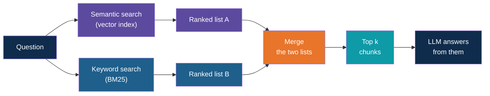
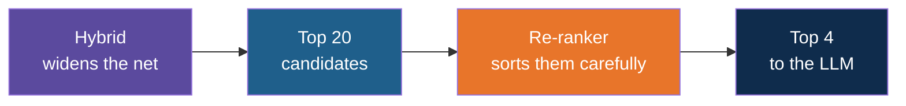

# Hybrid RAG: Keyword Plus Semantic Search

<!-- Slide deck in markdown. Each block between the --- lines is one slide.
     Trainer notes are in HTML comments and do not show in the preview.
     All documents, names and numbers in this deck are made up for teaching. -->

---

# Hybrid RAG

## Two ways of searching are better than one

**Day 4 | Extension to Block 5: Re-ranking and Hybrid Search Overview**

<!-- Trainer: about 20 minutes. Concept note, no code. Builds on the keyword versus semantic slide in the vectors note. The matching demo is the multi-format-rag-llamaindex app, but the idea stands without it. -->

---

# The Idea

## Why one search is not enough

---

## Two Ways to Find a Page in a Library

Walk into a library with a question. You have two options.

| | Ask the librarian | Look in the index at the back of the book |
|---|---|---|
| How it works | Describe what you need in your own words. The librarian understands what you mean | Look up the exact word. If the word is not listed, you find nothing |
| Strong when | You do not know the exact words used in the book | You know the exact term, name or code |
| Weak when | You ask for a precise code. "Section 7.2" and "Section 7.3" sound alike | The book says "refund" and you looked up "money back" |

Semantic search is the librarian. Keyword search is the index. A good researcher uses
both, and so can a RAG app.

---

## Where Each One Fails

Imagine a company with a handbook, a policy PDF and a spreadsheet of limits.

| Question | Semantic search | Keyword search |
|---|---|---|
| "Can I get money back for a course I paid for myself?" | **Finds** the training reimbursement rule, though it never says "money back" | Misses it. No shared words |
| "What is the hotel limit for grade L3?" | Returns rows for L2, L3 and L4. They all look nearly the same in meaning | **Finds** the L3 row. The token "L3" matches exactly |
| "Trips above 25,000 INR" | May return any rule about cost or approval | **Finds** the chunk containing "25,000" |
| "Do I need approval for a long trip?" | **Finds** the pre-approval rule, "long" matches "longer than 3 nights" in meaning | Weak. "long" and "longer" are different words |

> Neither search is the better one. Each fills the other's gap.

---

## How Keyword Search Scores a Chunk

The standard method is called **BM25**. You do not need the maths. It rewards a chunk for
three things.

| Idea | Plain meaning | Example |
|---|---|---|
| **Matches the question's words** | More of the question's words in the chunk means a higher score | A chunk with both "hotel" and "L3" beats one with only "hotel" |
| **Rare words count more** | A word found in few chunks is a stronger clue than one found everywhere | "L3" is worth more than "the" or "policy" |
| **Short chunks are not punished** | A word repeated in a short chunk counts, but repeating it endlessly does not keep adding up | A single clear row beats a long page that mentions L3 once |

Two details matter for the next slide: BM25 scores have **no upper limit**, and they are
only meaningful **inside one search**.

---

# The Approach

## Running both and merging

---

## The Hybrid Pipeline

The two searches run on the **same chunks** but look at them differently. The only new
problem is the merge step.

---

## The Merge Problem

Why not just add the scores?

| Search | Score looks like | Range |
|---|---|---|
| Semantic | 0.82 | 0 to 1 (a similarity) |
| Keyword | 7.4 | No upper limit |

Adding 0.82 and 7.4 lets the keyword score swamp the other, and the numbers do not mean
the same thing anyway. It is like adding a temperature in degrees to a weight in kilograms.

There are two common fixes.

| Fix | What it does |
|---|---|
| **Rescale the scores** first so both are on a 0 to 1 range, then add them with weights | Keeps the strength of each match, but sensitive to odd outliers |
| **Merge by rank, not score** | Ignores the numbers and uses only each chunk's position in each list. This is called **reciprocal rank fusion** |

---

## Reciprocal Rank Fusion in One Minute

Think of two judges at a talent show, each ranking the acts. You do not compare their
marks, only their rankings. An act that **both judges like** beats an act that only one
loves.

Each chunk earns points from each list: **1 divided by (60 plus its rank)**. The 60 is a
standard constant that stops first place from dominating.

| Chunk | Rank in semantic list | Rank in keyword list | Points | Final place |
|---|---|---|---|---|
| A | 1 | 3 | 0.0164 + 0.0159 = **0.0323** | 1 |
| D | 3 | 2 | 0.0159 + 0.0161 = **0.0320** | 2 |
| C | not listed | 1 | **0.0164** | 3 |
| B | 2 | not listed | **0.0161** | 4 |

Chunk A was first in one list and third in the other, so it wins. Chunk C was first in
the keyword list but absent from the other, so it ends up behind D, which both lists
liked.

> Because points come from ranks, the final scores are small, around 0.01 to 0.03. Do not
> compare them with similarity scores.

---

## What Hybrid Does to the Three Questions

| Question | Semantic list | Keyword list | After merging |
|---|---|---|---|
| "Hotel limit for grade L3" | L2, L3 and L4 rows, in some order | The L3 row first | L3 row on top, because both lists contain it |
| "Money back for a course I paid for" | The training reimbursement FAQ first | Nothing useful | The FAQ stays first. Keyword search adds no harm |
| "Do I need approval for a trip costing 30,000 INR?" | The pre-approval section | The chunk with "30,000" and "trip" | Pre-approval section first, plus the chunk with the amount |

Hybrid is a safety net. When one search is lost, the other still brings the right chunk
into the list.

---

# In Practice

## What to watch for

---

## Hybrid and Re-ranking Are Different Steps

They are often confused, and they are often used together.

| | Hybrid search | Re-ranking |
|---|---|---|
| Question it answers | Did the right chunk make it into the candidate list? | Is the best chunk at the top of the list? |
| How | Two different search methods, merged | A second model reads the question and each candidate together and scores the pair |
| Cost | Cheap, both searches are fast | Slower, one model call per candidate |

---

## Watch-Outs

| Watch out | Why it matters |
|---|---|
| **Scores change scale** | After fusion, scores are rank points. A similarity cut-off such as 0.3 no longer makes sense, and "nothing relevant found" must come from the prompt or from a re-ranker |
| **Two things to keep in step** | The vector index and the keyword index must be built from the same chunks. If you re-ingest one and not the other, they drift apart |
| **Filters must reach both** | A metadata filter, such as file type or department, has to apply to the keyword search as well, or the filtered-out chunks sneak back in |
| **Chunks must read well alone** | Keyword search only sees the chunk's own words. A spreadsheet row without its column names has no words to match |
| **Tokens like codes** | Check how the keyword search splits text. A code such as "L3" or "INV-204" must stay one searchable token |
| **More is not always better** | If your documents are clean prose and questions are loosely worded, plain semantic search may already be enough. Test before adding |

---

## When to Reach for Hybrid

| Your content and questions | Choice |
|---|---|
| Plain prose, questions in everyday words | Semantic search is often enough |
| Codes, names, IDs, section numbers, amounts in the questions | **Hybrid** |
| Tables and spreadsheet rows turned into text | **Hybrid**, with column names in each row |
| Mixed: some questions loose, some exact | **Hybrid** |
| Right chunk is in the list but not at the top | Add a **re-ranker** |

Rule of thumb: ask ten real questions. If the failures involve exact terms, add keyword
search. If they involve ordering, add a re-ranker.

---

## Explore It Yourself

No new code needed.

| To see... | Try | What to do |
|---|---|---|
| Keyword search at its simplest | Ctrl+F in any PDF or web page | Search "money back" in a refund policy that says "reimbursement". Then search an exact code. Note when it works and when it does not |
| Meaning search at its simplest | A local model in Ollama chat | Paste three short synthetic policy snippets. Ask a loosely worded question. Then ask one built on an exact code, and see if it mixes up similar codes |
| All three side by side | The multi-format-rag-llamaindex app | Run its compare_retrieval script. For each question, compare the vector, keyword and hybrid lists and see which chunks each one misses |
| The effect of a filter | The same app | In ask, type the file type filter for the PDF only and re-ask a spreadsheet question |

<!-- Trainer: run the compare script before class with your own key. Free-tier limits apply to the embedding calls. -->

---

## Remember These Four Things

1. **Semantic search** finds meaning. **Keyword search** finds exact words and codes.
   Each fails where the other works
2. **Hybrid** runs both on the same chunks and merges the two lists
3. Merge by **rank**, not score, because the two scores are on different scales.
   Reciprocal rank fusion rewards chunks that **both** searches like
4. Hybrid widens the net. A **re-ranker** sorts what the net caught. Keep the two ideas
   apart

---

## Next Up

**Next note:** how LlamaIndex packages these ideas as retrievers you can pick, combine and
tune.

---

*Prepared for Kalpataru Projects | AIM ADaSci | Confidential*
