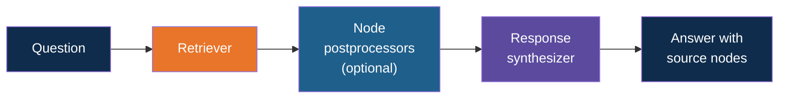
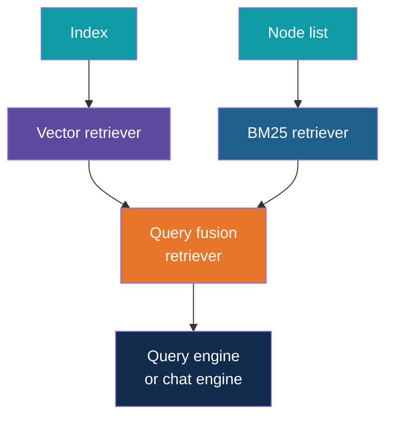
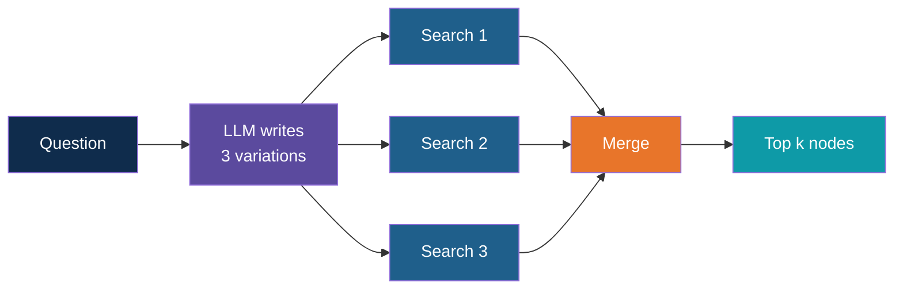
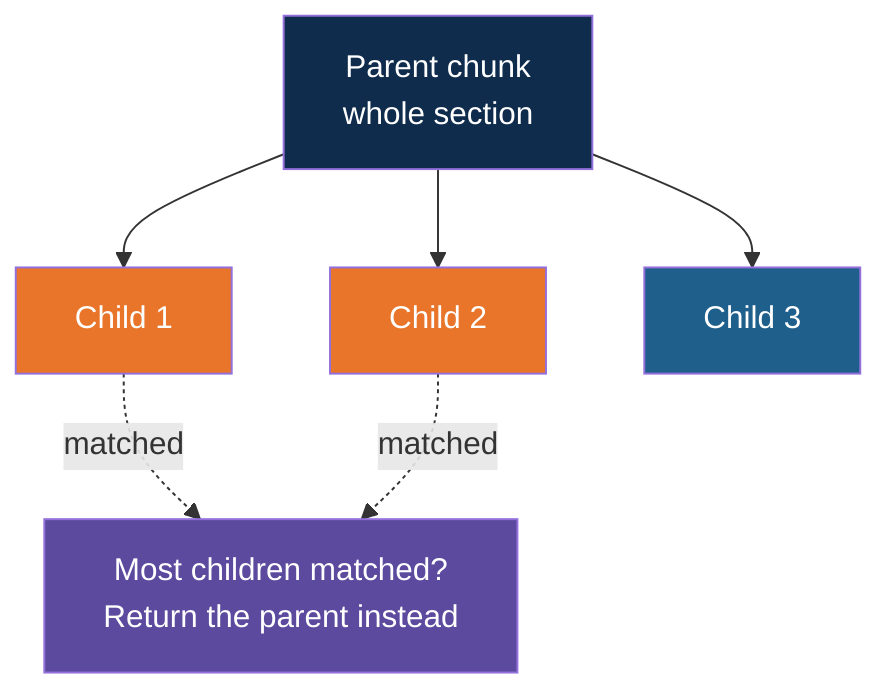

# LlamaIndex Retrievers

<!-- Slide deck in markdown. Each block between the --- lines is one slide.
     Trainer notes are in HTML comments and do not show in the preview.
     All documents, names and numbers in this deck are made up for teaching. -->

---

# LlamaIndex Retrievers

## The part of RAG that fetches the right chunks

**Day 4 | Extension to Block 5: Retrieval and Generation**

<!-- Trainer: about 20 minutes. Teach after the hybrid RAG note and after the LlamaIndex introduction. Class names change between LlamaIndex versions; check them against the current docs before class. -->

---

# The Basics

## What a retriever is, and where it sits

---

## A Retriever Fetches. It Does Not Answer.

Picture an archive clerk. You ask a question, the clerk walks to the shelves and returns
with a few folders, each with a sticky note saying how well it matches. The clerk does not
write the reply. Someone else does that.

In LlamaIndex a **retriever** does exactly this.

| | |
|---|---|
| **In** | A question |
| **Out** | A ranked list of nodes (chunks), each with a score |
| **Does not** | Call the LLM to write an answer |

Because it only fetches, a retriever is cheap to test. You can run it alone and look at
what comes back, without paying for an answer.

---

## The Retrieval Chain

| Part | Job |
|---|---|
| **Retriever** | Find candidate nodes |
| **Node postprocessors** | Clean up the candidates: drop weak ones, re-rank, and so on |
| **Response synthesizer** | Build the prompt from the nodes and ask the LLM |

A **query engine** is a retriever, postprocessors and a synthesizer packed together. A
**chat engine** is a query engine that also remembers the conversation. You can swap the
retriever inside either one.

---

# The Retrievers

## What you can pick from

---

## The Retrievers You Will Meet

| Retriever | What it does | Reach for it when |
|---|---|---|
| **Vector retriever** | Finds the nodes closest in meaning to the question | The default. Always the starting point |
| **BM25 retriever** | Finds nodes that share the question's exact words. Comes in a separate package | Questions contain codes, names or amounts |
| **Query fusion retriever** | Runs several retrievers and merges their lists | You want hybrid search |
| **Auto-merging retriever** | Matches small chunks, then returns their larger parent when enough of its children matched | Small chunks match well but lack context |
| **Recursive retriever** | Follows a link from one node to another source, such as from a table summary to the full table | Summaries that point to detail |
| **Router retriever** | Looks at the question and picks which retriever to use | Several collections or strategies, one entry point |

---

## Getting One

Every index can hand you a default retriever, and every retriever is used the same way:
give it a question, get nodes back. That shared shape is what makes them swappable.

Note that the BM25 retriever is built from a **list of nodes**, not from the vector index.
Keyword search needs the chunk text in hand, so it must be kept alongside the vector store.

---

## The Dials on a Vector Retriever

| Dial | What it does | Tuning advice |
|---|---|---|
| **top-k** | How many nodes to return | Too low misses the answer. Too high floods the prompt with noise. Start at 4 and test |
| **Metadata filters** | Only search nodes whose metadata matches, such as file type or department | Use whenever the question's scope is known |
| **Query mode** | Some vector databases offer their own keyword-plus-vector mode | Check what your store supports. Fusion works with any store |

---

# Combining and Cleaning

## Fusion and postprocessors

---

## The Query Fusion Retriever

The retriever behind hybrid search. It takes a list of retrievers, runs them all, and
merges the results.

| Setting | Meaning | Common choice |
|---|---|---|
| **Retrievers** | The list to combine | One vector, one BM25 |
| **Mode** | How to merge | See next slide |
| **Number of queries** | 1 means use the question as written. More than 1 asks the LLM to write variations of the question and searches with each one | 1 to keep it cheap and predictable |
| **Top-k** | How many nodes to keep after merging | 4 |

| Merge mode | Plain meaning |
|---|---|
| **Reciprocal rerank** | Merge by rank. A node both lists like wins |
| **Relative score** | Rescale each list to 0 to 1, then combine with weights |
| **Distance based score** | Rescale using each list's spread of scores, then combine |
| **Simple** | Keep each node's best score and sort |

---

## Multi-Query: One Question, Several Searches

When the number of queries is more than 1, the LLM first rewrites the question in a few
different ways.

It helps with vague questions. It costs an extra LLM call and makes the results change from run
to run. Leave it off until simple retrieval clearly fails.

---

## Node Postprocessors: Tidying the Candidates

Postprocessors run **after** the retriever and **before** the prompt is built.

| Postprocessor | What it does | Note |
|---|---|---|
| **Similarity cut-off** | Drops nodes scoring below a threshold | Works on similarity scores. Does not suit fused rank scores |
| **Re-ranker** | A second model re-scores each question and node pair, then re-sorts | Slower, usually the biggest quality gain |
| **Keyword filter** | Keeps only nodes that contain, or do not contain, certain words | Blunt, but predictable |
| **Previous and next nodes** | Adds the neighbouring chunks of each hit | Restores context lost by cutting |

---

# Small Chunks, Big Context

## Auto-merging

---

## The Chunk Size Dilemma

| Chunk size | Good | Bad |
|---|---|---|
| **Small** | Matches a question precisely | Too little context for the model to answer |
| **Large** | Plenty of context | The match is blurred by unrelated text |

The auto-merging retriever avoids the choice. Documents are cut into **layers**: big
parents with smaller children inside them. Only the small leaves are searched.

If several children of one parent are found, the parent replaces them. The search stays
precise and the model still gets the full section.

---

# Choosing

## Matching the retriever to the problem

---

## Which One for Which Problem

| What you see | Try first |
|---|---|
| Normal questions, clean prose | Vector retriever, tuned top-k |
| Exact codes or amounts get mixed up | Add BM25 through a fusion retriever |
| Right chunk found, wrong order | Add a re-ranker as a postprocessor |
| Answers feel cut off or lack context | Previous and next nodes, or auto-merging |
| A scoped question pulls in the wrong files | Metadata filters |
| Vague, short questions | Multi-query, with the cost in mind |
| Several different collections | Router retriever |

Change one thing at a time and re-run the same set of test questions. Retrievers are easy
to compare because each one is just "question in, nodes out".

---

## What the Multi-Format App Chose

The multi-format-rag-llamaindex app reads a Markdown file, a PDF, an Excel file, a Word
file and a CSV, and uses these retrievers.

| Choice | Reason |
|---|---|
| **Vector retriever with a file type filter** | Meaning search, with the option to narrow to one format |
| **BM25 retriever over the same nodes** | Spreadsheet rows are full of grade codes and numbers |
| **Query fusion with reciprocal rerank, one query** | Merge by rank, with no extra LLM call |
| **No similarity cut-off** | Fused scores are rank points, so the old cut-off no longer applies |

Two things that surprised us:

| Surprise | What we did |
|---|---|
| The BM25 retriever's own filter option did not restrict results | We filtered the node list by file type ourselves before building the keyword index |
| The fusion retriever still wants an LLM configured, even with one query | We set the LLM globally, and it is never called for rewriting |

---

## Explore It Yourself

| To see... | Try | What to do |
|---|---|---|
| What a retriever returns | The multi-format app's compare_retrieval script | Read the scores and file locations for each retriever. Notice that no answer is generated |
| The effect of top-k | The same app | Change the top-k value from 3 to 8 and re-run. Do new chunks help or only add noise? |
| Filters | The same app, ask script | Switch the file type filter and ask the same question. See which sources disappear |
| The official map of retrievers | The LlamaIndex documentation page on retrievers | Find each retriever from the table and note which index or node list it needs |

<!-- Trainer: try each step before class. Page names in the LlamaIndex documentation move, so search for "retrievers" rather than a fixed address. -->

---

## Remember These Four Things

1. A **retriever** takes a question and returns scored nodes. It does not answer. That
   makes it cheap to test on its own
2. Retrievers share one shape, so you can swap or combine them inside a query engine or
   chat engine
3. **Fusion** gives hybrid search. **Postprocessors** tidy the candidates. **Auto-merging**
   gives small-chunk precision with large-chunk context
4. Change one dial at a time and test with the same questions. Reach for the next retriever
   only when the simple one clearly fails

---

## Next Up

**Block 6:** citations and evaluation, where we measure whether the retriever is bringing
back the right chunks.

---

*Prepared for Kalpataru Projects | AIM ADaSci | Confidential*
