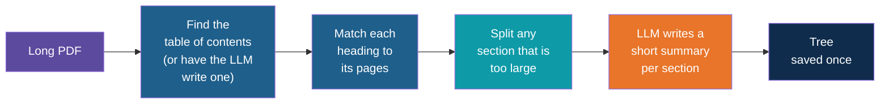
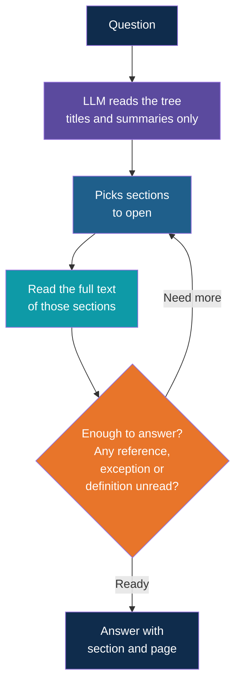

# PageIndex RAG: Use Cases, Example Data and Prompts

<!-- Slide deck in markdown. Each block between the --- lines is one slide.
     Trainer notes are in HTML comments and do not show in the preview.
     All documents, names and numbers in this deck are made up for teaching. -->

---

# PageIndex RAG in Practice

## Where reading the table of contents beats searching by similarity

**Day 4 | Extension to Block 6: Common Failure Modes**

<!-- Trainer: about 30 minutes. Teach after the note on knowledge graphs and PageIndex, which introduces the idea. This note goes deeper: how the tree is built, how the LLM navigates it, the prompts, and four cases with example data. Outcomes shown for vector RAG are typical, not guaranteed. Run each case in class to see what actually happens on your setup. -->

---

# Recap and Gap

## Why this note exists

---

## One Minute Recap

| | Vector RAG | PageIndex RAG |
|---|---|---|
| Stores the document as | Small chunks and their vectors | A tree of sections, each with a title, a page range and a short summary |
| Finds the answer by | Similarity to the question | An LLM reading the tree and **choosing** which sections to open |
| Reads | A chunk cut by size | A whole section cut by the document's own structure |

This note answers the practical questions: **what does the tree look like, what do we ask
the LLM, and on which questions does this really win?**

---

## Five Ways Chunks Let a Long Document Down

| Pattern in the document | What happens to a chunk | Example |
|---|---|---|
| **Cross-reference** | The reference and its target sit far apart and share no words | "Approval as per Annexure B" |
| **Exception elsewhere** | The rule is retrieved, its exception is not | A general rule in 3.2, the exception in 3.5 |
| **List spread over pages** | Chunk boundaries cut the list | Seven steps become two chunks, and one step is lost |
| **Position in the question** | Similarity cannot read "page 37" or "Annexure B" as a place | "Explain the table on page 37" |
| **Table without its title** | A table row has no words that say what the table is about | A row reading "Category C, 30 days, Department Head" |

All five are failures of **structure**, not of meaning. The section tree keeps exactly
the structure that chunking throws away.

---

# Under the Hood

## Building the tree and navigating it

---

## How the Tree Is Built

The tree is built **once per document**, then reused for every question. Each entry
carries the same few fields:

| Field | Meaning |
|---|---|
| **Node id** | A short label the LLM can return, such as 0007 |
| **Title** | The heading, such as "3.4 Leave Without Pay" |
| **Page range** | Start and end page of the section |
| **Summary** | One or two lines on what the section covers |
| **Children** | The sub-sections inside it |

<!-- Trainer: field names and options differ between versions of the open-source project, so check its current repository before class. -->

---

## The Summary Is the Signpost

The LLM chooses sections using **only titles and summaries**. It has not read the text
yet. So a summary must say more than "Leave rules".

| Weak summary | Strong summary |
|---|---|
| "Rules about leave without pay." | "Covers leave without pay. Says it is a Category C absence and that approval is as per Annexure B. Does not cover paid or sick leave." |

A good summary names three things: **what the section covers, what it leaves out, and
which other sections it points to**. That last part is what lets the LLM follow a
reference it has not read yet.

---

## The Navigation Loop

This is a small, bounded version of the loop from the agentic RAG note: **choose, read,
check, repeat**. Cap it at three or four rounds.

---

# Example Data

## A synthetic 40-page handbook

---

## The Document Tree

The "Acme Employee Policy Handbook, 2025" is made up. This is its tree, with the
summaries a navigating LLM would see.

| Id | Section | Pages | Summary |
|---|---|---|---|
| 1 | Introduction and Definitions | 1 to 4 | Purpose of the handbook. Defines key terms such as working day and probation |
| 2 | Working Hours and Attendance | 5 to 9 | Office hours, flexible start, attendance records |
| 3 | Leave | 10 to 20 | All leave rules. Sub-sections 3.1 to 3.5 |
| 3.1 | Paid Leave | 10 to 12 | 12 days a year, earned monthly |
| 3.2 | Carry Forward | 13 to 14 | How much unused paid leave moves to next year, and when it expires |
| 3.3 | Sick Leave | 15 to 16 | Sick leave days and medical certificate rule |
| 3.4 | Leave Without Pay | 17 to 18 | Absence beyond paid leave. Classed as Category C. Approval as per Annexure B |
| 3.5 | Exceptions to Leave Rules | 19 to 20 | Special cases for first-year employees and for those returning from medical leave |
| 4 | Expense Claims | 21 to 27 | Eligibility, steps to raise a claim, limits |
| 4.2 | Steps to Raise a Claim | 23 to 25 | The step-by-step claim process |
| 4.3 | Claim Limits | 26 to 27 | Spending limits per category. Claims above the limit need approval as per Annexure B |
| 5 | IT and Security | 28 to 33 | Laptop use, passwords, data handling |
| 6 | Annexure A: Holiday Calendar | 34 to 35 | Public holidays for 2025 |
| 7 | Annexure B: Approval Matrix | 36 to 38 | Who approves absences and expenses, by category and size |
| 8 | Annexure C: Forms | 39 to 40 | Leave and expense claim forms |

---

## Key Passages From the Handbook

These are the text excerpts that the four cases rely on.

| Where | Text |
|---|---|
| **3.2 Carry Forward** (p. 13) | "Unused paid leave of up to 6 days carries forward to the next leave year. Leave beyond 6 days expires on 31 March." |
| **3.4 Leave Without Pay** (p. 17) | "When paid leave is used up, further absence is a Category C absence. Approval for a Category C absence is as per Annexure B." |
| **3.5 Exceptions** (p. 19) | "First-year employees cannot carry forward any leave. An employee returning from approved medical leave may carry forward up to 10 days." |
| **4.2 Steps** (pp. 23 to 25) | Seven numbered steps, running across three pages |
| **Annexure B** (p. 37) | A table: Category A absence, Manager. Category B, Manager up to 5 days, Department Head above. **Category C, Department Head up to 30 days, HR Director above 30 days.** Expense claim above 50,000 INR, Finance Controller |

Notice that the Annexure B table **never uses the words "leave without pay"**. It only
says "Category C".

---

# Four Cases

## Where PageIndex does better

---

## Case 1: The Reference Chain

**Question:** *"Who approves 35 days of leave without pay?"*

| | Vector RAG | PageIndex RAG |
|---|---|---|
| Step 1 | Embeds the question. Retrieves the 4 chunks that sound closest: the leave without pay text from 3.4, and other approval-related chunks | Reads the tree. Picks 3.4 Leave Without Pay |
| Step 2 | The Category C row of the table shares few words with the question, so it may not be in the top 4 | Reads 3.4. Sees "Category C" and "as per Annexure B" |
| Step 3 | The model answers from what it has: "Approval is as per Annexure B", with no name, or a guess | Opens Annexure B. Finds Category C, above 30 days |
| Answer | Incomplete or wrong | **HR Director** (3.4, Annexure B p. 37) |

> The answer needs two sections linked by a reference and a label, with no shared words.
> A reader follows it. A similarity search cannot.

---

## Case 2: The Exception Elsewhere

**Question:** *"I am back from approved medical leave with 9 unused paid leave days. How many carry forward?"*

| | Vector RAG | PageIndex RAG |
|---|---|---|
| What it finds | The Carry Forward chunk (3.2) matches "unused paid leave" and "carry forward" strongly | Picks 3.2, and also 3.5 because its summary says "special cases for those returning from medical leave" |
| What it may miss | The exception in 3.5 uses other words and may sit outside the top 4 | Nothing. It was told to look for exceptions |
| Answer | "6 days carry forward, the rest expire." Confident and **wrong** | **9 days.** The 3.5 exception allows up to 10 (3.2 p. 13, 3.5 p. 19) |

The dangerous part is not that vector RAG fails. It is that the answer **sounds
complete**. A rule without its exception is a confident wrong answer.

---

## Case 3: The List Spread Over Pages

**Question:** *"List every step to raise an expense claim."*

The seven steps in 4.2 run across pages 23 to 25:

| Step | Action |
|---|---|
| 1 | Collect all receipts |
| 2 | Fill the claim form in Annexure C |
| 3 | Attach the approval, where Annexure B requires one |
| 4 | Submit in the portal within 15 days |
| 5 | Manager reviews within 5 working days |
| 6 | Finance verifies the receipts |
| 7 | Payment in the next payroll run |

| | Vector RAG | PageIndex RAG |
|---|---|---|
| What it reads | Chunks cut by size. Steps 1 to 4 in one chunk, 6 to 7 in another. Step 5 may be cut in half or left out | The whole of section 4.2, all three pages |
| Answer | A list with a **missing step** and nothing to show it is missing | All seven steps, in order |

Whole-section questions ("list all", "what is the full process", "summarise this
section") are where reading beats retrieving.

---

## Case 4: The Question About a Place

**Question:** *"What does the table on page 37 say, and which rows apply to expense claims?"*

| | Vector RAG | PageIndex RAG |
|---|---|---|
| Handles "page 37" | No. Page numbers and annexure names are not meaning, so the question matches by topic only | Yes. Page 37 falls inside node 7, Annexure B, pages 36 to 38 |
| The table | Rows come back as loose chunks with no title | The whole annexure is read, with its heading and all rows together |
| Answer | Some rows, in no clear order, and perhaps rows from a different table | The full table, then the one expense row: above 50,000 INR, Finance Controller |

People ask for documents by place: "the annexure", "the clause on page 12", "Section 4".
A tree built on the document's own structure can answer by place.

---

# The Prompts

## What we ask the LLM at each step

---

## Prompt 1: Choosing the Sections

Sent with the whole tree (titles, pages and summaries, but no section text).

> You are given the table of contents of a long document. Each entry has an id, a title,
> a page range and a short summary.
>
> Question: *{question}*
>
> Return the ids of the sections to read, in reading order. Include sections the answer
> may depend on, such as definitions, exceptions and annexures. Give one line of reasoning
> for each id. If no section looks relevant, return an empty list.

The line "such as definitions, exceptions and annexures" is what makes the LLM pick 3.5
in Case 2 and Annexure B in Case 1.

---

## Prompt 2: The Sufficiency Check

Sent after the chosen sections have been read.

> Here is the question and the text of the sections you chose.
>
> Check three things before answering.
> 1. Does the text point to another section, annexure, table or definition that you have
>    not read?
> 2. Does it use words such as "except", "unless", "subject to" or "as per"?
> 3. Is any number, role or condition that you need still missing?
>
> Reply ANSWER_READY, or NEED_MORE followed by the ids of the extra sections to read.

This is the step that follows "approval as per Annexure B". Without it, the LLM often
answers after the first section.

---

## Prompt 3: The Grounded Answer

> Answer the question using only the sections below.
>
> Cite every fact as (section number, page). If two sections disagree, say which one
> applies and why. If the answer is not in these sections, reply: "I could not find that
> in the document." Do not use outside knowledge.

---

## Prompt 4: Writing the Summaries (Done Once, at Build Time)

> Summarise this section in two lines for use in a table of contents. State what it
> covers, what it does not cover, and the name of any other section, annexure or table
> that it refers to.

This one prompt shapes the quality of everything above. Weak summaries lead to wrong
choices in Prompt 1.

---

# Beyond the Handbook

## Other documents with the same shape

---

## Where Else the Tree Is Rich

| Document | Why a tree helps | A question it answers well |
|---|---|---|
| **Contract with schedules** | Clauses are subject to other clauses and schedules | "What is the penalty for late delivery, and does the force majeure clause change it?" |
| **Tender or RFP document** | Eligibility, scope and annexures cross-refer | "Which documents must accompany the bid, as listed in the annexure?" |
| **Standard operating procedure manual** | Procedures are numbered and refer to other procedures | "What do I do after step 6 if the check fails?" |
| **Regulation or compliance manual** | Rules have exceptions and definitions elsewhere | "Does this rule apply to a contractor with fewer than 20 workers?" |
| **Annual or technical report** | Notes and tables explain the main text | "What does the note on page 47 say about the increase in costs?" |
| **Product or equipment manual** | Safety warnings and procedures are in different chapters | "Before I replace the filter, what safety steps apply?" |

All of these are **long**, **numbered or titled**, and **full of "see" and "subject to"**.

---

## Where PageIndex Does Not Do Better

| Situation | Example question | Better choice |
|---|---|---|
| **Short facts, one paragraph answers** | "What is the dress code?" | Plain vector RAG. A tree is overkill |
| **Many small documents** | "Which of our 300 policies mention fire safety?" | Vector or hybrid search, or a graph, to find documents first |
| **Flat text with no structure** | Chat logs, emails, meeting transcripts | Chunking by size, as there is nothing for a tree to say |
| **Exact codes across a table** | "Hotel limit for grade L3" | Hybrid search over rows |
| **Tight budget and high traffic** | Thousands of questions a day | Vector RAG, which costs less per question |

---

## Combining the Two

For a real knowledge base, the usual answer is **both**.

Vector search is cheap and good at picking **one document out of many**. The tree is good
at finding **the right section inside one long document**. Each does the job it is best at.

---

# Making It Work

## Checking it and keeping it honest

---

## A Test Set for Comparing the Two

Run the same questions through both approaches and judge each answer against the expected
one. Keep the set with the document.

| # | Question | Expected answer | Sections needed |
|---|---|---|---|
| 1 | Who approves 35 days of leave without pay? | HR Director | 3.4, Annexure B |
| 2 | I am back from medical leave with 9 unused days. How many carry forward? | 9 | 3.2, 3.5 |
| 3 | List every step to raise an expense claim | Seven steps, 1 to 7 | 4.2 |
| 4 | Who approves an expense claim of 60,000 INR? | Finance Controller | 4.3, Annexure B |
| 5 | How many days of paid leave do I earn each year? | 12 | 3.1 |
| 6 | What is the dress code? | Not in the handbook, so "could not find" | none |

Questions 5 and 6 are the controls. Plain vector RAG should do well on them, and a tree
should not make them worse.

---

## Failure Modes of the Tree

| Failure | What it looks like | Guard |
|---|---|---|
| **Weak summaries** | The LLM opens the wrong section | Rewrite summaries to say what is covered, excluded and referenced (Prompt 4) |
| **Stopping too early** | Answer given after the first section, reference not followed | Keep the sufficiency check (Prompt 2) |
| **Endless wandering** | Many rounds, high cost | Cap at three or four rounds, then answer or say "not found" |
| **Tree too big for one prompt** | A thousand-page document, a huge table of contents | Show the top level first, then open one branch at a time |
| **Wrong table of contents** | Page ranges off by a few pages | Check the tree against the real document once, after building |
| **Hallucinated section ids** | The LLM returns an id that does not exist | Reject unknown ids and ask again |

---

## Explore It Yourself

No code needed. Use a synthetic document only.

| To see... | Try | What to do |
|---|---|---|
| Navigation without a vector database | A local model in Ollama chat | Paste only the table of contents slide from this note and ask Prompt 1 for Case 1 and Case 2. See which sections it picks |
| The reading step | The same chat | Paste the excerpts from the "Key Passages" slide for the sections it picked. Ask Prompt 2, then Prompt 3 |
| Why summaries matter | The same chat | Replace the summary of 3.4 with "Rules about leave without pay" and re-run Case 1. Does it still choose Annexure B? |
| A ready-made PageIndex | The PageIndex project's website and open-source repository | Upload a short synthetic PDF with an annexure. Ask a cross-reference question and check which sections it opened |
| The vector side of the comparison | The hr-policy-qa or multi-format apps from earlier | Add a short synthetic handbook with an annexure table. Ask Cases 1 and 2 and read the retrieved sources |

<!-- Trainer: try each tool before class. Do not upload real company documents to any hosted service. Do not name an agent framework; those come on Day 5. -->

---

## Remember These Four Things

1. A **PageIndex** keeps the document's own structure: a tree of sections with titles,
   page ranges and summaries. The LLM reads the tree and chooses what to open
2. It wins on **cross-references, exceptions elsewhere, lists spread over pages, questions
   about a place, and tables with their titles**
3. Its prompts do the work: **choose** sections, **check** for references and exceptions,
   **answer** with citations. Good summaries made once, at build time, matter most
4. It costs more per question and suits **long, structured documents**. Use vector or
   hybrid search to find the document, and the tree to find the section inside it

---

## Next Up

**Day 5:** AI agents, where the choose, read, check loop is built properly, with tools,
memory and guardrails.

---

*Prepared for Kalpataru Projects | AIM ADaSci | Confidential*
