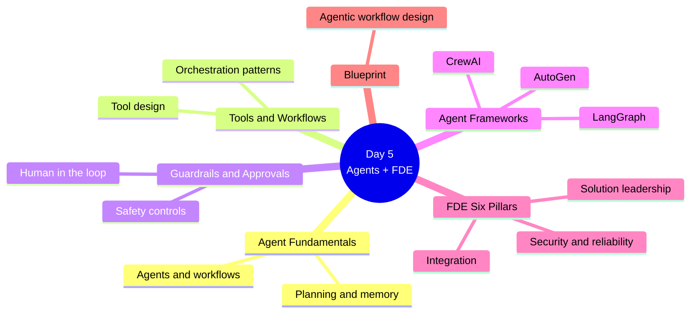
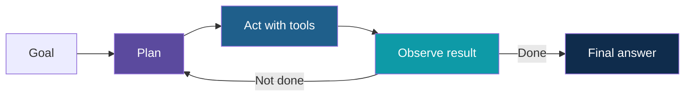
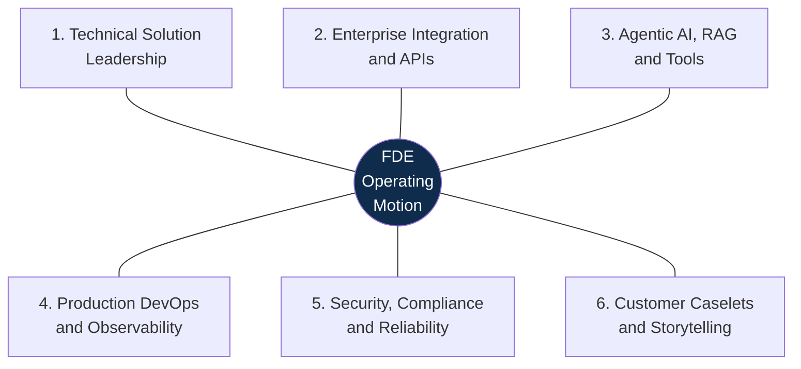
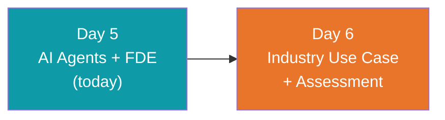

# Day 5: AI Agents + FDE Architecture

**AI Developer & FDE Training | Kalpataru Projects, Ahmedabad**
Week 2, Day 5 of 6 | 4 hours | Batch 1 (forenoon) and Batch 2 (afternoon)

> Scope note: this document covers structure, timing, topics and outputs only. Code, worked examples, datasets and demo content will be developed separately.

---

## Today at a Glance

From agent fundamentals to a full solution blueprint through the FDE six-pillar lens.

---

## Agenda

```mermaid
gantt
    title Day 5 Agenda (240 minutes)
    dateFormat HH:mm
    axisFormat %H:%M
    section Opening
    Kickoff and Day 4 recap         :a1, 09:30, 10m
    section Agents
    Agent fundamentals              :a2, after a1, 25m
    Tools and agent workflows       :a3, after a2, 35m
    Break                           :crit, a4, after a3, 15m
    section Control and Frameworks
    Guardrails and approvals        :a5, after a4, 35m
    Agent frameworks                :a6, after a5, 30m
    section FDE
    FDE six-pillar architecture     :a7, after a6, 40m
    Agentic workflow blueprint      :a8, after a7, 40m
    section Close
    Wrap-up and exit check          :a9, after a8, 10m
```

| Time | Duration | Topic Block | Type |
|---|---|---|---|
| 00:00 to 00:10 | 10 min | Kickoff and Day 4 recap | Intro |
| 00:10 to 00:35 | 25 min | 1. Agent Fundamentals | Learn |
| 00:35 to 01:10 | 35 min | 2. Tools and Agent Workflows | Learn + Apply |
| 01:10 to 01:25 | 15 min | Break | |
| 01:25 to 02:00 | 35 min | 3. Guardrails and Approvals | Learn + Apply |
| 02:00 to 02:30 | 30 min | 4. Agent Frameworks | Learn + Apply |
| 02:30 to 03:10 | 40 min | 5. FDE Six-Pillar Architecture | Learn |
| 03:10 to 03:50 | 40 min | 6. Agentic Workflow Blueprint | Apply |
| 03:50 to 04:00 | 10 min | Wrap-up and exit check | Reflect |

Clock times are indicative and can be shifted; Batch 2 follows the same durations.

---

## Topics Covered

### Kickoff and Day 4 Recap (10 min)

1. Day 5 objectives
2. Recap of Day 4: RAG pipeline and citations

### Block 1: Agent Fundamentals (25 min)

1. What an AI agent is
2. Agent compared with chatbot and fixed workflow
3. The plan, act and observe loop
4. Memory and state
5. When to use an agent and when not to

### Block 2: Tools and Agent Workflows (35 min)

1. Designing tools an agent can use
2. Building on function calling from Day 3
3. Using RAG as a tool, building on Day 4
4. Workflow patterns: single agent, multi-step and multi-agent overview
5. Managing state across steps
6. Failure handling and step limits

**Lab 1:** Agent with tools

### Block 3: Guardrails and Approvals (35 min)

1. Why agents need guardrails
2. Input and output checks
3. Permissions and scope of tools
4. Human-in-the-loop approvals
5. Prompt injection and unsafe tool use
6. Evaluating agent behaviour

**Lab 2:** Add guardrails and an approval step

### Block 4: Agent Frameworks (30 min)

1. Why frameworks exist
2. LangGraph, CrewAI and AutoGen at a glance
3. Choosing a framework
4. Working with the selected framework

**Lab 3:** Framework walkthrough

### Block 5: FDE Six-Pillar Architecture (40 min)

The FDE track builds customer-edge engineers who can translate ambiguity into secure, integrated and demonstrable AI solutions.

1. Technical solution leadership: turning ambiguity into a solution
2. Enterprise integration and APIs
3. Agentic AI, RAG and tools: mapping Days 3 to 5 to the pillar
4. Production DevOps and observability at overview level
5. Security, compliance and reliability
6. Customer caselets and storytelling

### Block 6: Agentic Workflow Blueprint (40 min)

1. Choose a business workflow
2. Map steps, tools, data sources and decisions
3. Place guardrails and approvals
4. Note integrations, risks and observability needs
5. Prepare a short readout

**Lab 4:** Agentic workflow blueprint

### Wrap-up and Exit Check (10 min)

1. Exit check on agents, guardrails and the six pillars
2. Blueprint show and tell
3. Day 6 preview: choosing a scenario

---

## What You Will Walk Away With

| Output | Block |
|---|---|
| A working agent with tools | Block 2 |
| Guardrails and an approval step | Block 3 |
| Framework awareness for LangGraph, CrewAI and AutoGen | Block 4 |
| A six-pillar view of an FDE solution | Block 5 |
| Agentic workflow blueprint | Block 6 |

**Day 5 output: agentic workflow blueprint**

### Learning Objectives

By the end of Day 5, you can:

1. Explain how agents work and when to use them
2. Design tools, guardrails and approval steps
3. Compare agent frameworks
4. Describe a solution across the FDE six pillars
5. Produce an agentic workflow blueprint

---

## Not Covered Today

- Detailed Docker, containers and deployment (production and DevOps section)
- Full multi-agent production builds

## Ground Rules

- Use only the provided synthetic or sanitized data
- Every agent that takes action needs an approval or a limit
- Keep API keys out of code and Git

## What Comes Next

---

*Prepared for Kalpataru Projects | AIM ADaSci | Confidential*
