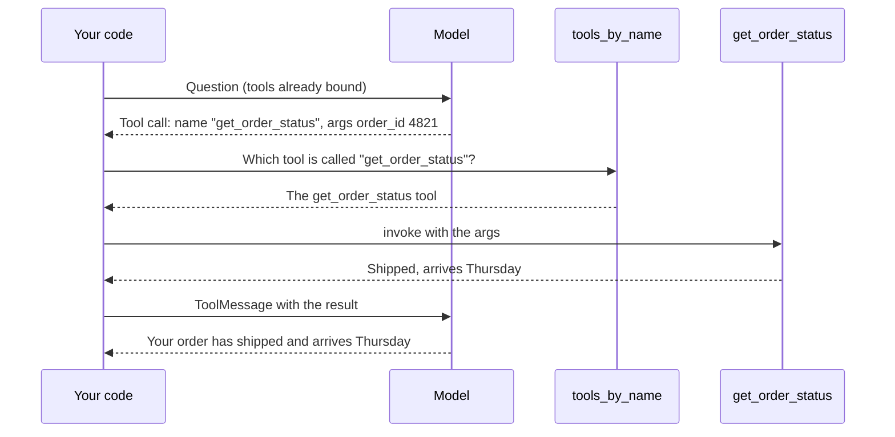

# Step 1 — Concepts Overview

> Back to index · Next: Project Setup

## Goal

See what LangChain replaces in the tool-calling loop you already know, and meet the one new
idea this project adds: choosing the tool by the name the model sends.

## Why this matters

In the simple-tool-calling walkthrough you wrote three things by hand: a nested dictionary
describing the tool, a call to the model with that dictionary on every request, and code to
read the model's reply and pack the result back into a message. None of that was the point.
The point was the idea underneath: the model asks, your code runs.

LangChain is a set of shortcuts for the hand-written parts. Think of a restaurant order pad.
You can write every order on a blank sheet, or you can use a pad with printed boxes for
table, dish and notes. The kitchen gets the same information either way. The pad only saves
you from drawing the boxes each time.

That is why this walkthrough is shorter. The round trip is the same. At each step you will
see what you wrote before and what you write now.

There is one real addition. The model's request names a tool as plain text, such as
`"get_order_status"`. With one tool you can ignore that name and call the function you know.
With several tools you cannot. This project builds a small lookup so the name the model sends
decides which function runs.

## The Vocabulary

| Word | Meaning | Where you will see it |
|---|---|---|
| `@tool` | A decorator that turns a function into a tool object, using its name, type hints and docstring | Above `get_order_status` |
| `ChatOpenAI` | LangChain's model object. It replaces the OpenAI client | `model` |
| `bind_tools` | Attaches the tool list to the model once, instead of on every call | `model_with_tools` |
| `invoke` | Runs a model or a tool with one input. Used on both | `model_with_tools.invoke(...)`, `selected_tool.invoke(...)` |
| `HumanMessage`, `ToolMessage` | Message classes that replace the `{"role": ...}` dictionaries | `messages` |
| `tool_calls` | The model's requests for tools, already a list of dictionaries | `reply.tool_calls` |
| Tool lookup | A dictionary from tool name to tool object | `tools_by_name` |

## The Shape of the App

The only new participant compared with the plain version is the lookup. It sits between the
model's request and the function, and turns a name into something you can run.

## What Changes and What Does Not

| Changes | Does not change |
|---|---|
| The tool description is built from the docstring | The two calls to the model |
| The model is bound to the tools once | The model's reply has no text when it asks for a tool |
| Messages are classes, not dictionaries | Your code, not the model, runs the tool |
| Arguments arrive as a dictionary, with no `json.loads` | The final answer comes from the second call |
| The tool is picked by name | The model sees only the name and description, never your function |

## Check Yourself

Before moving on, you should be able to say which parts of the plain-SDK version have no
counterpart in this one. The answer is the nested description dictionary and the
`json.loads` call. Ask yourself again after Step 5.

Next: **Step 2 — Project Setup**.
