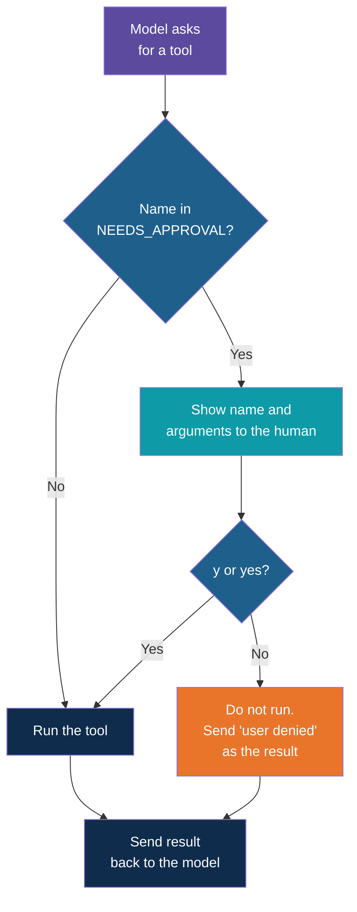

# Step 10 — Ask a Human First

> Back to index · Previous: Add a Cancel Tool · Next: Recap and Exercises

## Goal

Pause before `cancel_order` runs, show the person exactly what is about to happen, and run it
only if they say yes. This is a human in the loop.

## Why this matters

The model's tool call is a proposal, not a command. Your code is the one that runs the tool,
so your code can decide not to. That decision point is the line where `selected_tool` is
chosen, and it is the right place for a check, a limit or an approval.

Not every tool needs a human. Asking before every status lookup would make the assistant
useless. The sensible rule is to match the check to the risk: reads run freely, anything that
changes something waits for a yes. That is why the approval list is a small set of tool
names, and why adding a new risky tool to it is one word.

Four design choices are worth saying out loud.

- **The gate is in code, not in the prompt.** Telling the model "ask before cancelling" is a
  request it may ignore. A line of Python it cannot skip is a guarantee.
- **The human sees the real arguments.** The prompt prints the tool name and the actual
  `order_id` the model chose, not the model's friendly summary of it.
- **Only a clear yes counts.** `y` or `yes` approves. Anything else, including an empty line
  or a typo, is a no. When in doubt the action does not happen.
- **A denial still gets an answer.** The model asked, so it must receive a `ToolMessage` for
  that request. If you skip it, the next call fails because a tool request has no result. So
  the tool does not run, but a sentence goes back saying the user said no, and the model
  explains that to the customer.



## 1. Mark the Tools That Need Approval

Below `tools_by_name`, add:

```python
# Tools that change something need a human to say yes before they run.
NEEDS_APPROVAL = {"cancel_order"}
```

`get_order_status` is not in the set, so it keeps running without a question.

## 2. Write the Approval Function

Below the `history` list, add:

```python
def approved_by_human(name, args):
    answer = input(f"  Approval needed: {name}({args}). Allow? (y/n): ").strip().lower()
    return answer in ("y", "yes")
```

It prints what is about to run, reads one answer and returns `True` only for `y` or `yes`
in any capitalisation. Keeping it in its own function means you could later swap `input`
for a button in a web page or a message to a manager without touching the loop.

## 3. Put the Gate in the Loop

In the loop, add an `elif` between the unknown-tool guard and the normal run:

```python
            selected_tool = tools_by_name.get(call["name"])
            if selected_tool is None:
                result = f"Unknown tool: {call['name']}"
            elif call["name"] in NEEDS_APPROVAL and not approved_by_human(call["name"], call["args"]):
                # The tool never runs. The model is told, so it can explain to the user.
                result = "The user denied this action. It was not carried out."
            else:
                result = selected_tool.invoke(call["args"])
```

| Part | What it does |
|---|---|
| `call["name"] in NEEDS_APPROVAL` | True only for gated tools |
| `and not approved_by_human(...)` | Asks the human, and only runs when the first part was true |
| `result = "The user denied..."` | Takes the place of a real result when the answer is no |
| `else: ... .invoke(...)` | Runs the tool for ungated tools and for approved ones |

Because the check uses `and`, Python stops at the first false part. For `get_order_status`
the first part is false, so `approved_by_human` is never called and nobody is asked.

## 4. Tell the Model to Accept a No

Add one sentence to the end of the system message:

```python
        "Never mention functions or tools to the user. "
        "If a request is denied by the user, accept it and do not ask again."
```

Without it, a small model may retry the same cancellation straight after a denial.

## Try it

```bash
uv run human_in_the_loop.py
```

Approve one, check it stuck, then deny another:

```text
Chat started. Type 'exit' to quit.

You: Cancel order 4821
  [Model asks for: cancel_order({'order_id': '4821'})]
  Approval needed: cancel_order({'order_id': '4821'}). Allow? (y/n): y
  [Tool returned: Order 4821 has been cancelled.]
AI: Your order 4821 has been cancelled.

You: Where is order 4821?
  [Model asks for: get_order_status({'order_id': '4821'})]
  [Tool returned: Cancelled]
AI: Order 4821 has been cancelled.

You: Cancel order 4822
  [Model asks for: cancel_order({'order_id': '4822'})]
  Approval needed: cancel_order({'order_id': '4822'}). Allow? (y/n): n
  [Tool returned: The user denied this action. It was not carried out.]
AI: Understood, I have not cancelled order 4822.

You: Where is order 4822?
  [Model asks for: get_order_status({'order_id': '4822'})]
  [Tool returned: Packed, ships tomorrow]
AI: Order 4822 is packed and ships tomorrow.

You: exit
```

The status lookups ran with no question. Only the cancellations paused. After the `n`, order
4822 is untouched, which the last lookup proves.

## Checkpoint

<details>
<summary>Full <code>human_in_the_loop.py</code></summary>

```python
from dotenv import load_dotenv
from langchain_core.messages import HumanMessage, SystemMessage, ToolMessage
from langchain_core.tools import tool
from langchain_openai import ChatOpenAI

load_dotenv()

model = ChatOpenAI(model="llama3.1:8b", base_url="http://localhost:11434/v1",
    api_key="ollama")

# A fake order table used by the tools.
orders = {
    "4821": "Shipped, arrives Thursday",
    "4822": "Packed, ships tomorrow",
}


@tool
def get_order_status(order_id: str) -> str:
    """Look up the delivery status of an order. Use when the customer asks where their order is."""
    return orders.get(order_id, f"No order found with number {order_id}. Check the number and try again.")


@tool
def cancel_order(order_id: str) -> str:
    """Cancel an order. Use only when the customer clearly asks to cancel an order."""
    if order_id not in orders:
        return f"No order found with number {order_id}. Check the number and try again."
    orders[order_id] = "Cancelled"
    return f"Order {order_id} has been cancelled."


tools = [get_order_status, cancel_order]
model_with_tools = model.bind_tools(tools)
tools_by_name = {t.name: t for t in tools}

# Tools that change something need a human to say yes before they run.
NEEDS_APPROVAL = {"cancel_order"}

history = [
    SystemMessage(
        "You are a helpful assistant. Use a tool only when one clearly matches the request. "
        "For general questions, or requests no tool can do, answer directly in plain text "
        "from your own knowledge, or say politely what you cannot do. "
        "Never mention functions or tools to the user. "
        "If a request is denied by the user, accept it and do not ask again."
    ),
]


def approved_by_human(name, args):
    answer = input(f"  Approval needed: {name}({args}). Allow? (y/n): ").strip().lower()
    return answer in ("y", "yes")


print("Chat started. Type 'exit' to quit.\n")

while True:
    try:
        user_input = input("You: ").strip()
    except (EOFError, KeyboardInterrupt):
        print()
        break
    if not user_input:
        continue
    if user_input.lower() in ("exit", "quit"):
        break

    history.append(HumanMessage(user_input))
    reply = model_with_tools.invoke(history)

    while reply.tool_calls:
        history.append(reply)

        for call in reply.tool_calls:
            print(f"  [Model asks for: {call['name']}({call['args']})]")

            selected_tool = tools_by_name.get(call["name"])
            if selected_tool is None:
                result = f"Unknown tool: {call['name']}"
            elif call["name"] in NEEDS_APPROVAL and not approved_by_human(call["name"], call["args"]):
                # The tool never runs. The model is told, so it can explain to the user.
                result = "The user denied this action. It was not carried out."
            else:
                result = selected_tool.invoke(call["args"])
            print(f"  [Tool returned: {result}]")

            history.append(ToolMessage(str(result), tool_call_id=call["id"]))

        reply = model_with_tools.invoke(history)

    history.append(reply)
    print("AI:", reply.content, "\n")
```

</details>

This matches `simple-tool-calling-langchain/human_in_the_loop.py` in the reference project exactly.

## Common Mistakes

| Symptom | Cause | Fix |
|---|---|---|
| The order is cancelled without a question | The tool name in `NEEDS_APPROVAL` has a typo, or the `elif` was placed after the `else` | Match the name in `@tool` exactly and keep the `elif` before the `else` |
| A 400 error right after answering `n` | The denial branch did not set `result`, so no `ToolMessage` was sent | Set `result` in every branch and always append the `ToolMessage` |
| Every lookup asks for approval | `get_order_status` was added to the set | Gate only tools that change something |
| `Y` is treated as a no | `.lower()` was left off the answer | Keep `.strip().lower()` before the comparison |
| The model asks to cancel the same order again after a no | The system message has no line about denials | Add the sentence from section 4 |
| The prompt appears but the answer is ignored and the tool runs | The result of `approved_by_human` is not negated | The condition must read `not approved_by_human(...)` |

Next: **Step 11 — Recap and Exercises**.
