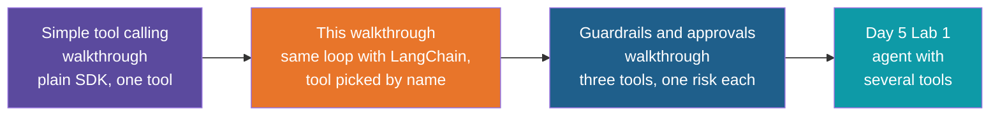

# Simple Tool Calling with LangChain — Build Walkthrough

A step-by-step guide to hand-building the `simple-tool-calling-langchain` reference project:
the simple-tool-calling app rebuilt on LangChain. Same order lookup, same round trip. This
version adds your code finding the tool to run by the name the model sends, then grows the
script into a chat with memory, and ends with a second script where a human must approve
a risky action (cancelling an order) before it runs.

## What You'll Build

A uv-managed Python project with two scripts and three small supporting files:

| File | What it is |
|---|---|
| `tool_calling.py` | A `@tool` function (`get_order_status`), a name-to-tool lookup, and a chat loop with conversation history |
| `human_in_the_loop.py` | The same chat with a second tool (`cancel_order`) that waits for a human yes or no before it runs |
| `pyproject.toml` | Dependencies: `langchain-openai` and `python-dotenv` |
| `.env.example` | Template for the API key |
| `.gitignore` | Keeps `.venv/`, `__pycache__/` and `.env` out of Git |

## Who This Is For / Prerequisites

- Comfortable with Python functions, dicts, lists and `if`.
- `uv` installed. The simple-chat walkthrough in Day 3 explains `uv sync` and `uv run`; this
  guide does not repeat them.
- You have built or watched the simple-tool-calling walkthrough. This guide does not
  re-teach what a tool, a tool call or a round trip is. It shows what LangChain does for you
  at each point where you wrote something by hand before. If those words are new, do that
  walkthrough first.
- An OpenAI API key, as issued for the training, for Steps 2 to 7. The program uses
  `gpt-4o-mini` there. From Step 8 the reference project runs a local Ollama model
  (`llama3.1:8b`) instead, so Ollama needs to be installed for Steps 8 to 10.
- Model wording varies from run to run. The transcripts in each step show the shape of the
  output, and yours will not match word for word.

Budget about 80 minutes to build everything. In a live session Steps 5, 6 and 7 are the core
(25 minutes), and Steps 9 and 10 are the human-in-the-loop part (20 minutes). Steps 3 and 4
can be typed quickly.

## Steps

| Step | File | What You'll Add | Est. Time |
|---|---|---|---|
| 1 | 01-concepts-overview.md | Vocabulary: `@tool`, `bind_tools`, `invoke`, message classes, tool lookup | 5 min |
| 2 | 02-project-setup.md | Project folder, dependencies, `.gitignore`, `.env` | 7 min |
| 3 | 03-write-the-tool.md | `get_order_status` as a `@tool`, and what LangChain builds from it | 8 min |
| 4 | 04-give-the-tool-to-the-model.md | The model object, `bind_tools`, and the first call | 8 min |
| 5 | 05-run-the-tool-and-return-the-result.md | The round trip with the tool named by hand | 10 min |
| 6 | 06-look-up-the-tool-by-name.md | A `tools_by_name` dictionary so the model's choice picks the function | 8 min |
| 7 | 07-handle-an-unknown-tool.md | A guard for names you never gave the model | 5 min |
| 8 | 08-keep-a-conversation.md | A chat loop, conversation history, a system message and a local Ollama model | 10 min |
| 9 | 09-add-a-cancel-tool.md | A tool that changes data, and what happens with no safeguard | 8 min |
| 10 | 10-ask-a-human-first.md | An approval gate: a set of risky tool names and a yes or no prompt | 12 min |
| 11 | 11-recap-and-exercises.md | Review, trade-offs, practice | 5 min |

## Relationship to the Reference Implementation

By the end your files should match the reference project exactly: `pyproject.toml`,
`.gitignore` and `.env.example` (Step 2), `tool_calling.py` (Step 8) and
`human_in_the_loop.py` (Step 10). Steps 3 to 7 build the single-question version of
`tool_calling.py`, and Step 8 turns it into the reference chat version. The reference
project is the folder `simple-tool-calling-langchain` under `session-05/code/solutions`. This
walkthrough was generated from those files, and every full-file checkpoint was checked for
valid Python syntax and the final checkpoint was compared against the reference.

## Suggested Demo Flow

1. In Step 3, call `get_order_status("4821")` directly and let the room read the
   `TypeError`. A `@tool` is no longer a plain function. It is an object with `.invoke`, and
   that object is what carries the name and description to the model.
2. Also in Step 3, print `get_order_status.description` and ask where that text came from.
   Nobody typed it into a tool list. It is the docstring. Then change one word in the
   docstring and print it again.
3. In Step 4, stop at the first call and print `reply.tool_calls`. The model's reply has no
   text, only a list with a name and a dict of arguments. This is the moment to say that the
   name is just a string.
4. In Step 5, point at the one line that names `get_order_status` in the loop. Ask "What
   happens when we add a second tool?" Let the room say that this line would have to change.
5. In Step 6, make the swap, then add a second dummy tool to the list live. Nothing else in
   the loop changes. That is the whole payoff of the lookup.
6. In Step 7, set `tools_by_name = {}` for one run and read the model's reply to the
   "Unknown tool" message. A made-up name no longer crashes the program.
7. In Step 8, ask a general question such as "What is the capital of France?" and then
   "What was the first thing I asked you?". The first shows that no tool is needed. The second
   shows that the memory is only the `history` list.
8. In Step 9, cancel an order and let the room watch it happen with no question asked. Then
   ask "Where is order 4821?" to show the change stuck. Leave the discomfort in the room for a
   moment before starting Step 10.
9. In Step 10, answer `n` once and then ask for the same order's status. Point at the one
   line that sends "The user denied this action" back. Then delete that line for a run and
   read the 400 error, to show why a refusal still needs a `ToolMessage`.

## Series

Start with Step 1 — Concepts Overview.

*Prepared for Kalpataru Projects | AIM ADaSci | Confidential*
