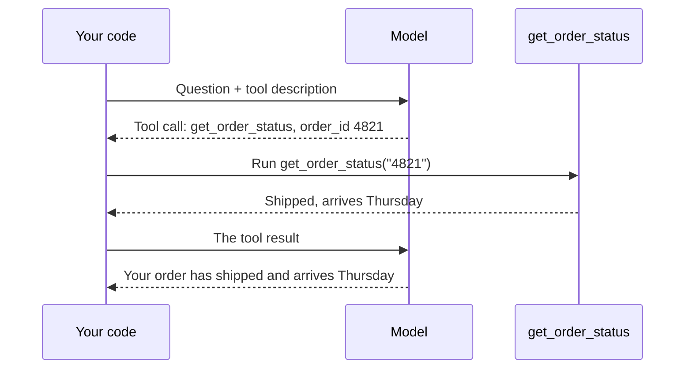

# Step 1 — Concepts Overview

> Back to index · Next: Project Setup

## Goal

Learn the words you need before writing any code, and see why one tool question takes two
calls to the model.

## Why this matters

A language model on its own is like a manager in a room with no phone and no computer. It
is good at thinking and writing, but it cannot look anything up. Your program is the
assistant outside the room, who has the phone and the computer.

The manager writes a note: "Please check the status of order 4821." The assistant makes the
call, writes the answer on a slip and slides it under the door. The manager reads the slip
and writes the reply to the customer.

The manager never touches the phone. They only ask. This is the single most important idea
in the walkthrough: **the model asks for a tool, your code runs it**. That is why you can
trust a model with tools at all, because your code sits between the request and the action.

## The Vocabulary

| Word | Meaning | Where you will see it |
|---|---|---|
| Tool | A capability you give the model, such as "look up an order" | `get_order_status` |
| Tool description | The name, purpose and inputs of a tool, written for the model to read | The `tools` list |
| Tool call | The model's request to run a tool, with the values to use | `reply.tool_calls` |
| Tool result | What your function returned, sent back to the model | A message with `role` set to `"tool"` |
| Round trip | Question, tool request, tool result, final answer | The whole program |

## The Shape of the App

Two calls to the model for one question. The first decides **what to ask for**. The second
turns the result into **a human answer**. If the question needs no tool, such as "Hi", the
first reply is already the answer and there is no second call.

## What the Model Sees and Does Not See

| The model sees | The model never sees |
|---|---|
| The tool's name | Your Python function |
| The tool's description | The order table inside it |
| The inputs it must fill in | Whether the function ran at all, until you tell it |

The model chooses a tool from the name and description alone. If the description is vague,
the choice will be poor, however good the function is.

## Check Yourself

Before moving on, you should be able to say how many calls to the model are made for
"Where is my order 4821?" and for "Hi, how are you?". The answers are two and one. Ask
yourself again after Step 7.

Next: **Step 2 — Project Setup**.
