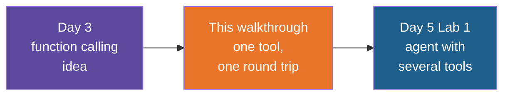

# Simple Tool Calling — Build Walkthrough

A step-by-step guide to hand-building the `simple-tool-calling` reference project: the
smallest possible tool-calling program. One tool, one question, two calls to the model. The
model asks for the tool, your code runs it, and the model uses the result to write the
answer.

## What You'll Build

A uv-managed Python project with one script and three small supporting files:

| File | What it is |
|---|---|
| `tool_calling.py` | A tool (`get_order_status`), its description for the model, and the two-call round trip |
| `pyproject.toml` | Dependencies: `openai` and `python-dotenv` |
| `.env.example` | Template for the API key |
| `.gitignore` | Keeps `.venv/`, `__pycache__/` and `.env` out of Git |

## Who This Is For / Prerequisites

- Comfortable with Python functions, dicts, lists and `if`.
- `uv` installed. The simple-chat walkthrough in Day 3 explains `uv sync` and `uv run`;
  this guide does not repeat them.
- You have seen a plain model call before (the simple-chat walkthrough, Steps 3 and 4).
  Step 3 here repeats it in a few lines.
- An OpenAI API key, as issued for the training. The program uses `gpt-4o-mini`, a small
  and inexpensive model.
- Helpful but not required: the Day 5 note "Tools and Tool Calling", which explains the
  idea in pictures.

Budget about 60 minutes to build everything. In a live session Steps 5, 6 and 7 are the
core (30 minutes). Steps 3 and 4 can be typed quickly.

## Steps

| Step | File | What You'll Add | Est. Time |
|---|---|---|---|
| 1 | 01-concepts-overview.md | Vocabulary: tool, tool description, tool call, tool result | 5 min |
| 2 | 02-project-setup.md | Project folder, dependencies, `.gitignore`, `.env` | 7 min |
| 3 | 03-your-first-call.md | A plain question to the model, to see what it cannot do alone | 8 min |
| 4 | 04-write-the-tool.md | `get_order_status`, a plain Python function | 5 min |
| 5 | 05-describe-the-tool.md | The tool description the model reads | 10 min |
| 6 | 06-let-the-model-decide.md | Send the tool list and read the model's request | 8 min |
| 7 | 07-run-the-tool-and-return-the-result.md | Run the function, send the result back, get the answer | 12 min |
| 8 | 08-recap-and-exercises.md | Review, gotchas, practice | 5 min |

## Relationship to the Reference Implementation

By the end your files should match the reference project exactly: `pyproject.toml`,
`.gitignore` and `.env.example` (Step 2) and `tool_calling.py` (Step 7). The reference
project is the folder `simple-tool-calling` under `session-05/code/solutions`. This
walkthrough was generated from those files, and every full-file checkpoint was checked for
valid Python syntax and compared against the reference.

## Suggested Demo Flow

1. At the end of Step 3, ask the model about order 4821 with no tools and read its reply
   aloud. It will say it cannot see orders. Ask the room what it would need in order to
   answer. That gap is the reason tools exist.
2. In Step 4, call `get_order_status("9999")` and let the room read the "not found"
   message. Point out that it is written as a sentence the model can pass on, not as an
   error code.
3. In Step 5, have the room read only the description, covering the code. Ask "Which
   question would you send to this tool, and which would you not?" The last sentence, "Do
   not use for refunds", is there to answer the second half.
4. In Step 6, run it and stop at `AI: None`. The model returned no text at all, because it
   asked for a tool instead. Let the room puzzle over it for a moment before explaining.
5. In Step 7, add `print(messages)` just before the second call. Seeing three items (the
   user's question, the model's request, the tool result) is the whole round trip in one
   list.
6. Finish by changing the question to "Hi, how are you?" and rerun. No tool call, one model
   call. The model decides, your code does not.

## Series

Start with Step 1 — Concepts Overview.
