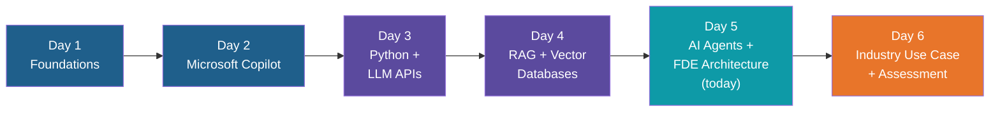
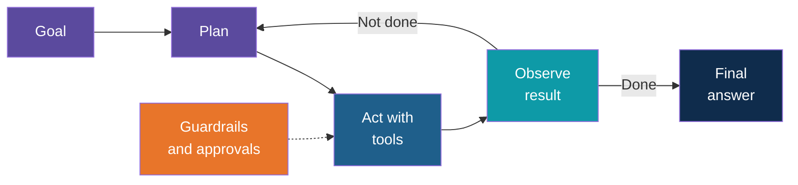
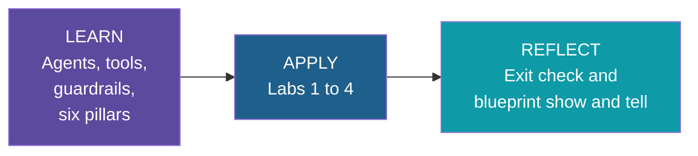

# Day 5: AI Agents + FDE Architecture — Introduction

**AI Developer & FDE Training | Kalpataru Projects, Ahmedabad**
Week 2, Day 5 of 6 | 4 hours | Batch 1 (forenoon) and Batch 2 (afternoon)

---

## Welcome

Until now, every AI system you built or used did one thing per request: you asked, it
answered. Today the model gets to decide what to do next. You will build an agent that picks
its own tools, checks the result, and keeps going until the job is done. Then you will make
it safe to trust, and finish by designing a complete solution on paper.

The day has two halves. The first half is hands-on: an agent with tools, guardrails and an
approval step. The second half steps back and asks how a real customer solution is shaped,
using the FDE six-pillar model. You leave with an agentic workflow blueprint for a business
process of your choice.

Developers will build and run the agent labs. Business users will follow the same ideas
through demos and take a full part in the blueprint block, which needs no code.

## Why This Day Exists

An agent is the Day 3 API call and the Day 4 retrieval pipeline, placed inside a loop that
the model controls. That extra freedom is useful and also risky:

| What the agent gains | What can go wrong |
|---|---|
| Chooses its own steps | Wanders off task or loops forever |
| Calls tools that act in the real world | A wrong or unsafe action actually happens |
| Reads documents and web content | Hidden instructions in that content take over (prompt injection) |
| Handles ambiguous requests | Behaves differently each run, so it is hard to test |

Guardrails, approvals and step limits are what turn an interesting demo into something a
team can deploy. That is why they get their own block today, and why the ground rule for the
day is that every agent that takes action needs an approval or a limit.

## How Today Fits Into the Program

- Day 3's function calling is how an agent invokes its tools.
- Day 4's RAG assistant becomes one tool among several that the agent can choose to call.
- Day 6's caselet builds on today's blueprint, so the workflow you design today is a
  candidate starting point for tomorrow.

## The Loop You Will Build

Block 2 builds this loop with tools. Block 3 adds the orange box: checks before an action
runs, and a human sign-off for the actions that matter.

## Learn, Apply, Reflect — Today

- **Learn:** agent fundamentals first, with everyday examples, then the controls, then the
  frameworks and the FDE model.
- **Apply:** four labs. The first three build and harden one agent; the fourth is a design
  exercise on a workflow you choose.
- **Reflect:** the exit check, plus a short show and tell where each group presents its
  blueprint.

## Today's Journey

| Block | Focus | You'll produce |
|---|---|---|
| 1. Agent Fundamentals | What an agent is, agent vs. chatbot vs. fixed workflow, plan-act-observe loop, memory and state, when not to use one | A clear mental model of the agent loop |
| 2. Tools and Agent Workflows | Tool design, function calling, RAG as a tool, workflow patterns, step limits and failure handling | A working agent with tools (Lab 1) |
| 3. Guardrails and Approvals | Input and output checks, tool permissions, human-in-the-loop, prompt injection, evaluating behaviour | Guardrails and an approval step (Lab 2) |
| 4. Agent Frameworks | Why frameworks exist, LangGraph, CrewAI and AutoGen at a glance, choosing one | Framework awareness (Lab 3) |
| 5. FDE Six-Pillar Architecture | Solution leadership, integration, agentic AI, DevOps and observability, security, caselets | A six-pillar view of an FDE solution |
| 6. Agentic Workflow Blueprint | Pick a workflow, map steps, tools, data and decisions, place guardrails, note risks | Agentic workflow blueprint (Lab 4) |

The Day5 schedule file in this folder has the full timing and topic-by-topic detail.

## Before You Start

- Your Day 3 Python environment and API client working, with a free-tier key in `.env`
- Your Day 4 document assistant, if you finished it, since it is reused as a tool
- A quick check that you can still make one successful API call before the session starts
- The synthetic sample data provided for today's labs
- Business users: bring one routine workflow from your own area that involves several
  steps and a few decisions. It is the raw material for the blueprint
- No confidential Kalpataru documents, datasets or credentials on the machine you're using

## How These Notes Are Organized

- The Day5 schedule file: the agenda with timing, topic lists, labs and ground rules.
- `intro.md`: this page, covering why the day matters and how it connects to the program.
- `notes/`: one file per block, with the idea explained through examples and diagrams.

## Not Covered Today

- Detailed Docker, containers and deployment
- Full multi-agent production builds

## Ground Rules

- Use only the provided synthetic or sanitized data
- Every agent that takes action needs an approval or a limit
- Keep API keys out of code and Git

---

*Prepared for Kalpataru Projects | AIM ADaSci | Confidential*
