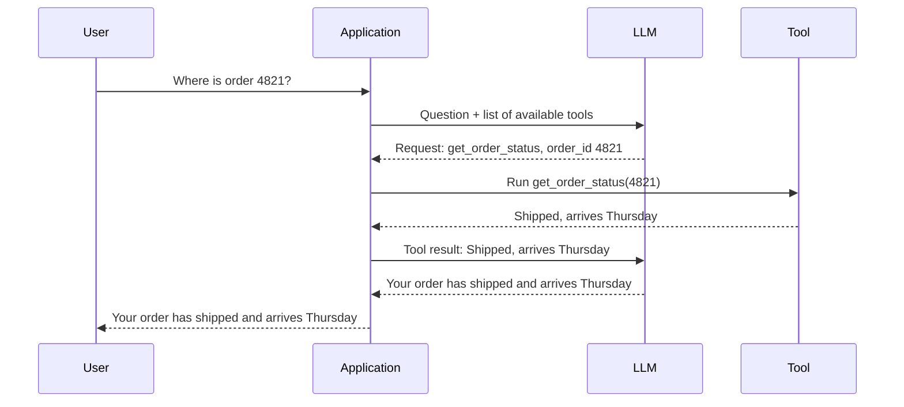
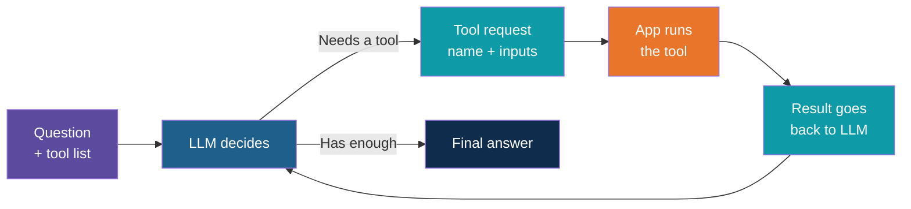
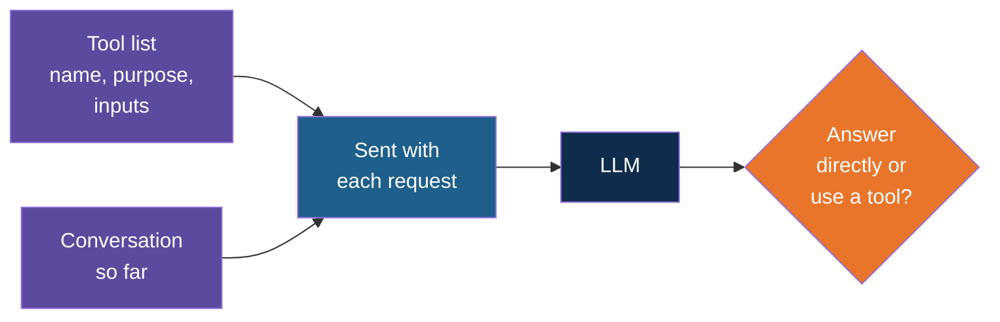
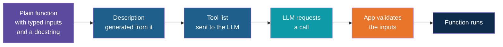
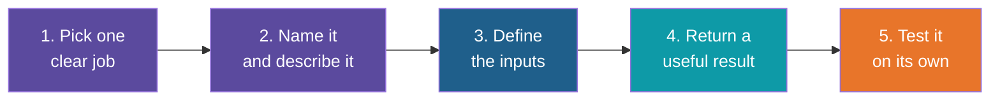
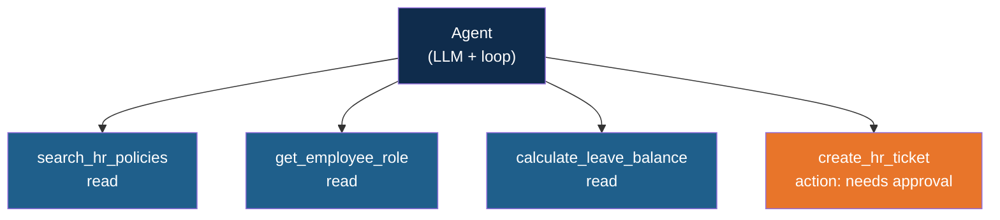
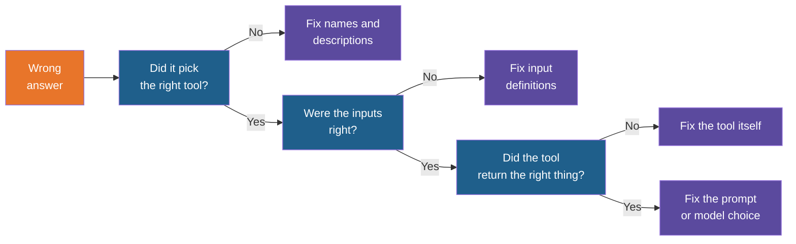

# Tools and Tool Calling

<!-- Slide deck in markdown. Each block between the --- lines is one slide.
     Trainer notes are in HTML comments and do not show in the preview.
     All tools, names and numbers in this deck are made up for teaching. -->

---

# Tools and Tool Calling

## How an LLM gets hands

**Day 5 | Block 2: Tools and Agent Workflows | Lab 1: Agent with tools**

<!-- Trainer: about 20 minutes of the 35-minute block. This note is concept and design only. The code and the step-by-step build live in the separate Lab 1 code and walkthrough. Workflow patterns, state and step limits are covered in the next note. -->

---

## What Is Missing From a Plain LLM

On its own, an LLM can only produce text. It cannot check today's date, open a file, look up an
order or send an email. Everything it "knows" is frozen at training time plus whatever you
paste into the prompt.

| Without tools | With tools |
|---|---|
| "I cannot access live data" | Looks up the live data and quotes it |
| Guesses at arithmetic | Hands the sum to a calculator |
| Describes how to send an email | Drafts it and asks to send it |
| Answers from memory | Answers from your systems |

A **tool** is simply a capability you hand to the model: a small action it can ask for, such as
"get the weather", "search the policies" or "create a ticket".

> An agent is an LLM plus tools plus a loop. Today's note is about the middle part.

---

## An Everyday Picture

Think of a **manager and an assistant**. The manager (the LLM) is good at thinking and
writing, but is sitting in a room with no phone and no computer. The assistant (your
application) has both.

The manager writes a note: *"Please check the status of order 4821."* The assistant makes the
call, writes the answer on a slip, and slides it under the door. The manager reads the slip
and writes the reply to the customer.

Two things to notice:

- The manager never touches the phone. They only **ask**.
- The assistant only does what is on the list of things it is willing to do.

That is tool calling, exactly.

---

# Part 1

## How Tool Calling Works

---

## The Key Fact: The Model Does Not Run the Tool

This is the single most important idea in the note, and the one most often misunderstood.

When an LLM "calls a tool", it does not execute anything. It produces a **structured request**:
the tool name and the values to use. **Your code** reads the request, runs the real function,
and sends the result back.

| Who | Does what |
|---|---|
| **LLM** | Decides a tool is needed, chooses which one, fills in the inputs |
| **Your application** | Checks the request, runs the real function, handles errors |
| **Tool** | Does the actual work: a database query, an API call, a calculation |
| **LLM (again)** | Reads the result and writes the answer, or asks for another tool |

This is why the model can be trusted with tools at all: your code sits between the request
and the action and can refuse, limit or log it.

---

## The Round Trip

Two LLM calls for one question. The first decides **what to ask for**. The second turns the
result into **a human answer**.

---

## The Same Thing as a Loop

Real questions often need more than one tool. The round trip repeats until the model has what
it needs, which is the plan, act, observe loop from Block 1.

The orange box is where your code is in control. Guardrails and approvals (Block 3) are added
exactly there.

---

## How Does the Model Know What Tools Exist?

You tell it, in every request. Alongside the conversation, the application sends a **tool
list**: a short description of each tool. The model reads the list the same way it reads the
rest of the prompt, then decides.

This is the same **function calling** you met on Day 3: the model returns a structured
request instead of free text. Today we use it as the engine of an agent.

---

# Part 2

## Anatomy of a Tool

---

## Every Tool Has Four Parts

| Part | What it is | Who reads it |
|---|---|---|
| **Name** | A short, clear label, such as `get_order_status` | The LLM, when choosing |
| **Description** | Plain sentences saying what it does and when to use it | The LLM, when choosing |
| **Inputs** | The values it needs, with a type and meaning for each | The LLM fills them in, your code checks them |
| **Function** | The real code that does the work and returns a result | Your application only |

The first three are the **menu** shown to the model. The fourth is the **kitchen** the model
never sees.

> The model chooses tools from the **name and description alone**. It does not see your code.
> If the description is vague, the choice will be poor, however good the code is.

---

## A Tool on One Page

Here is one tool, shown as a card rather than code.

| Field | Content |
|---|---|
| **Name** | `get_order_status` |
| **Description** | "Look up the current delivery status of a customer order. Use when the customer asks where their order is. Do not use for refunds." |
| **Input: order_id** | Text, required. "The order number, for example 4821" |
| **Returns** | Status, expected delivery date, or a clear message if the order is not found |

Notice the description says **when to use it and when not to**. That second half is what stops
the model from reaching for the wrong tool.

---

## Where the Tool List Comes From

Writing a tool is two small jobs: write the function, then describe it to the model. You do
not write the description twice.

Typed inputs from Day 3 (Pydantic) do double duty here: they produce the description the
model reads, and they check what the model sends back before anything runs.

---

# Part 3

## How to Create a Good Tool

---

## The Five-Step Recipe

| Step | What to do | Why |
|---|---|---|
| 1. One clear job | A tool does one thing: look up an order, not "manage orders" | The model picks reliably between small, distinct tools |
| 2. Name and describe | Verb-first name, description with when to use and when not to | This is all the model has to go on |
| 3. Define inputs | Few inputs, each with a type, a meaning and an example | Fewer inputs, fewer wrong guesses |
| 4. Return a useful result | Short, clear, only what the model needs | Long output wastes tokens and distracts |
| 5. Test it alone | Call the function directly before any LLM is involved | Separates "the tool is broken" from "the model chose badly" |

---

## Naming and Describing

The model reads names and descriptions like a new employee reading a list of buttons.

| Weak | Better | Why |
|---|---|---|
| `process` | `create_support_ticket` | Says what it does |
| `data_tool` | `search_hr_policies` | Says what it searches |
| "Gets stuff" | "Search the HR policy documents for passages that answer a question. Use for leave, travel and conduct questions." | Says what, over what, and when |
| Two tools: `search` and `find` | One tool, or two with clearly different descriptions | Overlapping tools confuse the model |

A good test: show the tool list to a colleague with no context and ask which tool they would
use for a given question. If they hesitate, the model will too.

---

## Designing the Inputs

| Guideline | Example |
|---|---|
| **Keep inputs few** | Two or three inputs, not ten |
| **Use fixed choices where possible** | `priority` is one of low, medium, high, not free text |
| **Explain each input** | "Order number, for example 4821" beats "id" |
| **Mark what is required** | Required inputs must be given; optional ones have sensible defaults |
| **Never ask the model for a secret** | API keys and passwords live in your code, not in tool inputs |
| **Check everything that comes back** | Treat the model's inputs as untrusted: validate before running |

---

## Designing the Result

What the tool returns is what the model reads next, so shape it for the model.

| Do | Avoid |
|---|---|
| Return the few fields needed to answer | Dumping a whole database row or page of HTML |
| Return plain, labelled values | Cryptic codes with no meaning |
| Include a source or ID when relevant, for citations | Results with no way to trace them |
| Return a clear message when nothing is found | Returning an empty result with no explanation |
| Return an error as readable text | Letting an exception crash the whole run |

A readable error is a gift to the agent: *"No order found with number 4821. Check the number
and try again"* lets the model correct itself or ask the user, instead of stopping.

---

## Read Tools and Action Tools

Not all tools carry the same risk. Sort yours into two groups before you build them.

| | Read tools | Action tools |
|---|---|---|
| **What they do** | Look something up | Change something in the world |
| **Examples** | Search policies, get order status, check stock | Send an email, create a ticket, update a record, issue a refund |
| **If used wrongly** | A wrong answer | A wrong action, possibly hard to undo |
| **Default control** | Allow freely, log | Limit, confirm or require human approval |

This split is the starting point for Block 3. Start every project with **read tools only**,
and add action tools one at a time, each with a limit or an approval.

---

# Part 4

## Tools You Already Have

---

## Day 4's RAG Assistant Is a Tool

Retrieval fits the tool shape perfectly: a question goes in, passages with sources come out.

| Part | Content |
|---|---|
| **Name** | `search_hr_policies` |
| **Description** | "Search the HR policy documents. Returns the most relevant passages with document and section." |
| **Input** | A search question, in full words |
| **Returns** | A few passages, each with its source |

Wrap the Day 4 retriever in this card and your agent can choose **when** to search, **where**,
and how many times. This is the agentic RAG idea from Day 4, now built properly.

---

## A Small Toolbox for One Agent

Four tools, each with one job, three safe to use freely and one marked for approval. Keep a
toolbox this small: models choose well from a handful of tools and badly from dozens.

---

# Part 5

## When Tool Calling Goes Wrong

---

## Common Failures and Their Fixes

| What goes wrong | Typical cause | Fix |
|---|---|---|
| Model picks the wrong tool | Vague or overlapping descriptions | Rewrite descriptions with "use when" and "do not use for" |
| Model calls a tool that is not needed | Description too broad | Narrow the description; allow answering directly |
| Model sends bad inputs | Unclear input meanings, free text where choices exist | Add examples, fixed choices, and validate before running |
| Model never calls the tool | Tool not relevant to how the question is phrased, or model too small | Test with a stronger model; make the description match user wording |
| Tool throws an error | Real-world failure: timeout, bad ID, service down | Catch it, return readable text, let the model react |
| Loop never ends | Model keeps calling tools without finishing | Cap the steps (covered in the next note) |
| Too many tools | Dozens of tools crowd the prompt | Keep only what this task needs |

When something misbehaves, first read the **exact tool request the model produced**. Most bugs
are visible there.

---

## A Debugging Habit

Check in this order: tool choice, inputs, tool output, then the prompt. Log all four for every
run and the answer is usually in the log.

---

## Explore It Yourself

No code needed.

| To see... | Try | What to do |
|---|---|---|
| The model only asks, it does not run | A local model in Ollama chat | Describe two tools in plain text (a calculator and an order lookup). Ask "What is 18 percent of 2450?" and tell it to reply only with which tool it wants and the inputs. Notice it never "runs" anything |
| You as the application | The same chat | Reply with a made-up tool result, such as "Result: 441", and ask for the final answer. You have just played both halves of the round trip |
| The effect of a good description | The same chat | Run the test twice: once with vague tool descriptions, once with "use when" and "do not use for". Compare how well it chooses |
| Tool use in a ready-made assistant | A chat assistant you already have access to | Ask a question needing live data, such as today's date or a recent event. Watch for the search or calculator step it shows |

<!-- Trainer: try each of these before class; features and model names change. Use only synthetic data. Some small local models are weak at choosing tools; if so, say so, because it is part of the lesson. -->

---

## Lab Tie-In

**Lab 1: Agent with tools.** By the end of the lab you can:

1. Write two or three small tools, each with a name, a description, typed inputs and a
   readable result
2. Test each tool on its own before involving the model
3. Wire the tools to an LLM and watch it choose between them
4. Read the tool requests the model produced to see why it chose as it did
5. Add the Day 4 retriever as one more tool

The code and the step-by-step build are provided separately.

---

## Remember These Five Things

1. A **tool** is an action the model can ask for. The model **requests**, your code **runs**
2. Every tool has a **name, description, inputs and a function**. The model sees only the
   first three
3. Good tools do **one job**, have **clear descriptions** (including when not to use them),
   **few typed inputs** and **short, readable results**
4. Separate **read tools** from **action tools**, and start with read only
5. When it goes wrong, check **tool choice, inputs, output, then prompt**, in that order

---

## Next Up

**Workflow patterns, state and step limits:** how several tool calls are strung together, how
the agent remembers what it has done, and how to stop it running forever.

---

*Prepared for Kalpataru Projects | AIM ADaSci | Confidential*
