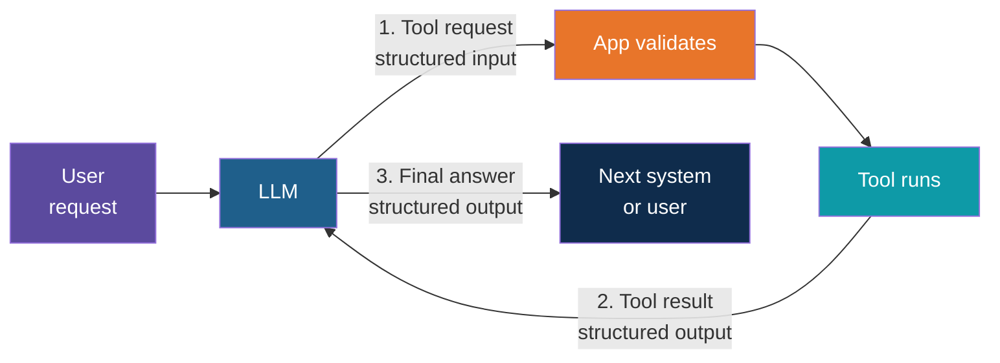
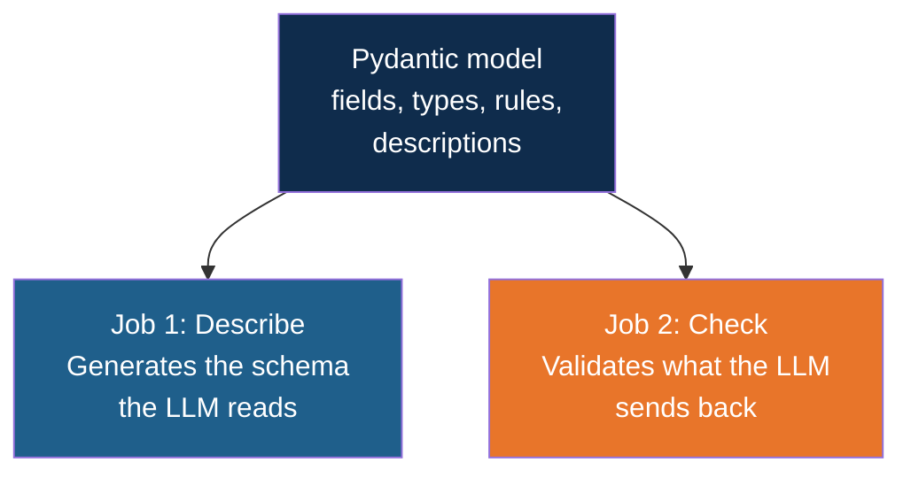
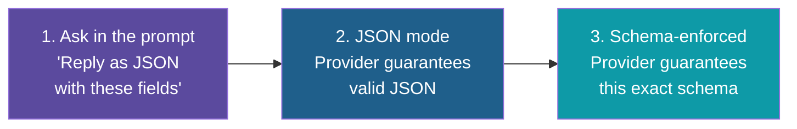
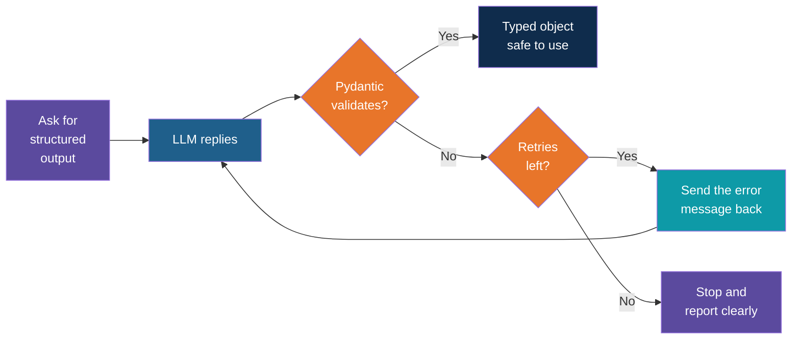
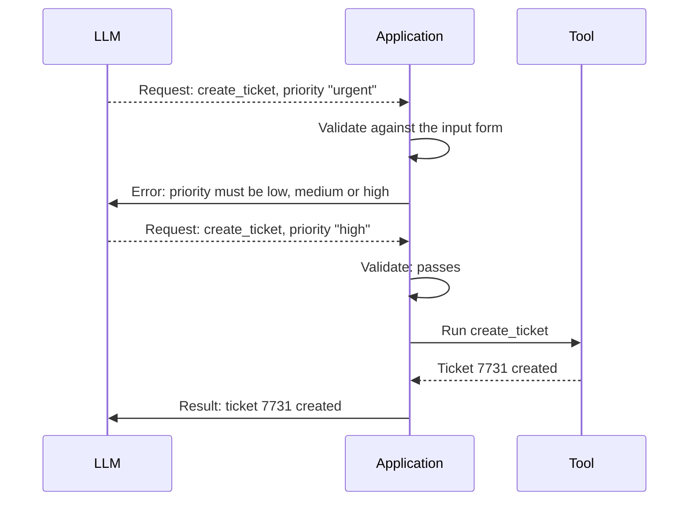

# Structured Input and Output With Pydantic

<!-- Slide deck in markdown. Each block between the --- lines is one slide.
     Trainer notes are in HTML comments and do not show in the preview.
     All tools, names and numbers in this deck are made up for teaching. -->

---

# Structured Input and Output

## Making an agent's data predictable

**Day 5 | Block 2: Tools and Agent Workflows | Supports Lab 1: Agent with tools**

<!-- Trainer: about 15 minutes. Pydantic itself was taught on Day 3 (Pydantic note); do not re-teach the syntax. This note shows why it matters more in an agent than in a single API call, and where in the loop the structure lives. Concept only, no code. -->

---

## One Mistake, Many Steps

In a single chat call, a badly shaped reply is an annoyance: you read it and move on. In an
agent, the reply feeds the **next step**, and the step after that.

Picture a relay race. If the first runner hands over the baton upside down, the second runner
fumbles, and the whole team loses time. Every handover in an agent is a baton pass:

- The user's request is handed to the model
- The model's tool request is handed to your code
- The tool's result is handed back to the model
- The model's final answer is handed to the next system

Each handover needs an agreed shape. That agreed shape is **structure**.

> Free text is for people. Structured data is for programs. An agent talks to both.

---

## Where Structure Lives in the Loop

Three places, and the same tool for all of them:

| Where | Direction | Example |
|---|---|---|
| **1. Tool inputs** | Model to your code | `order_id` and `reason` for a refund request |
| **2. Tool results** | Your code to the model | Status, delivery date, or a readable error |
| **3. Final output** | Agent to the outside world | A ticket with category, priority and summary |

---

# Part 1

## Structured Input

---

## The Model Fills In a Form

When an agent calls a tool, the model is not typing a sentence. It is **filling in a form**
that your tool defined. The form lists the boxes, what each one means and what is allowed.

| Without a form | With a form |
|---|---|
| "Refund the order from last week, about 40 dollars" | `order_id`: 4821, `amount`: 40.00, `reason`: damaged |
| Your code must guess what the model meant | Your code reads exact fields |
| Every run might word it differently | Every run has the same boxes |

Notice that the model still **chooses the values**. The form only controls the **shape**.

---

## One Model, Two Jobs

A Pydantic model is the form. It does two jobs at once, which is why it fits agents so well.

| Job | When | Who benefits |
|---|---|---|
| **Describe** | Before the call, as part of the tool list | The model, which now knows the boxes and the rules |
| **Check** | After the model replies, before the tool runs | Your system, which now refuses bad inputs |

Write the model once. The description and the check can never disagree, because they come
from the same place.

---

## What a Good Input Form Looks Like

Take a tool that creates a support ticket. Here is the form as a card.

| Field | Type | Rule | Description the model reads |
|---|---|---|---|
| `title` | Text | 5 to 80 characters | "Short summary of the problem" |
| `category` | One of: billing, delivery, product, other | Fixed choices | "Best-fitting category" |
| `priority` | One of: low, medium, high | Default: medium | "High only if the customer cannot work at all" |
| `order_id` | Text | Six digits | "Order number, for example 482100. Leave out if unknown" |
| `customer_email` | Email | Must look like an email | "Customer's email address" |

Three habits are visible here:

- **Fixed choices** instead of free text, so the model cannot invent a fourth category
- **Descriptions on every field**, because the model reads them as instructions
- **Rules and defaults** that catch the obvious mistakes without a human

---

## What Happens When the Input Is Wrong

The model is a clever guesser, not a form-filling machine. Typical slips:

| Slip | Example | What the form does |
|---|---|---|
| Wrong type | `amount` sent as "forty" | Rejected with a message |
| Value out of range | `amount` of -40 | Rejected: must be above zero |
| Not an allowed choice | `priority`: "urgent" | Rejected: must be low, medium or high |
| Missing required field | No `order_id` | Rejected: field required |
| Invented field | `ticket_colour`: "red" | Ignored or rejected, depending on settings |
| Quietly fixed | `amount` sent as "40" | Converted to the number 40 |

The rejection is not the end. It is **information** the agent can use, as the next part shows.

---

# Part 2

## Structured Output

---

## Two Kinds of Output

"Structured output" means two different things in an agent. Keep them apart.

| | Tool results | Agent's final output |
|---|---|---|
| **Produced by** | Your code | The model |
| **Read by** | The model, on the next step | A program, a database or a person |
| **Control** | You fully control the shape | You must ask for the shape and then check it |
| **Main risk** | Too much, or confusing, content | Wrong shape, missing fields, chatty wrapper text |

The first is easy: you wrote the function, so it returns what you decide. The second is where
most of the trouble is, because the model is writing the data.

---

## Tool Results Are Structured Too

A tool result is not just a number or a blob of text. A small labelled structure helps the
model read it correctly, and helps you log it.

| Field | Example | Why it helps |
|---|---|---|
| `ok` | true or false | The model sees at once whether the call worked |
| `data` | Status: shipped, arrives Thursday | Only the fields needed to answer |
| `source` | Order system, record 4821 | For citations and for tracing |
| `message` | "No order found with number 4821. Check the number and try again." | A readable hint when something fails |

The same model that describes inputs can describe results. Then every tool in the toolbox
**answers in the same shape**, and the agent learns one pattern instead of five.

---

## The Agent's Final Output as a Contract

When an agent's answer goes to another system, "a nice paragraph" is not enough. Agree a
**contract**: the exact fields the answer must have.

Say a triage agent reads incoming customer emails. Instead of a paragraph, it must return:

| Field | Type | Example |
|---|---|---|
| `category` | One of: billing, delivery, product, other | delivery |
| `priority` | One of: low, medium, high | high |
| `summary` | Text, at most 200 characters | "Parcel marked delivered, customer says not received" |
| `needs_human` | True or false | true |
| `suggested_reply` | Text, optional | "Sorry to hear this. We are checking with the courier." |

A program can now route the email, set the priority and notify the right team without reading
a single sentence. The text fields remain for humans. The rest is for machines.

---

## Structure Also Steers the Agent Itself

Structured output is not only for the final answer. Many agents use it **inside** the loop, to
make decisions that code can act on.

| Use inside the agent | What the model returns | What the code does |
|---|---|---|
| **Routing** | `next_step`: one of search, calculate, ask_user, finish | Jumps to that branch |
| **Planning** | A list of steps, each with a goal and a tool name | Runs the steps in order |
| **Self-check** | `is_answer_supported`: true or false, plus `missing`: list | Retries or finishes |
| **State** | A shared record: question, facts found, steps taken | Passes it on to the next step |

This is the quiet reason frameworks such as LangGraph lean on Pydantic: the **state** that moves
between steps is a model, so every step reads and writes the same checked shape. The next
note on state builds on this.

---

# Part 3

## Getting the Model to Follow the Shape

---

## Three Ways to Ask for Structure

There is no single switch. There is a ladder, from weakest to strongest guarantee.

| Level | What you get | Remaining risk |
|---|---|---|
| **1. Prompt only** | Usually right | Missing fields, extra chat around the JSON, wrong types |
| **2. JSON mode** | Always parseable JSON | Fields may still be wrong or missing |
| **3. Schema-enforced** | Reply fits the schema you gave | Values may still be untrue, and support varies by model |

Tool calling is itself a form of level 3: the tool's input form **is** the schema. That is why
agents use tool calls for decisions as well as for actions.

<!-- Trainer: free-tier and local models differ here. Some local models in Ollama support schema-enforced output, others only JSON mode. Check the model you will demo before class and say which level it gives. -->

---

## Even the Strongest Level Needs a Check

Whichever level you use, **validate on your side as well**. Three reasons:

1. Support differs between providers and models, and can change when you switch
2. A reply can fit the schema and still break a **rule** (a date in the past, an amount over
   the limit) that the schema cannot express
3. Small models sometimes slip even when asked nicely

Think of airport security. The airline already checked your ticket, and you still walk through
the scanner. Different check, different purpose.

> Treat model output like user input. Never trust, always validate.

---

## The Validate and Retry Loop

When validation fails, do not crash and do not guess. Send the error back to the model and let
it fix its own answer.

A validation error reads like a marked-up exam script: "priority: must be low, medium or
high, you wrote urgent." That is exactly what the model needs to correct itself, and it
usually does so on the first retry.

Two rules for the loop:

- **Cap the retries**, at two or three. This is the same step limit idea as the agent loop
- **Give the model the real error text**, not just "try again"

---

## The Same Idea for Tool Calls

The retry loop works for tool inputs too, and it is where agents gain the most.

The tool never saw the bad request. The model was corrected **before** anything happened in
the real world. For action tools, this check is the first line of defence, and it leads
straight into Block 3.

---

# Part 4

## Designing Good Models

---

## Design Guidelines

| Guideline | Why | Example |
|---|---|---|
| **Keep models small and flat** | Deeply nested shapes confuse models and break more often | Five fields, not twenty |
| **Use fixed choices over free text** | Removes a whole class of errors | Category is one of four |
| **Describe every field** | The model reads these as instructions | "High only if the customer cannot work at all" |
| **Allow "unknown" explicitly** | Otherwise the model invents a value to fill the box | Optional `order_id`, not a required guess |
| **Put reasoning before the answer** | Fields are written top to bottom, and thinking first improves the later fields | `reasoning` field before `category` |
| **One model, one purpose** | Do not reuse an input form as an output contract | A separate model for the ticket request and the ticket record |
| **Do not ask for secrets or computed values** | Keys stay in your code, and sums come from tools | No `api_key` input, no `total` the model must add up |

The most important one is the fourth. If a box is required and the model does not know the
answer, it will **make something up** to fill it. Giving it a way to say "not known" is an
honesty feature.

---

## What Pydantic Can and Cannot Promise

| Structure and Pydantic can ensure | They cannot ensure |
|---|---|
| Every required field is present | The values are **true** |
| Numbers are numbers, dates are dates | The summary is **faithful** to the source |
| Values are inside the allowed range or list | The model chose the **right tool** |
| The shape is the same on every run | The tool should have been called **at all** |

A perfectly shaped answer can still be wrong. Structure makes output **safe to handle**.
Correctness needs other checks: citations, approvals and evaluation, which are the subject of
Block 3.

---

## Common Failures and Their Fixes

| What goes wrong | Typical cause | Fix |
|---|---|---|
| Reply wrapped in friendly text | Prompt-only structure | Use JSON mode, schema-enforced output or a tool call |
| Field missing from the reply | Field not described, or model unsure | Describe it, or make it optional with a default |
| Invented value in a field | Required field the model could not fill | Allow an "unknown" value |
| Right shape, wrong content | Descriptions too vague | Add examples and "use when" wording to field descriptions |
| Retry loop never succeeds | Model too small, or schema too complex | Simplify the model, try a stronger model, cap retries |
| Works in testing, fails in production | Different provider or model, different support | Always validate on your side |
| Rule broken though schema passed | Rule not expressed in the model | Add a custom rule (Day 3 Pydantic note, Custom Rules) |

---

## Explore It Yourself

No code needed.

| To see... | Try | What to do |
|---|---|---|
| Free text breaks programs | A local model in Ollama chat | Ask for "a support ticket as JSON with category, priority and summary". Run it five times. Count how often there is extra chat around the JSON, a missing field or a made-up category |
| A schema tightens the reply | The same chat | Repeat, this time listing the exact allowed values for each field and saying "reply with JSON only". Compare |
| A validator in action | A free JSON validator website | Paste a reply and a schema, and read the error messages. These are what you would send back to the model |
| The model invents values | The same chat | Ask for a ticket with a required order number, but give an email that has none. See what it puts in the box |
| What a schema looks like | A website that converts JSON to a schema | Paste a sample ticket and look at the schema produced. This is the "describe" half of a Pydantic model |

<!-- Trainer: try each of these before class; features and model names change. Use only synthetic data. For the second row, small local models often still add chat text, which is a good moment to show why a check on your side matters. -->

---

## Lab Tie-In

**Lab 1: Agent with tools.** Using the structure ideas from this note, you can:

1. Define a tool's inputs as a Pydantic model with types, fixed choices, rules and descriptions
2. See what happens when the model sends a bad value, and read the validation error
3. Return tool results in one consistent labelled shape, with a readable error message
4. Ask the agent for its final answer in a fixed shape, and validate it
5. Cap the retries so a stubborn model cannot loop forever

The code and the step-by-step build are provided separately.

---

## Remember These Five Things

1. An agent passes data at every step, so each handover needs an **agreed shape**
2. A **Pydantic model** both **describes** the shape to the model and **checks** what comes back
3. **Tool inputs** are a form the model fills in. **Tool results** and the **final answer** should be structured too
4. **Validate on your side**, whatever the provider promises, and **retry with the real error**, capped at two or three tries
5. Structure makes output **safe to handle**, not **correct**. Correctness is the job of guardrails and approvals

---

## Next Up

**Workflow patterns, state and step limits:** how several tool calls are strung together, how
the agent remembers what it has done in a checked, shared state, and how to stop it running
forever.

---

*Prepared for Kalpataru Projects | AIM ADaSci | Confidential*
