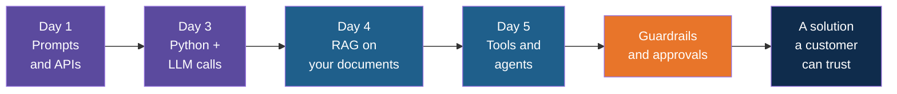
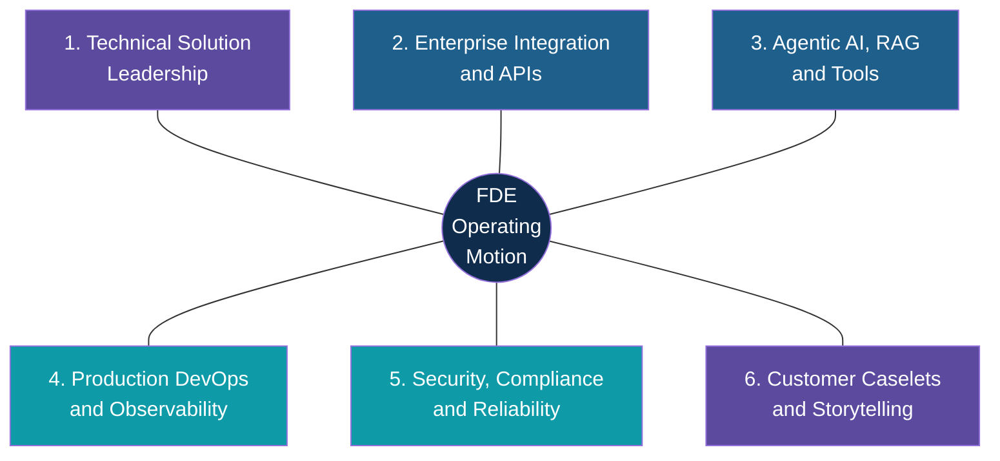
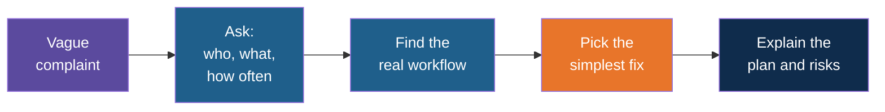
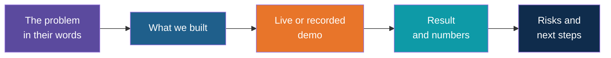
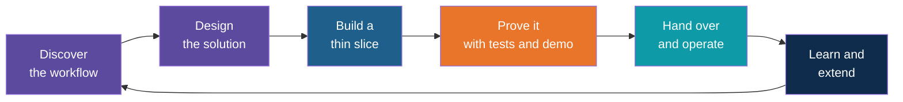

# From Agents to the FDE Journey

<!-- Slide deck in markdown. Each block between the --- lines is one slide.
     Trainer notes are in HTML comments and do not show in the preview.
     All names and numbers in this deck are made up for teaching. -->

---

# From Agents to the FDE Journey

## Why a working agent is only the start of a solution

**Day 5 | Block 5: FDE Six-Pillar Architecture | Leads into Lab 4: Agentic workflow blueprint**

<!-- Trainer: about 25 to 30 minutes of the 40-minute block, leaving time to set up Lab 4. Concept only, no code. This block is the bridge from "I can build an agent" to "I can deliver a solution a customer can trust". The six pillars come from the course overview; keep the wording consistent with it. Use only synthetic data in every example. -->

---

## The Journey So Far

Each day added one ability. Put together, they make a ladder.

| Step | What the model could do | What was still missing |
|---|---|---|
| Prompts and APIs | Answer a question | Your data, any action |
| RAG | Answer from your documents, with citations | Doing anything about the answer |
| Tools | Look things up and take steps | Limits, safety, a person in charge |
| Agent with guardrails | Act within limits, ask before big steps | Fit with the customer's real systems, rules and people |

The last row is today's topic. Building the agent is roughly half the work of delivering it.

---

## A Great Engine Is Not a Car

You can build a superb engine and still not have something a customer can drive to work. A car
needs a body, brakes, a licence plate, insurance, a fuel plan and a service schedule.

An agent that works on your laptop has the same gap:

| What you have | What the customer also needs |
|---|---|
| Works on sample data | Works with their real systems and their messy data |
| You run it | Their staff sign in and use it, each with the right access |
| It gave a good answer today | Proof it keeps giving good answers |
| It did something | A record of what it did, why, and who approved it |
| It runs on your machine | Someone owns it, watches it and fixes it |
| You understand it | Their leaders understand it well enough to say yes |

Closing this gap is the job of a **Forward Deployed Engineer (FDE)**.

---

## Who Is an FDE

A **Forward Deployed Engineer** works at the **customer edge**: close to the people with the
problem, not behind a wall of tickets. They take a vague business need and turn it into a
secure, connected, demonstrable AI solution.

Think of an **interpreter who can also build**. They speak the language of the business and the
language of the system, and they do not stop at translating.

| | Developer | FDE |
|---|---|---|
| **Starts from** | A clear specification | A fuzzy business problem |
| **Success means** | The code works | The customer's work improves |
| **Works with** | Other engineers | Business users, IT, security and leaders |
| **Owns** | A component | The outcome, from first meeting to handover |
| **Shows results by** | Passing tests | A demo and a story the customer believes |

You are not asked to stop being a developer. You are asked to add the rest of the picture.

---

## The Six Pillars in One Picture

The program describes the FDE role as six capabilities that work together around one operating
motion.

| Pillar | The question it answers | Where you have already touched it |
|---|---|---|
| 1. Technical Solution Leadership | What should we build, and why this way? | Choosing agent or workflow, Day 5 Block 1 |
| 2. Enterprise Integration and APIs | How does it connect to their systems? | LLM APIs on Day 3, tools and MCP on Day 5 |
| 3. Agentic AI, RAG and Tools | Can it find, decide and act? | Days 3 to 5 |
| 4. Production DevOps and Observability | Can we run it and see what it does? | Traces and step limits, at overview level |
| 5. Security, Compliance and Reliability | Is it safe, allowed and dependable? | Guardrails and approvals, Day 5 Block 3 |
| 6. Customer Caselets and Storytelling | Can the customer see the value? | Day 6 caselet demo |

You have already worked in pillar 3 for three days. Today fills in the other five.

---

# Part 1

## The Six Pillars, One at a Time

---

## Pillar 1: Technical Solution Leadership

The skill of **turning ambiguity into a solution**. A customer rarely says "build me a
retrieval agent with an approval step". They say "our team spends all week chasing updates".

Think of a **doctor**. The patient describes symptoms, not a diagnosis. The doctor asks
questions, rules things out, picks a treatment and explains the plan.

| Good looks like | Warning sign |
|---|---|
| Asks "what happens today?" before proposing anything | Jumps straight to "we will use agents" |
| Chooses the simplest approach that works (prompt, workflow, then agent) | Uses an agent because it sounds modern |
| States what is in scope and what is not | Promises everything, delivers a demo |

---

## Pillar 2: Enterprise Integration and APIs

An AI solution is only useful if it can **reach the data and systems where work happens**:
document stores, ticket systems, databases, email, internal services.

Think of a new hire at a large office. Talent is useless without a login, a desk phone and
access to the shared drive.

| Integration question | Why it matters |
|---|---|
| Does the system offer an API, and who approves access? | No access, no solution |
| What does the data look like, and how clean is it? | Messy data limits every answer |
| Can the agent read only, or also write? | Read is low risk; write needs limits and approvals |
| What happens when the other system is slow or down? | Retries, timeouts and a clear failure message |
| Is there a standard way to expose the tool? | MCP lets one tool serve many apps |

You practised this on Day 3 (calling an API and handling its errors) and Day 5 (tools and MCP).

---

## Pillar 3: Agentic AI, RAG and Tools

The pillar you know best. It is the **thinking and doing** part of the solution.

| Day | Building block | Pillar 3 role |
|---|---|---|
| 3 | LLM APIs, structured output, function calling | The model can be called reliably and return usable results |
| 4 | RAG and vector databases | The model answers from the customer's own documents |
| 5 | Agent loop, tools, state | The model can plan and take steps |
| 5 | Guardrails and approvals | The model acts within limits |

The FDE habit here is **restraint**: use the least autonomy that solves the problem. A fixed
workflow with one model call beats an agent whenever the steps are known in advance.

---

## Pillar 4: Production DevOps and Observability

Overview level only today. The idea: once real people depend on the solution, you must be able
to **see it, run it and change it safely**.

Think of a **hospital monitor**. The patient is the same with or without it, but without it
you only find out something is wrong when it is too late.

| Concern | The question | Plain answer |
|---|---|---|
| **Observability** | What did the agent do and why? | Record every step, tool call and result |
| **Cost and speed** | What does one request cost and how long does it take? | Measure it, set limits |
| **Change control** | How do we update safely? | Version prompts, test before release |
| **Ownership** | Who is called when it breaks? | A named owner and an alert |

Packaging and hosting, such as containers and cloud deployment, are outside this program by
design. The thinking is what matters here.

---

## Pillar 5: Security, Compliance and Reliability

You met this on Day 5 as guardrails. For a customer it has a wider meaning.

| Area | The customer's question | What you show |
|---|---|---|
| **Security** | Can someone misuse or trick it? | Least-privilege tools, injection tests |
| **Privacy** | Who can see which data? | Sign-in, role-based access, data masking |
| **Compliance** | Does it follow our rules and laws? | Audit trail, approvals, data kept where policy says |
| **Reliability** | Does it work every day, not just in the demo? | Test set, retries, a human fallback |

A customer's security team will ask these before anyone else does. **Having the answers ready is
often what earns the go-ahead.**

---

## Pillar 6: Customer Caselets and Storytelling

A solution that nobody understands does not get adopted. A **caselet** is a short, concrete
story of one problem solved: before, after, and how.

| Good looks like | Warning sign |
|---|---|
| Starts from the customer's problem | Starts from the technology |
| Shows one workflow end to end | Shows ten features |
| Says honestly what it does not do yet | Hides the limits |

This is exactly what you will do in the Day 6 caselet demo.

---

# Part 2

## Putting the Pillars to Work

---

## The Operating Motion

The hub in the middle of the six pillars is not a ninth skill. It is the **rhythm** an FDE
follows on every engagement: learn, build small, prove it, hand over, repeat.

A **thin slice** is one real workflow working end to end, however small, instead of every
feature half done. It gets the customer's reaction early, when changes are cheap.

---

## One Workflow Through All Six Pillars

A generic example: an assistant that **checks expense claims against a policy document** and
prepares an approval for a manager.

| Pillar | What the FDE thinks about |
|---|---|
| 1. Solution leadership | Is this a fixed workflow or does it need an agent? Which claims are in scope for a first release? |
| 2. Integration | Where do claims live? Read-only access first. How does an approved claim reach the finance system? |
| 3. Agentic AI, RAG, tools | RAG over the policy document with citations; a lookup tool for past claims; the model drafts a recommendation |
| 4. DevOps and observability | Log each claim, tools called and cost. Who watches the logs? |
| 5. Security and reliability | Employees see only their own claims. Amounts over a limit need a manager's approval. Test with tricky and malicious claims |
| 6. Caselet and story | Before: three days per claim batch. After: reviewed drafts in minutes, with every decision traceable |

Notice that the agent is **one row** of six. The other five decide whether anyone can use it.

---

## Explore It Yourself

No code needed.

| To see... | Try | What to do |
|---|---|---|
| Discovery in action | A local model in Ollama chat | Ask it to play a manager with a vague problem. Interview it with five questions, then write the problem in one sentence |
| The six pillars on a real product | Any AI feature you already use | For each pillar, write one thing you think the makers had to solve |
| The thin-slice idea | Pen and paper | Pick a workflow with eight steps. Circle the smallest end-to-end path of three steps |
| Your own strengths | A six-row table | Rate yourself from 1 to 5 on each pillar. Which is lowest? |

<!-- Trainer: the Ollama role-play works well in pairs. One person interviews, the other reads the model's replies. Use made-up scenarios only. -->

---

## Next Up

**Block 6: Agentic Workflow Blueprint (Lab 4).** You will choose a business workflow and map it
across these six pillars: steps, tools, data sources, decisions, guardrails, approvals,
integrations, risks and what to observe. Then give a short readout.

Tip for the lab: the table in "One Workflow Through All Six Pillars" is a ready-made template
for your blueprint.

---

## Remember These Five Things

1. A working agent is **roughly half** of a deliverable solution. The rest is fit, safety, proof and trust
2. An **FDE** works at the customer edge and turns a vague need into a secure, connected, demonstrable solution
3. The **six pillars**: solution leadership, integration, agentic AI and RAG, DevOps and observability, security and reliability, caselets and storytelling
4. Follow the **operating motion**: discover, design, build a thin slice, prove, hand over, learn
5. Use the **least autonomy that works**, and tell the customer honestly what it does not do yet

---

*Prepared for Kalpataru Projects | AIM ADaSci | Confidential*
