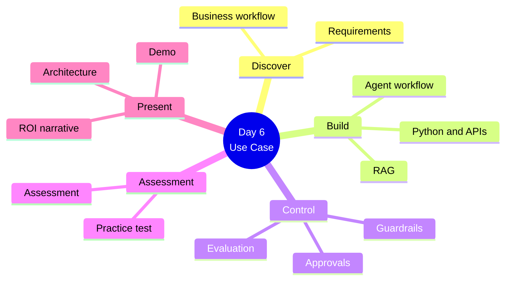
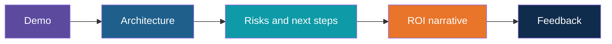
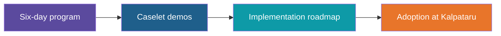

# Day 6: Industry Use Case + Assessment

**AI Developer & FDE Training | Kalpataru Projects, Ahmedabad**
Week 2, Day 6 of 6 | 4 hours | Batch 1 (forenoon) and Batch 2 (afternoon)

> Scope note: this document covers structure, timing, topics and outputs only. Scenario materials, datasets, test content and rubrics will be developed separately.

---

## Today at a Glance

Bring everything together: build a solution for an industry scenario, be assessed, and present it.

---

## Agenda

```mermaid
gantt
    title Day 6 Agenda (240 minutes)
    dateFormat HH:mm
    axisFormat %H:%M
    section Opening
    Kickoff and briefing            :a1, 09:30, 10m
    section Solution
    Discover                        :a2, after a1, 30m
    Build                           :a3, after a2, 55m
    Break                           :crit, a4, after a3, 15m
    Control                         :a5, after a4, 25m
    section Assessment
    Practice test and assessment    :a6, after a5, 30m
    section Present
    Readout preparation             :a7, after a6, 15m
    Caselet demos and readouts      :a8, after a7, 45m
    section Close
    Wrap-up and certificates        :a9, after a8, 15m
```

| Time | Duration | Topic Block | Type |
|---|---|---|---|
| 00:00 to 00:10 | 10 min | Kickoff and briefing | Intro |
| 00:10 to 00:40 | 30 min | 1. Discover | Learn + Apply |
| 00:40 to 01:35 | 55 min | 2. Build | Apply |
| 01:35 to 01:50 | 15 min | Break | |
| 01:50 to 02:15 | 25 min | 3. Control | Apply |
| 02:15 to 02:45 | 30 min | 4. Practice Test and Assessment | Reflect |
| 02:45 to 03:00 | 15 min | 5. Readout Preparation | Apply |
| 03:00 to 03:45 | 45 min | 6. Caselet Demos and Readouts | Reflect |
| 03:45 to 04:00 | 15 min | Wrap-up and certificates | Reflect |

Clock times are indicative and can be shifted; Batch 2 follows the same durations. Team sizes and readout slots will be set based on batch size.

---

## Topics Covered

### Kickoff and Briefing (10 min)

1. Day 6 objectives and how the day is scored
2. Recap of the program journey
3. Team formation and scenario options

### Indicative Use-Case Scenarios

1. Project status and management reporting assistant
2. Procurement / vendor comparison and exception workflow
3. Contract, tender or policy document knowledge assistant
4. Site issue / service ticket classification and escalation

### Block 1: Discover (30 min)

1. Understanding the business workflow
2. Capturing requirements and constraints
3. Defining scope and success criteria
4. Choosing which capabilities to use: prompts, APIs, RAG, agents

**Activity:** Requirements and solution outline

### Block 2: Build (55 min)

1. Python and API foundation
2. Structured outputs and function calling
3. RAG over scenario documents
4. Agent workflow with tools

**Activity:** Working solution build

### Block 3: Control (25 min)

1. Guardrails
2. Approval steps
3. Evaluation of quality and behaviour
4. Risks and limitations

**Activity:** Add controls and run evaluation checks

### Block 4: Practice Test and Assessment (30 min)

1. Practice test
2. Assessment
3. Review of gaps

### Block 5: Readout Preparation (15 min)

1. Architecture summary
2. Demo flow
3. Risks and next steps
4. ROI narrative

### Block 6: Caselet Demos and Readouts (45 min)

1. Caselet demo
2. Capstone solution readout: architecture, risks and next steps
3. ROI narrative
4. Peer and trainer feedback

### Wrap-up and Certificates (15 min)

1. Program recap across all six days
2. Implementation roadmap: next steps for adoption at Kalpataru
3. Completion certificates from ADaSci

---

## What You Will Walk Away With

| Output | Block |
|---|---|
| A working caselet built on prompts, APIs, RAG and an agent workflow | Blocks 2 and 3 |
| Assessment results and gap review | Block 4 |
| Architecture, risks and next-steps readout | Block 6 |
| Completion certificate from ADaSci | Wrap-up |

**Day 6 output: caselet demo**

### Learning Objectives

By the end of Day 6, you can:

1. Turn a business workflow into a working AI solution
2. Apply guardrails, approvals and evaluation
3. Present an architecture with risks, next steps and an ROI narrative
4. Demonstrate readiness through hands-on practice and assessment

---

## Ground Rules

- Use only the provided synthetic or sanitized data
- No confidential Kalpataru documents in any AI tool
- Keep API keys out of code and Git

## After the Program

---

*Prepared for Kalpataru Projects | AIM ADaSci | Confidential*
