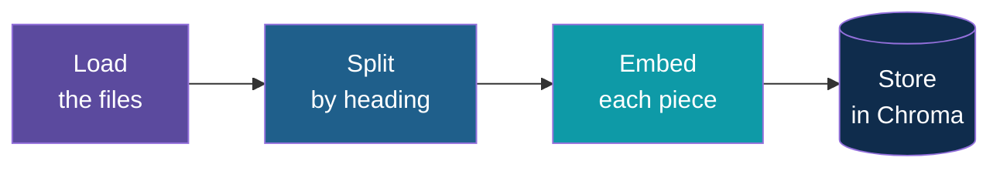

# Step 3 — Ingest the Documents

> Back to index · Previous: Project Setup · Next: Retrieve With RAG

## Goal

Write three small policy documents, then write `ingest.py`, which reads them, cuts them into
pieces, turns each piece into numbers, and stores everything in Chroma.

## Why this matters

A model cannot read a folder of files at question time. Even if it could, it would be slow, and
a long document would drown the one paragraph that matters. So the work is done **once, in
advance**: this step is the librarian who files every page, so the receptionist can fetch the
right one in a second.

Four things happen, in order:



**Why split by heading?** Policies are written in sections: "Sick Leave", "Carry Forward". If
you cut every 500 characters, a rule can be sliced in half, and half a rule is worse than none.
Cutting at headings keeps each rule whole, and the heading becomes the **source label** you will
show users later.

**Why wipe and rebuild?** If a policy changes and you add the new version next to the old
one, the store holds both, and the assistant may quote the old one. Starting from an empty
collection every time means what is in the store is exactly what is in `docs/`.

## 1. Write the Documents

Create a `docs` folder with three files. All names, numbers and rules in them are made up.

Create `docs/leave_policy.md`:

```markdown
# Leave Policy
Department: HR
Version: 2026
Effective: 1 January 2026

## Paid Leave Entitlement
Every employee gets 18 days of paid leave per year. Paid leave is credited on 1 January. A new joiner gets a prorated share based on the joining month. Part-time employees get paid leave in proportion to their working hours, for example 9 days a year for someone working half-time.

## Carry Forward of Leave
Up to 5 unused paid leave days carry forward to the next year. Anything above 5 days expires on 31 March. Carried-forward days must be used by 30 June.

## Sick Leave
Employees get 10 days of paid sick leave per year, separate from paid leave. A medical certificate is needed when sick leave runs for 3 or more days in a row. Unused sick leave does not carry forward.

## How to Apply for Leave
Raise the request in the HR portal. The reporting manager approves it. Leave of up to 2 days needs 2 working days of notice. Leave of 3 or more days needs 7 days of notice. In an emergency, message the manager the same day and enter the request within 2 days.

## Leave Without Pay
Once paid leave is used up, further absence is leave without pay and is deducted from that month's salary. More than 10 days of leave without pay in a year needs the department head's approval.
```

Create `docs/expense_handbook.md`:

```markdown
# Expense Handbook
Department: Finance
Version: 2026
Effective: 1 January 2026

## What Can Be Claimed
Employees can claim travel for approved work trips, client meals, and internet for approved work-from-home days. Personal items, fines and alcohol are never reimbursed.

## Daily Limits
The meal limit is 1,200 per day when travelling, and 600 per day for a client meal at the office city. Local taxi rides for work are reimbursed at actual cost with a receipt.

## Late Shift Taxi
A taxi home is reimbursed when work ends after 9 PM and the manager has approved the late shift. Attach the receipt and write the approving manager's name in the claim.

## Receipts and Deadlines
Every claim over 200 needs a receipt. Submit the claim within 30 days of the expense. Claims older than 30 days are not paid except with the Finance head's written approval.

## Approval Steps
Claims up to 5,000 are approved by the reporting manager. Claims above 5,000 also need the department head. Payment is made in the next monthly salary cycle.
```

Create `docs/it_support_guide.md`:

```markdown
# IT Support Guide
Department: IT
Version: 2026
Effective: 1 January 2026

## Resetting Your VPN
Open the VPN app and choose Forgot Password. A reset link is sent to your work email and works for 15 minutes. If the link expires, request a new one. After 5 failed sign-in attempts the account locks for 30 minutes.

## Password Rules
Passwords must have at least 12 characters and must be changed every 90 days. Never share your password, even with the IT desk. IT will never ask for it.

## Laptop Repair
For a broken or slow laptop, raise an IT ticket with the asset tag from the sticker under the laptop. Repairs take 3 working days. A loaner laptop can be requested if the repair will take longer.

## Software Requests
Only software from the approved list can be installed. For anything else, raise an IT ticket with the business reason. The security team reviews it within 5 working days.

## Reporting a Suspicious Email
Do not click links or open attachments. Forward the email to the security mailbox and delete it from your inbox.
```

The `#` and `##` headings matter: the splitter cuts at them. The lines under the title
(Department, Version, Effective) are the kind of detail a real policy carries, and they live
in the first piece of each file.

## 2. Add Two Settings to `config.py`

Add these lines at the end of `config.py`:

```python
# Where the vectors live: a Chroma database on disk, in this folder.
CHROMA_PATH = ".chroma"
COLLECTION = "company_docs"
```

A **collection** is Chroma's word for one named set of stored pieces, like a table in a
database.

## 3. Load and Split (First Half of `ingest.py`)

Create `ingest.py`. First, only the first half, so you can see the pieces before storing them:

```python
"""Document ingestion: read everything in docs/, cut it into nodes, embed it, store it in Chroma.

Run this once, and again whenever a file in docs/ is added or changed.
"""

from pathlib import Path

from llama_index.core import SimpleDirectoryReader
from llama_index.core.node_parser import MarkdownNodeParser

# Step 1: load every file in docs/. Keep only the file name as metadata.
documents = SimpleDirectoryReader(
    "docs", file_metadata=lambda path: {"file_name": Path(path).name}
).load_data()

# Step 2: cut each document into nodes (LlamaIndex's word for chunks), one per heading.
nodes = MarkdownNodeParser().get_nodes_from_documents(documents)
print(f"Made {len(nodes)} nodes from {len(documents)} documents.")
for node in nodes[:3]:
    print("---")
    print(node.metadata["file_name"])
    print(node.get_content()[:120])
```

| Part | What it does |
|---|---|
| `SimpleDirectoryReader("docs", ...)` | Reads every file in `docs/` into a `Document` |
| `file_metadata=lambda ...` | Keeps only the file name as metadata. By default LlamaIndex also records the full path, which would get embedded and make the numbers depend on where your folder lives |
| `MarkdownNodeParser()` | Cuts each document at its headings; each cut is a **node** |
| the `for` loop | A peek at the first three nodes. You will delete it in a moment |

Run it:

```bash
uv run ingest.py
```

```text
LLM is explicitly disabled. Using MockLLM.
Made 18 nodes from 3 documents.
---
expense_handbook.md
# Expense Handbook
Department: Finance
Version: 2026
Effective: 1 January 2026
---
expense_handbook.md
## What Can Be Claimed
Employees can claim travel for approved work trips, client meals, and internet for approved work-
---
expense_handbook.md
## Daily Limits
The meal limit is 1,200 per day when travelling, and 600 per day for a client meal at the office city. L
```

Eighteen nodes from three documents, one per heading. The heading is the first line of each
node. Step 4 uses that line as the source label.

## 4. Embed and Store (the Full `ingest.py`)

Now replace the whole file with the full version, which keeps the same first half, removes the
peek loop, and adds the storing:

<details>
<summary>Full <code>ingest.py</code></summary>

```python
"""Document ingestion: read everything in docs/, cut it into nodes, embed it, store it in Chroma.

Run this once, and again whenever a file in docs/ is added or changed.
"""

from pathlib import Path

import chromadb
from llama_index.core import SimpleDirectoryReader, StorageContext, VectorStoreIndex
from llama_index.core.node_parser import MarkdownNodeParser
from llama_index.vector_stores.chroma import ChromaVectorStore

import config

# Step 1: load every file in docs/. Keep only the file name as metadata.
documents = SimpleDirectoryReader(
    "docs", file_metadata=lambda path: {"file_name": Path(path).name}
).load_data()

# Step 2: cut each document into nodes (LlamaIndex's word for chunks), one per heading.
nodes = MarkdownNodeParser().get_nodes_from_documents(documents)
print(f"Made {len(nodes)} nodes from {len(documents)} documents.")

# Steps 3 and 4: embed every node and store the vectors in Chroma. We start from an empty
# collection so that running this twice does not store duplicates, and an updated policy
# replaces the old version cleanly. "cosine" makes the score a similarity from 0 to 1.
client = chromadb.PersistentClient(path=config.CHROMA_PATH)
try:
    client.delete_collection(config.COLLECTION)
except Exception:
    pass  # first run: there is nothing to delete yet
collection = client.create_collection(config.COLLECTION, metadata={"hnsw:space": "cosine"})

storage_context = StorageContext.from_defaults(
    vector_store=ChromaVectorStore(chroma_collection=collection)
)
VectorStoreIndex(nodes, storage_context=storage_context, show_progress=True)

print(f"Stored {collection.count()} nodes in Chroma. Now run app.py.")
```

</details>

| Part | What it does |
|---|---|
| `chromadb.PersistentClient(path=config.CHROMA_PATH)` | Opens a Chroma database kept on disk in `.chroma/`, so it survives between runs |
| `delete_collection` inside `try` | Wipes the old collection. On the very first run there is none, so the error is expected and ignored |
| `create_collection(..., metadata={"hnsw:space": "cosine"})` | Makes a new empty collection that measures closeness as cosine similarity, so a score is a number from 0 to 1 |
| `ChromaVectorStore` and `StorageContext` | Connect LlamaIndex to that collection |
| `VectorStoreIndex(nodes, storage_context=..., show_progress=True)` | The work: embeds every node with Ollama and writes it into Chroma, with a progress bar |
| `import config` | Importing it runs the `Settings` lines, so the embedding model is set before anything is embedded. It also supplies `CHROMA_PATH` and `COLLECTION` |

## Try it

```bash
uv run ingest.py
```

```text
LLM is explicitly disabled. Using MockLLM.
Made 18 nodes from 3 documents.
Stored 18 nodes in Chroma. Now run app.py.
```

(A progress bar appears while the nodes are embedded; it takes a second or two.)

Look inside Chroma to see what was stored:

```bash
uv run python -c "
import chromadb
c = chromadb.PersistentClient(path='.chroma').get_collection('company_docs')
print(c.count())
r = c.peek(1)
print(list(r['metadatas'][0].keys()))
print(len(r['embeddings'][0]))
"
```

```text
18
['header_path', 'document_id', 'ref_doc_id', 'doc_id', '_node_content', '_node_type', 'file_name']
768
```

Eighteen stored pieces, each with its metadata (including `file_name`) and an embedding of 768
numbers. Run `uv run ingest.py` again and the count is still 18, not 36.

## Checkpoint

The full `ingest.py` is the checkpoint shown in section 4. It is not the final version: in
Step 13 you will wrap the body in a function so the browser UI can call it. The three documents
match the reference files exactly, and `config.py` now matches the reference file's first 25
lines.

<details>
<summary>Full <code>config.py</code></summary>

```python
"""Settings shared by every file, read from .env (see .env.example).

Both models run locally in Ollama, so no API key is needed.
"""

import os

from dotenv import load_dotenv
from llama_index.core import Settings
from llama_index.embeddings.ollama import OllamaEmbedding

load_dotenv()

OLLAMA_BASE_URL = os.getenv("OLLAMA_BASE_URL", "http://localhost:11434")
CHAT_MODEL = os.getenv("CHAT_MODEL", "llama3.1:8b")
EMBED_MODEL = os.getenv("EMBED_MODEL", "nomic-embed-text")

# One embedding model for the whole app. ingest.py, rag.py and faq.py must all use the
# same one, or the vectors cannot be compared. If you change it, run ingest.py again.
Settings.embed_model = OllamaEmbedding(model_name=EMBED_MODEL, base_url=OLLAMA_BASE_URL)
Settings.llm = None  # LlamaIndex only retrieves here. LangChain does all the talking.

# Where the vectors live: a Chroma database on disk, in this folder.
CHROMA_PATH = ".chroma"
COLLECTION = "company_docs"
```

</details>

## Common Mistakes

| Symptom | Cause | Fix |
|---|---|---|
| `ConnectError` or connection refused | Ollama is not running | Start Ollama, then run again |
| `model "nomic-embed-text" not found` | The embedding model was never pulled | `ollama pull nomic-embed-text` |
| `Made 0 nodes from 0 documents` or a "directory does not exist" error | You ran from the wrong folder | `cd smart-qa-assistant` first; `docs` is a relative path |
| Node count is 3, one per file | The headings are missing `#` characters | Check the documents start each section with `##` |
| `.chroma` appears in the wrong folder | `CHROMA_PATH` is relative to where you run | Always run from the project folder |

Next: **Step 4 — Retrieve With RAG**.
