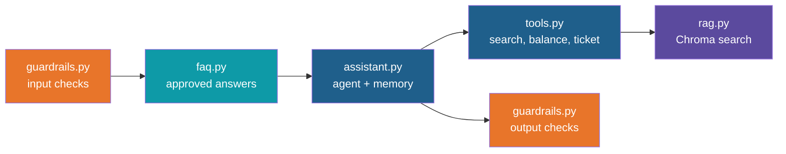

# Step 14 — Recap and Exercises

> Back to index · Previous: The Browser UI

## What You Built

A question goes through a small number of clear stages, and each stage is one file:

## Quick Reference

| Concept | Where it lives |
|---|---|
| Embedding model, retrieval cut-offs, signed-in user | `config.py` |
| Reading, splitting, embedding and storing documents | `ingest.py` (`build_index`) |
| Search by meaning, with a cut-off | `rag.py` (`search`, `MIN_SCORE`) |
| The agent's tools | `tools.py` (`@tool`, `ALL_TOOLS`) |
| Standing instructions to the model | `SYSTEM_PROMPT` in `assistant.py` |
| Conversation memory | `InMemorySaver` and `thread_id` in `assistant.py` |
| Pause for a person | `HumanInTheLoopMiddleware`, `resume`, `reject` in `assistant.py` |
| Sources and tools used | `_this_turns_trace` in `assistant.py` |
| Approved answers to common questions | `faq.json`, `faq.py`, `FAQ_MIN_SCORE` |
| Hard guardrails | `guardrails.py`, `ToolCallLimitMiddleware` |
| Checks without a model | `test_guardrails.py` |
| Terminal screen | `app.py` |
| Browser screen | `ui.py` |

## Gotchas

| Gotcha | Why it happens |
|---|---|
| Scores and cut-offs only suit one embedding model | `MIN_SCORE` and `FAQ_MIN_SCORE` were chosen by looking at `nomic-embed-text` scores. A different model has a different scale. Change the model, run ingest again, then recalibrate |
| Ingest and search must use the same embedding model | Numbers from two models cannot be compared. `config.py` sets one model for everything |
| `.chroma` and `docs` are relative paths | Run everything from the project folder |
| The prompt is a request, not a lock | `llama3.1:8b` is small. It sometimes skips a tool, writes a vague ticket summary, adds a detail the document does not state, or writes a tool request as text. The hard guardrails and the approval step are what you rely on |
| The model's final wording is not a record | After a ticket is approved the reply may not mention the ticket number. The record is the tool result |
| The "Retrieved from" line shows what the model was given | It is built from the search results. It does not prove the answer used every section |
| The FAQ does not update itself | When a source document changes, review the FAQ entries that point at it |
| Memory is in RAM | `InMemorySaver` is lost when the program stops, and each browser tab has its own thread |
| The override-phrase list is easy to reword around | It is one layer. The approval step and the tool design are the others |
| `LLM is explicitly disabled. Using MockLLM.` on every start | LlamaIndex confirming `Settings.llm = None`. Not an error |
| A `@tool` function cannot be called like a normal function | It is an object. Use `.invoke({...})` |
| Answers differ from run to run | Even at temperature 0, small differences in wording and in tool choice can occur |

## Discussion Questions

1. The search drops weak matches and the prompt says "never guess". Which of the two is a hard
   guardrail and which is a request? What happens on a day when the model ignores the prompt?
2. `get_leave_balance` takes no arguments. What would go wrong if it took an `employee_id`, and
   where would you put the check to make it safe?
3. Why does the FAQ use a much higher similarity bar than the document search?
4. The sources line is built from the tool results rather than written by the model. What
   exactly does it prove, and what does it not?
5. Only `create_support_ticket` pauses for approval. Which of the three tools would you add
   to the list first if it started to write something, and why?
6. What would you need to change before 800 staff used this at the same time?

## Exercises

1. Add a fourth document to `docs/` (for example a short work-from-home policy), re-index and ask
   a question only it can answer. Where did you see the new source?
2. Lower `MIN_SCORE` to `0.55` and ask "What is the dress code for Mars?". Then raise it to `0.8`
   and ask the taxi question. What does too low or too high do to the answers?
3. Add two entries to `faq.json`, then add a test to `test_guardrails.py` that checks each one
   matches a reworded version of its question.
4. Add `"hand over to a manager"` to `OVERRIDE_PHRASES` and test it. Then reword it and see it
   pass. What does that tell you about this kind of check?
5. Add a second write tool, `cancel_ticket`, to `tools.py`. List it in `interrupt_on`, and
   check that it pauses for approval in the terminal.
6. Make the approval screen in `ui.py` also show the signed-in user (`config.CURRENT_USER`), so
   the approver knows whose ticket it is.
7. Log every question, the tools used and the sources to a file, one line each. Where is the best
   place in `assistant.py` to add it?
8. Add a "Download FAQ candidates" idea: count repeated questions in your log and print the top
   five, which would become new FAQ entries.
9. Rebuild `assistant.py` from memory in an empty folder, then compare it with the reference.
   Which part did you forget first?

## What's Next

This project wires every layer by hand, which is the best way to understand it. The Day 6 caselet
asks you to do the same for a scenario of your own: choose the documents, the tools and the
approval rules, then show the architecture, the risks and the next steps. The same feature list
applies: ingestion, retrieval, memory, tools, guardrails, an FAQ shortcut and a screen. For the
longer road after the six days, see the "What Comes Next" closing session.
