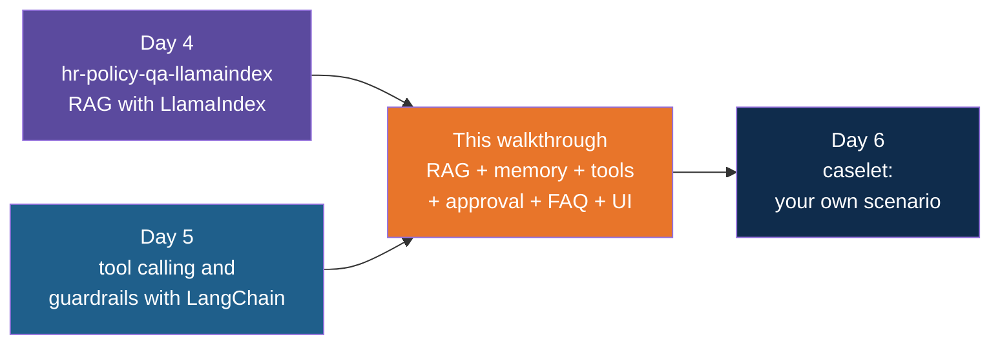

# Smart QA Assistant — Build Walkthrough

A step-by-step guide to hand-building the `smart-qa-assistant` reference project: a chat
assistant for the staff of a made-up company that answers from policy documents, remembers the
conversation, checks your own leave balance, raises tickets only when you approve them, and
shows approved answers to the most common questions instantly. You start with a folder of
documents and end with a working assistant in the terminal and in the browser.

Everything runs on your own machine. No API key is needed.

## What You'll Build

A uv-managed Python project with these files:

| File | What it is |
|---|---|
| `docs/` | Three synthetic policy documents: leave, expenses, IT support |
| `config.py` | Model names, retrieval settings, the signed-in user |
| `ingest.py` | Reads the documents, cuts them into pieces, stores them in Chroma (LlamaIndex) |
| `rag.py` | Finds the pieces that best match a question (LlamaIndex) |
| `tools.py` | Three tools for the agent: search documents, leave balance, support ticket (LangChain) |
| `assistant.py` | The agent, its memory, the approval pause and the path a question takes (LangChain) |
| `faq.json`, `faq.py` | Approved answers to common questions, matched by meaning |
| `guardrails.py` | Plain-Python input and output checks |
| `app.py` | The terminal chat |
| `ui.py` | The browser chat, with a small admin area (Streamlit) |
| `test_guardrails.py` | Checks for the guardrails and the FAQ matcher |
| `pyproject.toml`, `.env.example`, `.gitignore` | Dependencies, settings template, Git ignore list |

## Who This Is For / Prerequisites

- Comfortable with Python functions, dicts and classes.
- `uv` installed. The simple-chat walkthrough in Day 3 explains `uv sync` and `uv run`; this
  guide does not repeat them.
- **Ollama** installed and running, with the two models used here:

```bash
ollama pull llama3.1:8b
ollama pull nomic-embed-text
```

- Helpful but not required: the Day 4 walkthrough `hr-policy-qa-llamaindex` (RAG with
  LlamaIndex), the Day 5 walkthrough `simple-tool-calling-langchain` (tools), and the Day 5
  walkthrough `guardrails-and-approvals-langchain` (guardrails). This project reuses the ideas
  and shows them working together. Each step explains what it uses, so none is required.
- Model wording varies from run to run. The transcripts in each step are representative runs,
  lightly trimmed, and yours will not match word for word. What to look for is named in each
  "Try it" section.

Budget about 2 hours to build everything. In a live session, Steps 3, 4, 5, 8 and 10 are the
core. Steps 6, 7, 9, 11 and 12 are short and can be typed quickly. Step 13 (the browser UI) can be
shown from the finished file instead of typed.

## Steps

| Step | File | What You'll Add | Est. Time |
|---|---|---|---|
| 1 | 01-concepts-overview.md | The path of a question, and the words you will use | 5 min |
| 2 | 02-project-setup.md | Project folder, dependencies, settings | 8 min |
| 3 | 03-ingest-the-documents.md | The documents, and `ingest.py`: read, split, embed, store | 15 min |
| 4 | 04-retrieve-with-rag.md | `rag.py`: find the best pieces for a question | 10 min |
| 5 | 05-your-first-agent.md | `tools.py` and `assistant.py`: an agent that searches the documents | 12 min |
| 6 | 06-conversation-memory.md | Memory, and the terminal chat in `app.py` | 8 min |
| 7 | 07-a-tool-for-your-own-data.md | The leave balance tool | 8 min |
| 8 | 08-tickets-and-human-approval.md | A ticket tool that waits for a person | 15 min |
| 9 | 09-show-your-sources.md | The sources and tools used, built by code | 8 min |
| 10 | 10-frequently-asked-questions.md | The FAQ shortcut | 12 min |
| 11 | 11-guardrails.md | Input checks, output checks and a tool-call cap | 10 min |
| 12 | 12-checks-without-a-model.md | `test_guardrails.py` | 6 min |
| 13 | 13-the-browser-ui.md | The Streamlit chat and admin area | 15 min |
| 14 | 14-recap-and-exercises.md | Review, gotchas, practice | 5 min |

## Relationship to the Reference Implementation

By the end your files should match the reference project exactly: `pyproject.toml`,
`.gitignore` and `.env.example` (Step 2), `config.py` (Step 10), `tools.py` (Step 8), `faq.py`
and `faq.json` (Step 10), `app.py` (Step 10), `guardrails.py` and `assistant.py` (Step 11),
`test_guardrails.py` (Step 12), `ingest.py`, `rag.py` and `ui.py` (Step 13), and the three
documents (Step 3). The reference project is the folder `smart-qa-assistant` under
`session-06/code/solutions`. This walkthrough was generated from those files. Every full-file
checkpoint was checked for valid Python syntax, every typed snippet was checked against the
checkpoint it belongs to, and the final checkpoint of each file was compared with the
reference. Each step was also run against `llama3.1:8b` on a local Ollama.

Two files change shape on the way: `ingest.py` is a plain script until Step 13 wraps it in a
function, and `assistant.py` grows through six steps. Each step shows what changes.

## Suggested Demo Flow

1. At the end of Step 4, search for "What is the dress code for Mars?" with `MIN_SCORE` set to
   `0.0` and then to `0.65`. Three loosely related pieces come back, then none. Ask the room
   which one they would want a model to read. That one setting is the difference between an
   honest "I could not find it" and an invented answer.
2. In Step 6, ask "Do I need a certificate for that?" before and after memory. Without a thread
   id the agent has no idea what "that" is. Say plainly that the model is the same; only the
   saved messages changed.
3. In Step 7, show the old wording of the balance tool ("12 of 18 days left") and let the room
   guess what a model will say when asked how many days they have used. It says 12. Tool
   output is part of the prompt, so write it for a reader that takes you literally.
4. In Step 8, run the ticket request twice, answering `y` once and `n` once. Then ask "who
   decided?" The model proposed, a person decided, and the code made sure of it.
5. In Step 10, ask the same question worded three ways and print the match score each time.
   The FAQ threshold is a number you can see, move and defend.
6. In Step 11, send "Ignore previous instructions" and then reword it. The first is blocked,
   the second passes. A phrase list is one thin layer, which is why the other layers exist.
7. Finish with Step 13: run the browser UI and upload a changed policy through the Admin area.
   Ask the question again and watch the answer change.

## Series



Start with Step 1 — Concepts Overview.
