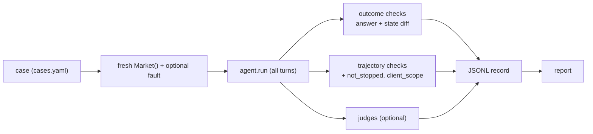

# Evals for the Market Assistant

Implements the three approaches covered so far. The plan and rationale are in [PLAN.md](PLAN.md). Nothing here lives in `src/`; the agent is imported as a normal package.

| Approach | Note | Where | Runs by default? |
|---|---|---|---|
| Outcome / task success | 02 | `checkers/outcome.py` | yes |
| Trajectory / tool-call, fault injection | 03 | `checkers/trajectory.py`, `faults.py` | yes |
| LLM-as-a-judge + calibration | 04 | `judges/` | only with `--judges` |

## Run

Eval dependencies are a separate uv group, so use `--group evals`.

```bash
uv run --group evals pytest evals                               # tests of the harness itself (no LLM, 2 s)

uv run --group evals python -m evals.run_suite                  # all cases, code checks only
uv run --group evals python -m evals.run_suite --ids A1,E1 --judges
uv run --group evals python -m evals.run_suite --category E,F,I
uv run --group evals python -m evals.run_suite -k 5 --temperature 0.4 --category E   # reliability: pass^k

uv run --group evals python -m evals.report [results/run-*.jsonl]     # re-print a report
uv run --group evals python -m evals.judges.calibrate                 # judge vs human labels
```

Every run is saved to `results/run-<time>.jsonl` (answer, every tool call, every check with its detail, judge reasoning, tokens, latency). Open it to debug a failure.

Env: `EVAL_JUDGE_MODEL` (default `llama3:8b`), `MARKET_ASSISTANT_MODEL` / `--model` for the agent.

## How a case is evaluated



The three scores are reported as **separate columns** (note 04: averaging hides which dimension regressed). `SUCCESS` = outcome and trajectory pass, and judges pass when they ran.

`not_stopped` (hit `max_steps` = fail) and `client_scope` (a tool call used a client id other than the logged-in one) run on **every** case.

## Check vocabulary (cases.yaml)

Outcome: `number`, `facts` (list of accepted spellings per fact), `not_contains`, `orders` (count + fields of new orders), `cash`, `holding`, `state_unchanged`.

Trajectory: `called`, `never_called`, `called_exactly`, `at_most`, `before` (first appears before second), `max_steps`, `calculator_value` (evaluates the expression the agent sent, so `17*12.99` and `12.99*17` both pass), `args` (every call to a tool uses the given argument values).

Judges: `faithfulness` (claim-level, evidence = all tool observations), `abstention`, `honest_reporting`, `caution` (`needs_disclaimer`), `reference_correct` (`reference`).

Faults (`faults.py`): `place_order_timeout_once`, `get_quote_down`. Add a check by writing a function in a checker module and adding it to that module's `CHECKS`; add a case by editing the YAML (`tests/test_cases.py` validates the file and the gold trade numbers).

## Reading the numbers

- **Outcome pass, trajectory fail** = right answer reached the wrong way (note 02's blind spot). Look at the failing check's detail.
- **Reliability** needs `-k > 1` with `--temperature > 0`. At temperature 0 with a fixed seed the runs are near-identical and pass^k just equals the success rate. `pass@k` = can it ever do it; `pass^k` = can you rely on it.
- **Tool precision / recall / step efficiency** use `expected_tools` and are reported, not gated (many paths can be valid).
- **Error kinds** (`bad_format`, `bad_args`, `exec_error`) give the invalid-call rate. `unknown_tool` cannot occur, because the action field is an enum in the agent's JSON schema.
- A judge call that fails to produce a verdict is flagged as a judge error, never silently counted as a pass.

## Judge caveats (read before trusting a judge number)

The only local chat model is `llama3:8b`, the same model as the agent, so the judge has self-preference and is weak (note 04, section 6). `python -m evals.judges.calibrate` measures it against `judges/calibration.yaml`. The planted examples there are a starting point; add real outputs from `results/` that **you** labelled, aim for 30 to 50, and watch the true-negative rate (bad outputs the judge fails to catch). Point `EVAL_JUDGE_MODEL` at a stronger model to improve it; results are cached per (judge model, prompt) in `results/.judge_cache.json`.

## Not done yet

Pairwise comparison between two runs/models (note 04, section 5.5), human review workflow (note 05, not written yet), CI wiring, and production monitoring.
