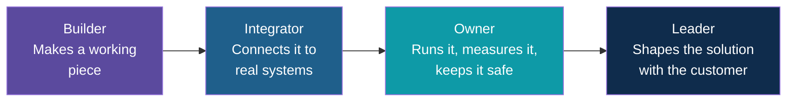
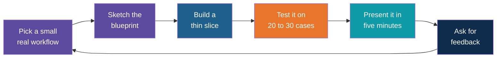

# Your FDE Growth Path

<!-- Slide deck in markdown. Each block between the --- lines is one slide.
     Trainer notes are in HTML comments and do not show in the preview.
     All names and numbers in this deck are made up for teaching. -->

---

# Your FDE Growth Path

## From the six days to the customer edge

**Closing session | After Day 6 | Companion to the What Comes Next deck**

<!-- Trainer: about 15 minutes, discussion style. The What Comes Next deck answers "which technologies should I learn next". This deck answers "how do I grow into the FDE role". Run this one first or second, then use the technology deck as the menu. Keep it personal: ask each person to name one pillar to strengthen. -->

---

## Where You Stand

The six days built a strong base in one pillar and a first taste of the rest.

| Pillar | Where you are now | Where to grow |
|---|---|---|
| 1. Technical Solution Leadership | Chose agent or workflow; drafted a blueprint | Leading a discovery conversation on your own |
| 2. Enterprise Integration and APIs | Called LLM APIs; built tools; met MCP | Connecting to real internal systems with approval |
| 3. Agentic AI, RAG and Tools | Built RAG and an agent with tools | Reliability: better retrieval, better testing |
| 4. Production DevOps and Observability | Overview and step traces | Tracing, cost control, safe releases |
| 5. Security, Compliance and Reliability | Guardrails and approvals | Access control, audit trails, privacy rules |
| 6. Customer Caselets and Storytelling | One caselet demo | Telling a clear story to non-technical leaders |

The pillars where you are newest are not weaknesses. They are the next things to practise.

---

## The Skill Ladder

Growth in this role is less about learning more tools and more about **taking on more of the
outcome**.

| Stage | You can say | Proof you have reached it |
|---|---|---|
| **Builder** | "I can make this work" | A working caselet or prototype |
| **Integrator** | "I can make it work with your systems" | A tool connected to a real, approved data source |
| **Owner** | "I can show it keeps working" | A test set, a trace, a named owner and a review rhythm |
| **Leader** | "I can help you decide what to build" | A customer conversation that ends with a clear, scoped plan |

The six days took you to a confident Builder. The path forward is one stage at a time.

---

## The Practice Loop

Skills come from repeating a small cycle on real work, not from reading more.

Each lap exercises all six pillars. Do the loop with **synthetic or sanitised data** unless the
company has approved something else.

---

## What to Practise for Each Pillar

Each pillar has a simple habit to build and a matching topic from the What Comes Next deck.

| Pillar | Habit to build | Matching next-step topic |
|---|---|---|
| 1. Solution leadership | Write a one-page problem statement before touching code | Not a technology; practise with colleagues |
| 2. Integration | Connect one tool to one real system, read-only first | MCP servers |
| 3. Agentic AI, RAG, tools | Improve one weak answer at a time | Advanced RAG, LangGraph, CrewAI |
| 4. DevOps and observability | Add tracing and a cost number to every prototype | Agents in production |
| 5. Security and reliability | Write 10 hostile test cases for every agent | Agent evals |
| 6. Caselets and storytelling | Present every prototype in five minutes to a non-technical listener | Practice, practice |

If you do only one thing from the table: **build a small eval set**. It makes every other pillar
measurable.

---

## Build a Portfolio of Caselets

A caselet is a one-page record of a problem solved. Three or four of them show your growth far
better than a list of tools.

| Section | What to include |
|---|---|
| **Problem** | Who has it, how often, what it costs them today |
| **Solution** | A diagram and three sentences |
| **Pillar notes** | One line each: integration, guardrails, observability |
| **Evidence** | Test results, a demo recording, time saved |
| **Limits and risks** | What it cannot do and what you would add next |
| **Next step** | The pilot, expansion or handover you would propose |

Include only what is approved to share. Strip names and figures that belong to the company.

---

## Habits of Strong FDEs

| Habit | Why it works |
|---|---|
| **Ask before building** | Most failed projects solved the wrong problem well |
| **Build the smallest end-to-end slice** | Early feedback is cheap; late surprises are not |
| **Show, do not tell** | A five-minute demo beats a twenty-slide plan |
| **Write decisions down** | Teams change; reasons should not be lost |
| **Measure, then claim** | "It works" needs a number behind it |
| **Name the limits yourself** | Trust grows when you say what it will not do before anyone finds out |
| **Use the least autonomy that works** | Simple systems are easier to approve, test and fix |

---

## A Suggested First Three Months

A gentle pace is fine. The aim is steady laps of the practice loop.

| When | Focus | Output |
|---|---|---|
| **Weeks 1 to 2** | Re-run your Day 6 caselet; add a 20-question eval set | A scored baseline you can improve |
| **Weeks 3 to 6** | Pick one real, low-risk workflow; run the practice loop | A second caselet, built on approved data |
| **Weeks 7 to 10** | Strengthen one weak pillar (for example, tracing or access control) | A short write-up of what changed |
| **Weeks 11 to 12** | Present to colleagues; collect feedback; choose the next workflow | A third caselet and a plan for what to learn next |

Share what you learn. Explaining a topic to a colleague is one of the fastest ways to master it.

---

## Explore It Yourself

| To see... | Try | What to do |
|---|---|---|
| Your current profile | A six-row table | Rate yourself 1 to 5 on each pillar; pick the lowest as your first focus |
| A good problem statement | A local model in Ollama chat | Describe a workflow badly, ask the model to ask you clarifying questions, then write the one-page statement |
| A five-minute story | A colleague or friend | Present your Day 6 caselet to someone outside tech; note where they got lost |
| Your first eval set | A spreadsheet | List 20 questions with expected answers for your caselet; score it by hand |

<!-- Trainer: close by asking each person to say aloud one pillar they will strengthen first and one workflow they will practise on. -->

---

## Remember These Five Things

1. Growth in the FDE role is about taking on **more of the outcome**: builder, integrator, owner, leader
2. Practise with a small cycle: **pick, sketch, build a thin slice, test, present, get feedback**
3. Each lap exercises **all six pillars**, so you improve the weak ones without a separate course
4. Start with a **small eval set**; it makes every other improvement measurable
5. Keep a **portfolio of caselets**: honest, evidence-backed and easy for a non-technical person to follow

---

*Prepared for Kalpataru Projects | AIM ADaSci | Confidential*
