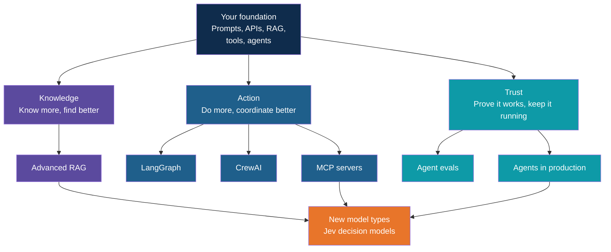
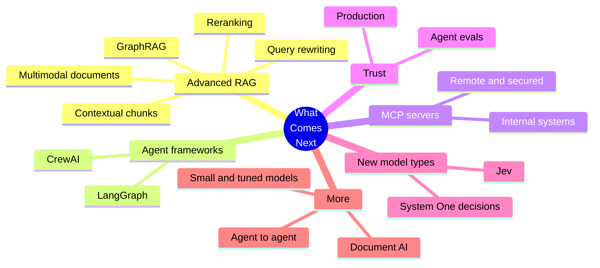
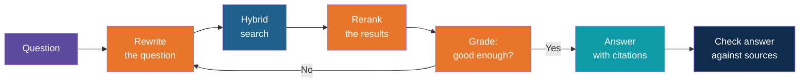
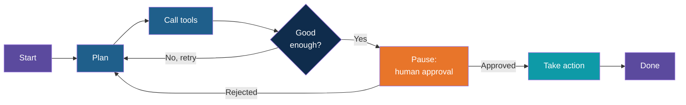
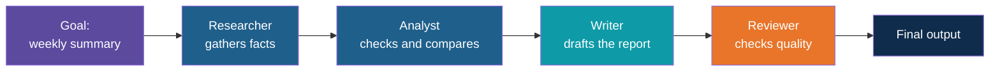
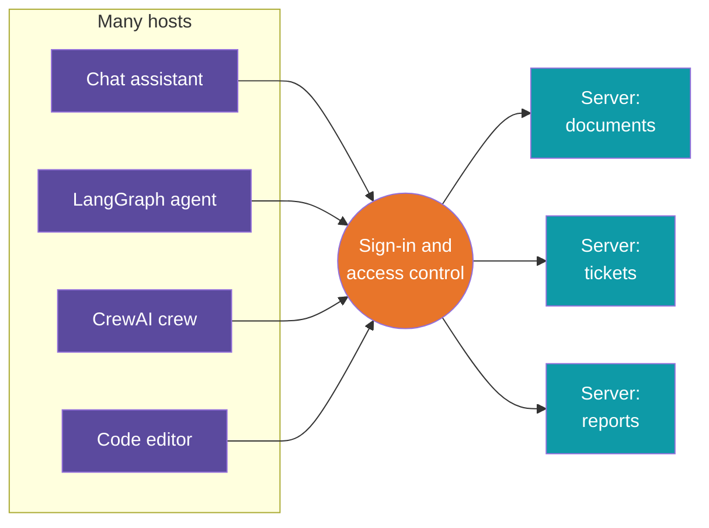
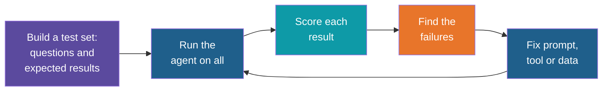
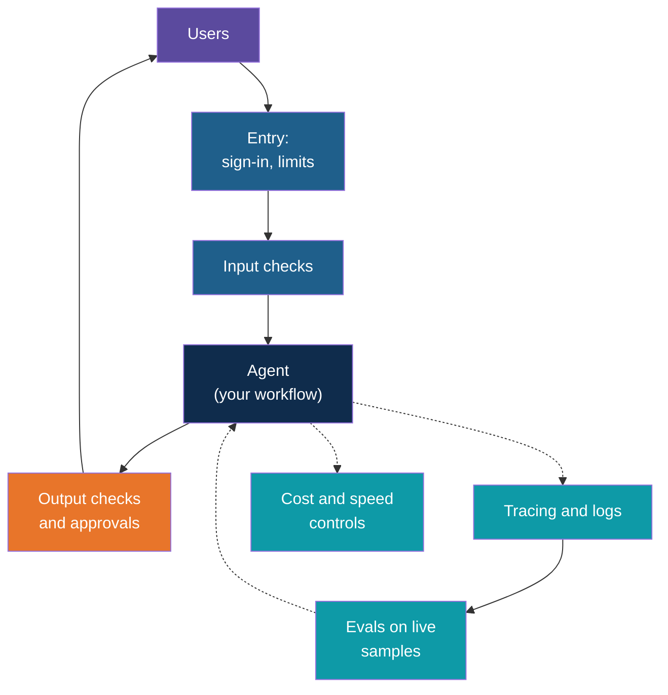
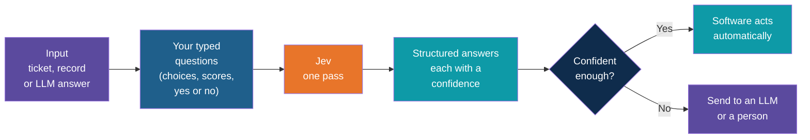
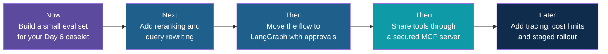

# What Comes Next

<!-- Slide deck in markdown. Each block between the --- lines is one slide.
     Trainer notes are in HTML comments and do not show in the preview.
     All names and numbers in this deck are made up for teaching. -->

---

# What Comes Next

## From the six days to real-world AI systems

**Closing session | After Day 6 | A map of where to go from here**

<!-- Trainer: about 20 to 30 minutes, discussion style. This is a map, not a lesson: each topic gets one idea, one picture and one "what you can achieve" table. Tool names and versions in this space change every few months, so confirm the current state of each before presenting. The Jev slide is based on TypeSafe AI's launch material and early write-ups, so re-check it before presenting. -->

---

## Where You Are Now

Over six days you built the foundation that every advanced topic stands on.

| Day | You learned | You can now |
|---|---|---|
| 1 | Prompting and API setup | Talk to a model reliably and safely |
| 2 | Copilot workflows | Use AI inside everyday business tools |
| 3 | Python plus LLM APIs | Build a small LLM-powered utility |
| 4 | RAG and vector databases | Answer questions from your own documents |
| 5 | Agents, tools, MCP, guardrails | Let a model take controlled actions |
| 6 | Use case and assessment | Pick a problem and demo a solution |

The next steps are not new subjects. Each one takes something you already built and makes it
**more accurate, more capable, more trustworthy or closer to real use**.

---

## The Map in One Picture

Think of it as three questions you will keep asking about any AI system you build:

| Question | Track | Topics in this deck |
|---|---|---|
| Does it **know** the right things? | Knowledge | Advanced RAG |
| Can it **do** the right things? | Action | LangGraph, CrewAI, MCP servers |
| Can we **trust and run** it? | Trust | Agent evals, agents in production |

---

## Topics at a Glance

---

# Part 1

## Knowledge Track

---

## Advanced RAG: From "Works" to "Works Reliably"

On Day 4 you built a RAG assistant that finds a passage and answers from it. That is the
starting line. Real documents are messy, questions are vague, and a wrong answer that sounds
confident is the worst outcome.

Think of a **research librarian**. A beginner fetches the first books that look right. An expert
rephrases your question, searches several ways, discards weak matches, double-checks the
quote, and tells you when the library simply does not have the answer.

Orange steps are the additions. Search and answer are what you already know.

---

## Advanced RAG: The Toolbox and What Each Piece Achieves

| Technique | Plain meaning | What you can achieve |
|---|---|---|
| **Reranking** | A second, slower model re-orders the top results by true relevance | The right passage moves to the top; fewer "close but wrong" answers |
| **Query rewriting** | Rephrase or split the question before searching (multi-query, step-back, hypothetical answer) | Vague or multi-part questions still find the right material |
| **Contextual chunks** | Add a one-line summary of where each chunk came from before indexing it | Chunks stop losing meaning when cut out of their document |
| **Small-to-big retrieval** | Search on small pieces, hand the model the larger section around them | Precise matching and enough surrounding detail to answer |
| **Corrective checks** | Grade what was retrieved; search again or say "not found" if weak | Fewer confident wrong answers; honest "I don't know" |
| **GraphRAG** | Build a map of entities and relationships, then search the map | Questions that connect facts across many documents |
| **Multimodal RAG** | Index tables, charts, drawings and scanned pages, not just text | Answers from PDFs where the key facts are in a table or image |
| **RAG evaluation** | Measure retrieval and answer quality on a fixed question set | You can prove a change helped (see the Agent Evals slides) |

Day 4 already introduced agentic RAG, hybrid search and PageIndex. These techniques stack on top
of them. **Add one at a time and measure**, because each adds cost and delay.

---

## Advanced RAG: Which One First?

| Symptom you see | Reach for | Effort |
|---|---|---|
| Right document found, wrong passage on top | Reranking | Low |
| Users type short or vague questions | Query rewriting | Low |
| Answers miss because chunks lack context | Contextual chunks | Medium |
| Questions need facts from several documents | GraphRAG or agentic RAG | High |
| Key facts live in tables, charts or scans | Multimodal RAG | Medium to high |
| You cannot tell if changes help | RAG evaluation | Medium, and worth doing first |

---

# Part 2

## Action Track

---

## Agent Frameworks: Why Move Beyond a Hand-Written Loop

In Day 5 you wrote the agent loop yourself: ask the model, run the tool, repeat. That is the
right way to learn. But as soon as you need to **pause for approval, resume tomorrow, retry a
failed step, or run two agents together**, the hand-written loop grows tangled.

A framework is like moving from a notebook of recipes to a **professional kitchen layout**: the
cooking is the same, but stations, hand-offs and timing are organised for you.

| Need | Hand-written loop | Framework |
|---|---|---|
| Simple tool-using assistant | Perfect | Overkill |
| Pause for a human, then continue later | Painful | Built in |
| Several agents with different jobs | Messy | Built in |
| See what happened step by step | You build it | Built in |

---

## LangGraph: Workflows as a Map

**LangGraph** models an agent as a **graph**: boxes (steps) joined by arrows (what happens
next), with a shared **state** that every step reads and updates. Arrows can loop back, branch
on a decision, or stop and wait for a person.

Think of a **metro map**. You always know which station you are at, where you can go next, and
where you got off if the train stops.

| LangGraph feature | What you can achieve |
|---|---|
| **State** shared across steps | Agents that remember what has happened in this task |
| **Branches and loops** | Retry, escalate or take a different path on a decision |
| **Checkpoints** (saved state) | Resume a long task after a crash or a day later |
| **Human-in-the-loop pauses** | Approval gates before any real action, as taught in Day 5 |
| **Tracing support** | See each step, tool call and decision when debugging |

**Best for:** workflows with clear steps, approvals and recovery. Document processing,
multi-step requests, anything where "what happens next" must be predictable.

---

## CrewAI: A Team of Role-Playing Specialists

**CrewAI** models an agent system as a **crew**: several agents, each with a **role**, a
**goal** and a set of tools, working through a list of **tasks**. You describe the team the way
you would describe a small department.

| CrewAI idea | What you can achieve |
|---|---|
| **Roles and goals** | Prompts that stay focused because each agent has one job |
| **Tasks in sequence or delegated** | Pipelines like research, analyse, write, review |
| **Flows** (more controlled orchestration around crews) | Predictable steps with agent teams used where judgment is needed |
| **Quick setup** | A multi-agent prototype in a short time, good for demos and exploration |

**Best for:** content and analysis pipelines where specialist roles map naturally to people's
jobs, and fast prototyping.

---

## LangGraph or CrewAI?

| | LangGraph | CrewAI |
|---|---|---|
| **Mental model** | A map of steps and decisions | A team of roles and tasks |
| **Control** | High: you draw every path | Higher-level: the team coordinates |
| **Approvals and resume** | Strong, a core feature | Possible, less central |
| **Learning curve** | Steeper | Gentler |
| **Reach for it when** | The process must be predictable and auditable | The work divides naturally by role and you want speed |

A common path: **prototype in CrewAI, harden in LangGraph** when the flow needs to be
controlled. AutoGen, from the Day 5 toolchain list, is a third option; check its current status
and roadmap before choosing it for new work.

**Rule from Day 5 still holds: start with the simplest thing.** One agent with good tools beats
a crew of five that nobody can debug.

---

## MCP Servers: Taking Tools Beyond One App

Day 5 showed how MCP lets a tool be written once and used by many apps. The next step is to
make that real: servers that other people and systems can **safely** reach.

| Next step | What you can achieve |
|---|---|
| **Remote servers** (Streamable HTTP) | One shared tool service for a whole team instead of copies on laptops |
| **Sign-in and least privilege** | Each user and agent sees only what they are allowed to |
| **Servers for your own systems** | Internal data and actions become available to any MCP-capable assistant |
| **Using existing servers** | Files, databases, code hosting and search without writing connectors |
| **Frameworks as MCP clients** | LangGraph and CrewAI agents reuse the same tools |
| **Review and logging** | Know which tool was called, by whom, with what input |

Related idea to watch: **agent-to-agent protocols** (such as A2A) are about agents from
different teams or vendors talking to **each other**, the way MCP lets them talk to tools.

**Best for:** any organisation with more than one AI app that needs the same data or actions.
Remember the Day 5 rule: **a server is a door**, so trust it, limit it and approve actions.

---

# Part 3

## Trust Track

---

## Agent Evals: How You Know It Works

A demo that worked once proves little. Models vary, prompts change and data shifts. An **eval**
is a repeatable test for an AI system, like the **road test** a driver must pass: the same
route, the same marking sheet, every time.

An agent can fail in more places than a chat answer, so test at three levels:

| Level | Question | Example check |
|---|---|---|
| **Final answer** | Is the result correct and well written? | Matches expected facts; cites a source |
| **Steps taken** | Did it use the right tools in a sensible order? | Called the lookup tool, not the delete tool; no needless loops |
| **Safety** | Did it stay inside its limits? | Asked for approval before acting; ignored instructions hidden in a document |

---

## Agent Evals: Ways to Score

| Method | How it works | Good for | Watch out for |
|---|---|---|---|
| **Code checks** | Rules: right format, right tool, answer contains the number | Anything with a clear right answer | Cannot judge tone or reasoning |
| **LLM as judge** | A second model grades the output against a marking guide | Helpfulness, faithfulness to sources | The judge has biases; spot-check it by hand |
| **Human review** | People rate a sample | Final say on quality, new risks | Slow and costly, so sample |
| **RAG metrics** | Was the right passage retrieved? Is the answer supported by it? | Advanced RAG tuning | Needs a good question set |
| **Regression runs** | Re-run the full set after every change | Catching "fixed one thing, broke two" | Needs the set kept up to date |

| What you can achieve | How |
|---|---|
| Prove a change made things better | Same test set, before and after |
| Choose between models or prompts with evidence | Score each on the same set |
| Catch breakage before users do | Run evals on every change |
| Turn real failures into permanent tests | Add each bug to the set |

Tools to explore: LangSmith, Langfuse, Ragas, DeepEval, Promptfoo and Phoenix. Start with a
spreadsheet of 20 to 30 real questions and expected answers. That alone beats most projects.

---

## Agents in Production: The Gap Between Demo and Daily Use

A prototype that runs on your laptop is a **food truck**: great food, one cook, no inspections.
A production system is a **restaurant**: the same food, plus a health certificate, a fire exit,
a manager, a billing system and a plan for the day the cook is ill.

---

## Agents in Production: The Checklist

| Concern | The question | What to put in place |
|---|---|---|
| **Observability** | What did the agent do and why? | Trace every step, tool call, input and cost |
| **Reliability** | What if a step fails or a service is down? | Retries, timeouts, fallbacks, saved state to resume |
| **Cost** | What does one request cost at 10,000 users? | Caching, cheaper models for easy steps, token limits |
| **Speed** | Will users wait? | Streaming answers, parallel steps, smaller prompts |
| **Safety** | What if someone attacks it or it misfires? | Guardrails, approvals, least-privilege tools, prompt-injection tests |
| **Security and privacy** | Who can see what? | Sign-in, role-based access, data masking, audit logs |
| **Change control** | How do we update safely? | Version prompts and models; run evals before release; roll out to a few users first |
| **Human fallback** | What when the AI is unsure? | Escalate to a person, with context attached |
| **Ownership** | Who is called when it breaks? | Named owner, monitoring alerts, a review rhythm |

What you can achieve: an assistant the business can **depend on**, with clear answers to "what
happened", "what did it cost" and "who approved it". Packaging and hosting (containers, cloud)
come into play here; they were out of scope for the six days by design.

**A safe rollout path:** shadow mode (AI suggests, nobody sees) then assisted mode (human
approves every action) then limited autonomy (low-risk actions only) then wider use.

---

# Part 4

## Newer Model Types and More

---

## Jev and System One Models: A Model That Decides, Not Writes

Chat models are built to **write**. But much of the AI work inside software is not writing at
all: it is a quick **decision**. Which queue does this ticket go to? Is this invoice
complete? Is this answer safe to send? **TypeSafe AI** calls models built for this job
**System One models**, borrowing the idea of fast, automatic judgment as opposed to slow,
deliberate reasoning. Its first one is **Jev**, launched in September 2026.

Think of a **hospital triage nurse**. They do not write a report. They look at the patient and
say "urgent", "can wait" or "send to X-ray", quickly, and they say how sure they are.

| | Chat LLM | System One model (Jev) |
|---|---|---|
| **Job** | Write, explain, reason in open text | Answer fixed questions about some input |
| **Output** | Free text, parsed afterwards | Values that always fit the shape you defined, plus a probability |
| **How it answers** | One word at a time | All fields in a single pass |
| **Speed and price (TypeSafe's figures)** | Seconds, priced per output token | 70 to 500 milliseconds; $0.042 per million input tokens; output free |
| **Can it write a paragraph?** | Yes | No, by design |

| What you can achieve | Example |
|---|---|
| **Routing and triage** | Assign urgency and team to every incoming ticket or email |
| **Classification and scoring** | Tag documents, rate lead quality, rank items |
| **Extraction into a fixed shape** | Pull dates, amounts and categories into a form |
| **Guardrails on other models** | Check an LLM's draft: "is it on-topic, does it leak personal data?" |
| **Cheap decisions at volume** | Run on every record in a large batch, or inside a real-time screen |
| **Confidence-based hand-off** | Act automatically when sure, ask a person when not |

**Where it sits:** beside the LLM, not instead of it. Use the LLM to draft and reason, and use a
decision model for the many small judgments in between. This is the same idea as the Day 5
guardrails: a fast checker around a slow thinker.

**Read the claims with care:**

- The model cannot return a value outside your schema, but it can still pick the **wrong**
  allowed value. Fixed shape does not guarantee correct substance
- Speed, cost and accuracy figures come from **TypeSafe's own tests**; independent checks and
  confidence calibration were still to be shown at launch
- It is a **closed, hosted service** with early access: no downloadable weights, no
  self-hosting. Sending company data to it needs the same approval as any external API

**Verdict: worth a pilot, with evals.** Run it next to your current approach on 50 real-style
(synthetic) examples, compare accuracy, cost and speed, and let the Agent Evals slides decide.

<!-- Trainer: Jev is very new. Details here come from TypeSafe AI's launch blog post and early independent write-ups; re-check availability, pricing and access before presenting, since it was on a waitlist at launch. Use only synthetic data in any trial. The key teaching point is the idea of a decision model versus a generative model, which holds even if the product changes. -->

---

## And More: Other Directions Worth Knowing

| Direction | Plain meaning | What you can achieve |
|---|---|---|
| **Document AI and vision models** | Models that read scans, forms, tables, drawings and photos | Extract data from paperwork instead of re-typing it |
| **Small and fine-tuned models** | Smaller open models (such as Llama, Mistral families) tuned or run in-house | Lower cost, private data stays inside, fast on narrow tasks |
| **Agent-to-agent protocols** | Standards for agents from different systems to cooperate | Cross-team automation without custom integrations |
| **Voice agents** | Speech in, speech out, with tools behind it | Phone or hands-free assistants for field use |
| **Computer-use agents** | Models that operate screens and apps like a person | Automate old systems that have no API (with strict approvals) |
| **Memory for agents** | Long-term notes about users and past tasks | Assistants that improve and personalise over time |

---

## A Suggested Path

You do not need all of this. Pick the thread that matches the problem in front of you.

| Topic | Effort | Payoff | Do it when |
|---|---|---|---|
| Agent evals | Low | Very high | **First.** It makes every other step measurable |
| Advanced RAG | Low to medium | High | Answers are close but not reliable |
| LangGraph | Medium | High | You need approvals, retries or resumable tasks |
| MCP servers | Medium | High | A second app needs the same tools |
| CrewAI | Low to medium | Medium | Work splits naturally into roles; for prototypes |
| Agents in production | High | Essential | Before real users depend on it |
| Jev (decision models) | Low to try | Medium, unproven | You make many small routing, tagging or checking decisions at volume |

---

## Explore It Yourself

| To see... | Try | What to do |
|---|---|---|
| Why reranking helps | Your Day 4 assistant | Ask 10 questions, note where the right passage was ranked 3rd or lower |
| A graph workflow | The LangGraph documentation quickstart | Draw the steps on paper first, then compare with the graph it builds |
| A crew at work | The CrewAI quickstart | Give two agents different roles on the same topic; compare their outputs |
| Tools shared across apps | MCP Inspector with a sample server | Connect it to two different hosts and call the same tool from each |
| An eval in practice | A spreadsheet of 20 questions | Score your assistant by hand, change one prompt, score again |
| A decision model | TypeSafe AI's Jev launch post, and the waitlist if open | List 5 decisions in your workflow that need a label, not a paragraph |

<!-- Trainer: use synthetic data only. Rehearse any live demo on the class machines; quickstarts change often. -->

---

## Remember These Five Things

1. Every next step makes something you built **more accurate, more capable or more
   trustworthy**: knowledge, action, trust
2. **Advanced RAG** is a toolbox: rewrite, rerank, check. Add one piece at a time and measure
3. **LangGraph** gives control and approvals; **CrewAI** gives speed and role-based teams.
   Start with the simplest agent that works
4. **MCP servers** share tools across apps; **evals** prove it works; **production** work keeps
   it working. Do evals first
5. **Jev** and System One models decide instead of write: fast, structured, with a confidence.
   Pilot them beside an LLM and judge with evals

---

*Prepared for Kalpataru Projects | AIM ADaSci | Confidential*
